# Complete Event Handling Flow in Laminar

This document traces the **COMPLETE** implementation flow for:

```scala
div(onClick --> Observer { _ => println("clicked") })
```

From definition to DOM event handling, with **NO details omitted**.

---

## Table of Contents

1. [Event Property Definition](#1-event-property-definition)
2. [The `-->` Operator](#2-the----operator)
3. [Binder Creation](#3-binder-creation)
4. [Element Creation](#4-element-creation)
5. [Binder Application](#5-binder-application)
6. [DOM Event Listener Registration](#6-dom-event-listener-registration)
7. [Element Mounting & Owner Activation](#7-element-mounting--owner-activation)
8. [Event Flow (User Clicks)](#8-event-flow-user-clicks)
9. [Event Propagation](#9-event-propagation)
10. [Observer Execution](#10-observer-execution)
11. [Ownership & Cleanup](#11-ownership--cleanup)

---

## 1. Event Property Definition

### **Step 1.1: `onClick` is defined**

**File:** `laminar/src/io/github/nguyenyou/laminar/defs/eventProps/GlobalEventProps.scala:34`

```scala
lazy val onClick: EventProp[dom.MouseEvent] = eventProp("click")
```

**What happens:**
- `onClick` is a lazy val of type `EventProp[dom.MouseEvent]`
- It's created by calling `eventProp("click")`

### **Step 1.2: `eventProp` factory method**

**File:** `laminar/src/io/github/nguyenyou/laminar/defs/eventProps/GlobalEventProps.scala:21`

```scala
def eventProp[Ev <: dom.Event](name: String): EventProp[Ev] = new EventProp(name)
```

**What happens:**
- Creates a new `EventProp` with the event name "click"

### **Step 1.3: `EventProp` class**

**File:** `laminar/src/io/github/nguyenyou/laminar/keys/EventProp.scala:14`

```scala
class EventProp[Ev <: dom.Event](override val name: String) extends Key
```

**Result:** `onClick` is an `EventProp[dom.MouseEvent]` with `name = "click"`

---

## 2. The `-->` Operator

### **Step 2.1: Implicit conversion to EventProcessor**

**File:** `laminar/src/io/github/nguyenyou/laminar/api/Implicits.scala:41-43`

```scala
@inline implicit def eventPropToProcessor[Ev <: dom.Event](eventProp: EventProp[Ev]): EventProcessor[Ev, Ev] = {
  EventProcessor.empty(eventProp)
}
```

**What happens:**
- When you use `onClick`, it's implicitly converted to `EventProcessor[dom.MouseEvent, dom.MouseEvent]`
- This conversion happens automatically when you call methods on `onClick`

### **Step 2.2: EventProcessor.empty factory**

**File:** `laminar/src/io/github/nguyenyou/laminar/keys/EventProcessor.scala:474-476`

```scala
def empty[Ev <: dom.Event](eventProp: EventProp[Ev], shouldUseCapture: Boolean = false, shouldBePassive: Boolean = false): EventProcessor[Ev, Ev] = {
  new EventProcessor(eventProp, shouldUseCapture, shouldBePassive, Some(_))
}
```

**What happens:**
- Creates an `EventProcessor` with:
  - `eventProp = onClick`
  - `shouldUseCapture = false` (bubble mode)
  - `shouldBePassive = false`
  - `processor = Some(_)` (identity function - passes events through unchanged)

### **Step 2.3: The `-->` method on EventProcessor**

**File:** `laminar/src/io/github/nguyenyou/laminar/keys/EventProcessor.scala:36-38`

```scala
@inline def -->(onNext: V => Unit): EventListener[Ev, V] = {
  new EventListener[Ev, V](this, onNext)
}
```

**What happens:**
- `onClick --> Observer { _ => println("clicked") }` calls this method
- `this` = the `EventProcessor[dom.MouseEvent, dom.MouseEvent]`
- `onNext` = `Observer { _ => println("clicked") }` which is just a function `dom.MouseEvent => Unit`
- Returns a new `EventListener[dom.MouseEvent, dom.MouseEvent]`

---

## 3. Binder Creation

### **Step 3.1: EventListener is created**

**File:** `laminar/src/io/github/nguyenyou/laminar/modifiers/EventListener.scala:12-15`

```scala
class EventListener[Ev <: dom.Event, Out](
  val eventProcessor: EventProcessor[Ev, Out],
  val callback: Out => Unit
) extends Binder[ReactiveElement.Base]
```

**What happens:**
- `EventListener` extends `Binder`, so it IS a Binder
- It stores:
  - `eventProcessor` = the EventProcessor with onClick info
  - `callback` = the `_ => println("clicked")` function

### **Step 3.2: domCallback is created**

**File:** `laminar/src/io/github/nguyenyou/laminar/modifiers/EventListener.scala:24-27`

```scala
val domCallback: js.Function1[Ev, Unit] = ev => {
  val processor = EventProcessor.processor(eventProcessor)
  processor(ev).foreach(callback)
}
```

**What happens:**
- Creates a JavaScript function that will be registered with the DOM
- When called with a DOM event `ev`:
  1. Gets the processor function from eventProcessor (the `Some(_)` identity function)
  2. Calls `processor(ev)` which returns `Some(ev)` (the event wrapped in Option)
  3. Calls `foreach(callback)` which unwraps and passes the event to our callback

**Why this design?**
- The processor can filter/transform events (e.g., `preventDefault`, `filter`, `map`)
- If processor returns `None`, the callback is not called
- This allows chaining like `onClick.preventDefault.filter(...) --> observer`

---

## 4. Element Creation

### **Step 4.1: `div(...)` is called**

**File:** `laminar/src/io/github/nguyenyou/laminar/tags/HtmlTag.scala:13-17`

```scala
def apply(modifiers: Modifier[ReactiveHtmlElement[Ref]]*): ReactiveHtmlElement[Ref] = {
  val element = build()
  modifiers.foreach(modifier => modifier(element))
  element
}
```

**What happens:**
- `build()` creates the element
- Each modifier (including our EventListener) is applied to the element
- Returns the configured element

### **Step 4.2: Element is built**

**File:** `laminar/src/io/github/nguyenyou/laminar/tags/HtmlTag.scala:22`

```scala
protected def build(): ReactiveHtmlElement[Ref] = new ReactiveHtmlElement(this, DomApi.createHtmlElement(this))
```

**What happens:**
- Creates a new `ReactiveHtmlElement`
- `DomApi.createHtmlElement(this)` creates the actual DOM element using `document.createElement("div")`

### **Step 4.3: ReactiveElement initialization**

**File:** `laminar/src/io/github/nguyenyou/laminar/nodes/ReactiveElement.scala:24-27`

```scala
private val pilotSubscription: TransferableSubscription = new TransferableSubscription(
  activate = dynamicOwner.activate,
  deactivate = dynamicOwner.deactivate
)
```

**What happens:**
- Each element has a `pilotSubscription` that manages its lifecycle
- When the element is mounted, `dynamicOwner.activate` is called
- When unmounted, `dynamicOwner.deactivate` is called

### **Step 4.4: DynamicOwner is created**

**File:** `laminar/src/io/github/nguyenyou/laminar/nodes/ParentNode.scala:12-15`

```scala
private[nodes] val dynamicOwner: DynamicOwner = new DynamicOwner(() => {
  val path = DomApi.debugPath(ref).mkString(" > ")
  throw new Exception(s"Attempting to use owner of unmounted element: $path")
})
```

**What happens:**
- Every element has its own `DynamicOwner`
- This is the **source of the implicit owner** for all subscriptions on this element
- The lambda is called if you try to use the owner after it's been killed

---

## 5. Binder Application

### **Step 5.1: Modifier is applied**

**File:** `laminar/src/io/github/nguyenyou/laminar/tags/HtmlTag.scala:15`

```scala
modifiers.foreach(modifier => modifier(element))
```

**What happens:**
- Our `EventListener` (which is a `Binder` which is a `Modifier`) is applied to the element
- This calls `eventListener.apply(element)`

### **Step 5.2: Binder.apply calls bind**

**File:** `laminar/src/io/github/nguyenyou/laminar/modifiers/Binder.scala:16`

```scala
final override def apply(element: El): Unit = bind(element)
```

### **Step 5.3: EventListener.bind is called**

**File:** `laminar/src/io/github/nguyenyou/laminar/modifiers/EventListener.scala:34-36`

```scala
override def bind(element: ReactiveElement.Base): DynamicSubscription = {
  bind(element, unsafePrepend = false)
}
```

### **Step 5.4: EventListener.bind (internal)**

**File:** `laminar/src/io/github/nguyenyou/laminar/modifiers/EventListener.scala:38-74`

```scala
private[laminar] def bind(element: ReactiveElement.Base, unsafePrepend: Boolean): DynamicSubscription = {
  if (element.indexOfEventListener(this) == -1) {
    val subscribe = (ctx: MountContext[ReactiveElement.Base]) => {
      DomApi.addEventListener(element.ref, this)
      new Subscription(
        ctx.owner,
        cleanup = () => {
          val listenerIndex = element.indexOfEventListener(this)
          if (listenerIndex != -1) {
            element.removeEventListener(listenerIndex)
            DomApi.removeEventListener(element.ref, this)
          }
        }
      )
    }
    
    val sub = ReactiveElement.bindSubscriptionUnsafe(element)(subscribe)
    element.addEventListener(this, unsafePrepend)
    sub
  } else {
    ReactiveElement.bindCallback(element)(_ => ())
  }
}
```

**What happens:**
1. Check if this listener is already registered (prevent duplicates)
2. Create a `subscribe` function that will be called when the element is mounted
3. The subscribe function:
   - Adds the DOM event listener
   - Creates a Subscription with cleanup logic
4. Call `ReactiveElement.bindSubscriptionUnsafe` to create a DynamicSubscription
5. Add this EventListener to the element's internal list
6. Return the DynamicSubscription

**KEY INSIGHT:** The DOM listener is NOT added yet! It's wrapped in a function that will be called on mount.

### **Step 5.5: Create DynamicSubscription**

**File:** `laminar/src/io/github/nguyenyou/laminar/nodes/ReactiveElement.scala:272-281`

```scala
@inline def bindSubscriptionUnsafe[El <: ReactiveElement.Base](
  element: El
)(
  subscribe: MountContext[El] => Subscription
): DynamicSubscription = {
  DynamicSubscription.unsafe(
    element.dynamicOwner,
    owner => subscribe(new MountContext[El](element, owner))
  )
}
```

**What happens:**
- Calls `DynamicSubscription.unsafe` with:
  - `dynamicOwner` = the element's DynamicOwner
  - `activate` = a function that creates a MountContext and calls our subscribe function

**File:** `airstream/src/io/github/nguyenyou/airstream/ownership/DynamicSubscription.scala:70-76`

```scala
def unsafe(
  dynamicOwner: DynamicOwner,
  activate: Owner => Subscription,
  prepend: Boolean = false
): DynamicSubscription = {
  new DynamicSubscription(dynamicOwner, (owner: Owner) => Some(activate(owner)), prepend)
}
```

**File:** `airstream/src/io/github/nguyenyou/airstream/ownership/DynamicSubscription.scala:26-35`

```scala
class DynamicSubscription private (
  dynamicOwner: DynamicOwner,
  activate: Owner => Option[Subscription],
  prepend: Boolean
) {
  private var maybeCurrentSubscription: Option[Subscription] = None
  
  dynamicOwner.addSubscription(this, prepend)
  // ...
}
```

**What happens:**
- DynamicSubscription is created and registers itself with the element's DynamicOwner
- The `activate` function is stored but NOT called yet
- `maybeCurrentSubscription = None` (not activated)

### **Step 5.6: Add to element's listener list**

**File:** `laminar/src/io/github/nguyenyou/laminar/nodes/ReactiveElement.scala:37-48`

```scala
private[laminar] def addEventListener(
  listener: EventListener.Base,
  unsafePrepend: Boolean
): Unit = {
  if (maybeEventListeners.isEmpty) {
    maybeEventListeners = JsArray[EventListener.Base](listener)
  } else if (unsafePrepend) {
    maybeEventListeners.get.unshift(listener)
  } else {
    maybeEventListeners.get.push(listener)
  }
}
```

**What happens:**
- The EventListener is added to the element's `maybeEventListeners` array
- This is used for bookkeeping (checking for duplicates, cleanup, etc.)

**STATE AT THIS POINT:**
- ✅ Element created with DOM ref
- ✅ Element has a DynamicOwner (not activated)
- ✅ EventListener created and stored in element's list
- ✅ DynamicSubscription created and registered with DynamicOwner
- ❌ DOM event listener NOT registered yet
- ❌ DynamicOwner NOT activated yet

---

## 6. DOM Event Listener Registration

**IMPORTANT:** The DOM listener is NOT registered during element creation!

It's registered when the element is **mounted** to the DOM.

Let's trace what happens on mount...

---

## 7. Element Mounting & Owner Activation

### **Step 7.1: Element is mounted**

**Typical usage:**
```scala
val app = div(onClick --> Observer { _ => println("clicked") })
render(dom.document.getElementById("app"), app)
```

**File:** `laminar/src/io/github/nguyenyou/laminar/api/package.scala` (render function)

The `render` function creates a `RootNode`:

**File:** `laminar/src/io/github/nguyenyou/laminar/nodes/RootNode.scala:39-45`

```scala
mount()

def mount(): Boolean = {
  dynamicOwner.activate()
  ParentNode.appendChild(parent = this, child, hooks = js.undefined)
}
```

**What happens:**
1. `dynamicOwner.activate()` is called on the root
2. The child element is appended to the DOM

### **Step 7.2: DynamicOwner.activate()**

**File:** `airstream/src/io/github/nguyenyou/airstream/ownership/DynamicOwner.scala:51-83`

```scala
def activate(): Unit = {
  if (!isActive) {
    Transaction.onStart.shared {
      val newOwner = new OneTimeOwner(onAccessAfterKilled)
      _maybeCurrentOwner = Some(newOwner)
      isSafeToRemoveSubscription = false
      numPrependedSubs = 0
      var i = 0;
      val originalNumSubs = subscriptions.length
      while (i < originalNumSubs) {
        val ix = i + numPrependedSubs
        val sub = subscriptions(ix)
        sub.onActivate(newOwner)
        i += 1
      }
      removePendingSubscriptionsNow()
      isSafeToRemoveSubscription = true
      numPrependedSubs = 0
    }
  }
}
```

**What happens:**
1. Creates a fresh `OneTimeOwner`
2. Stores it in `_maybeCurrentOwner`
3. Iterates through all DynamicSubscriptions
4. Calls `sub.onActivate(newOwner)` on each one

### **Step 7.3: DynamicSubscription.onActivate()**

**File:** `airstream/src/io/github/nguyenyou/airstream/ownership/DynamicSubscription.scala:44-49`

```scala
private[ownership] def onActivate(owner: Owner): Unit = {
  Transaction.onStart.shared {
    maybeCurrentSubscription = activate(owner)
  }
}
```

**What happens:**
- Calls the `activate` function with the `OneTimeOwner`
- Remember, our activate function is:
  ```scala
  owner => subscribe(new MountContext[El](element, owner))
  ```

### **Step 7.4: MountContext is created**

**File:** `laminar/src/io/github/nguyenyou/laminar/lifecycle/MountContext.scala:6-9`

```scala
class MountContext[+El <: ReactiveElement.Base](
  val thisNode: El,
  implicit val owner: Owner
)
```

**What happens:**
- A `MountContext` is created with:
  - `thisNode` = the element
  - `owner` = the `OneTimeOwner` (as an implicit!)

### **Step 7.5: subscribe function is called**

Remember from Step 5.4, our subscribe function is:

```scala
val subscribe = (ctx: MountContext[ReactiveElement.Base]) => {
  DomApi.addEventListener(element.ref, this)
  new Subscription(
    ctx.owner,
    cleanup = () => {
      val listenerIndex = element.indexOfEventListener(this)
      if (listenerIndex != -1) {
        element.removeEventListener(listenerIndex)
        DomApi.removeEventListener(element.ref, this)
      }
    }
  )
}
```

**What happens:**
1. `DomApi.addEventListener(element.ref, this)` is called - **DOM listener is registered!**
2. A `Subscription` is created with the owner from the context

### **Step 7.6: DOM listener is registered**

**File:** `laminar/src/io/github/nguyenyou/laminar/DomApi.scala:126-136`

```scala
def addEventListener[Ev <: dom.Event](
  element: dom.Element,
  listener: EventListener[Ev, ?]
): Unit = {
  element.addEventListener(
    `type` = EventProcessor.eventProp(listener.eventProcessor).name,
    listener = listener.domCallback,
    options = listener.options
  )
}
```

**What happens:**
- Calls the browser's native `element.addEventListener`
- `type` = "click" (from the EventProp)
- `listener` = the `domCallback` JavaScript function
- `options` = `{ capture: false, passive: false }`

**THIS IS IT!** The actual DOM event listener is now registered!

### **Step 7.7: Subscription is created**

**File:** `airstream/src/io/github/nguyenyou/airstream/ownership/Subscription.scala:13-23`

```scala
class Subscription(
  private[ownership] val owner: Owner,
  cleanup: () => Unit
) {
  final private var _isKilled = false
  
  owner.own(this)
  // ...
}
```

**What happens:**
- Subscription calls `owner.own(this)` immediately
- This registers the subscription with the OneTimeOwner

**File:** `airstream/src/io/github/nguyenyou/airstream/ownership/Owner.scala:48-51`

```scala
private[ownership] def own(subscription: Subscription): Unit = {
  subscriptions.push(subscription)
  onOwned(subscription)
}
```

**STATE AT THIS POINT:**
- ✅ Element mounted to DOM
- ✅ DynamicOwner activated with OneTimeOwner
- ✅ DynamicSubscription activated
- ✅ **DOM event listener registered!**
- ✅ Subscription created and owned by OneTimeOwner
- ✅ Ready to receive events!

---

## 8. Event Flow (User Clicks)

### **Step 8.1: User clicks the div**

The browser fires a native `click` event on the DOM element.

### **Step 8.2: Browser calls the registered listener**

The browser calls our `domCallback` function with the DOM event.

**File:** `laminar/src/io/github/nguyenyou/laminar/modifiers/EventListener.scala:24-27`

```scala
val domCallback: js.Function1[Ev, Unit] = ev => {
  val processor = EventProcessor.processor(eventProcessor)
  processor(ev).foreach(callback)
}
```

**What happens:**
1. `processor` = the function from EventProcessor (the `Some(_)` identity function)
2. `processor(ev)` = `Some(ev)` (wraps the event in Option)
3. `foreach(callback)` = calls our callback with the unwrapped event

---

## 9. Event Propagation

### **Step 9.1: Processor function**

**File:** `laminar/src/io/github/nguyenyou/laminar/keys/EventProcessor.scala:474-476`

Remember, we created the EventProcessor with:
```scala
new EventProcessor(eventProp, shouldUseCapture, shouldBePassive, Some(_))
```

The `Some(_)` is the processor function. It's an identity function that wraps the event in `Some`.

**What happens:**
- `processor(ev)` returns `Some(ev)`
- If we had used `.filter(...)` or `.preventDefault`, the processor would be different
- For example, `.preventDefault` creates a processor that calls `ev.preventDefault()` and returns `Some(ev)`
- `.filter(predicate)` creates a processor that returns `Some(ev)` if predicate is true, `None` otherwise

### **Step 9.2: foreach(callback)**

**What happens:**
- `Some(ev).foreach(callback)` calls `callback(ev)`
- `callback` is our `_ => println("clicked")` function

---

## 10. Observer Execution

### **Step 10.1: Callback is called**

```scala
callback(ev)  // where callback = { _ => println("clicked") }
```

**What happens:**
- Our observer function is executed
- `println("clicked")` is called
- The event parameter is ignored (we used `_`)

**DONE!** The event has been handled!

---

## 11. Ownership & Cleanup

### **Step 11.1: What happens on unmount?**

When the element is removed from the DOM:

**File:** `laminar/src/io/github/nguyenyou/laminar/nodes/ReactiveElement.scala:183-189`

```scala
override private[nodes] def willSetParent(maybeNextParent: Option[ParentNode.Base]): Unit = {
  if (isUnmounting(maybePrevParent = maybeParent, maybeNextParent = maybeNextParent)) {
    setPilotSubscriptionOwner(maybeNextParent)
  }
}
```

This triggers the `pilotSubscription` to deactivate, which calls:

**File:** `airstream/src/io/github/nguyenyou/airstream/ownership/DynamicOwner.scala:85-107`

```scala
def deactivate(): Unit = {
  if (isActive) {
    Transaction.onStart.shared {
      isSafeToRemoveSubscription = false
      var i = 0
      while (i < subscriptions.length) {
        val sub = subscriptions(i)
        sub.onDeactivate()
        i += 1
      }
      _maybeCurrentOwner.foreach(_._killSubscriptions())
      _maybeCurrentOwner = None
      isSafeToRemoveSubscription = true
    }
  }
}
```

**What happens:**
1. Calls `onDeactivate()` on all DynamicSubscriptions
2. Kills the OneTimeOwner and all its Subscriptions

### **Step 11.2: DynamicSubscription.onDeactivate()**

**File:** `airstream/src/io/github/nguyenyou/airstream/ownership/DynamicSubscription.scala:51-56`

```scala
private[ownership] def onDeactivate(): Unit = {
  maybeCurrentSubscription.foreach { currentSubscription =>
    currentSubscription.kill()
    maybeCurrentSubscription = None
  }
}
```

**What happens:**
- Kills the Subscription

### **Step 11.3: Subscription.kill()**

**File:** `airstream/src/io/github/nguyenyou/airstream/ownership/Subscription.scala` (simplified)

```scala
def kill(): Unit = {
  if (!_isKilled) {
    _isKilled = true
    cleanup()
    owner.onKilledExternally(this)
  }
}
```

**What happens:**
- Calls the `cleanup` function

### **Step 11.4: Cleanup function**

Remember from Step 7.5, our cleanup function is:

```scala
cleanup = () => {
  val listenerIndex = element.indexOfEventListener(this)
  if (listenerIndex != -1) {
    element.removeEventListener(listenerIndex)
    DomApi.removeEventListener(element.ref, this)
  }
}
```

**What happens:**
1. Removes the EventListener from the element's internal list
2. Calls `DomApi.removeEventListener` to remove the DOM listener

### **Step 11.5: DOM listener is removed**

**File:** `laminar/src/io/github/nguyenyou/laminar/DomApi.scala:138-146`

```scala
def removeEventListener[Ev <: dom.Event](
  element: dom.Element,
  listener: EventListener[Ev, ?]
): Unit = {
  element.removeEventListener(
    `type` = EventProcessor.eventProp(listener.eventProcessor).name,
    listener = listener.domCallback,
    options = listener.options
  )
}
```

**What happens:**
- Calls the browser's native `element.removeEventListener`
- The DOM listener is removed
- No more events will be received

**CLEANUP COMPLETE!**

---

## Summary: The Complete Flow

```
USER CODE:
  div(onClick --> Observer { _ => println("clicked") })

DEFINITION PHASE:
  1. onClick = EventProp("click")
  2. onClick implicitly converted to EventProcessor
  3. EventProcessor --> Observer creates EventListener
  4. EventListener extends Binder

ELEMENT CREATION PHASE:
  5. div(...) creates ReactiveHtmlElement
  6. Element has DynamicOwner (not activated)
  7. Element has pilotSubscription

BINDER APPLICATION PHASE:
  8. EventListener.bind(element) is called
  9. Creates subscribe function (not called yet)
  10. Creates DynamicSubscription with element.dynamicOwner
  11. DynamicSubscription registers with DynamicOwner
  12. EventListener added to element's internal list

MOUNTING PHASE:
  13. render() creates RootNode
  14. RootNode.mount() calls dynamicOwner.activate()
  15. DynamicOwner creates OneTimeOwner
  16. DynamicOwner calls onActivate() on all DynamicSubscriptions
  17. DynamicSubscription calls activate(oneTimeOwner)
  18. activate creates MountContext with implicit owner
  19. subscribe function is called
  20. DomApi.addEventListener registers DOM listener
  21. Subscription created and owned by OneTimeOwner

EVENT HANDLING PHASE:
  22. User clicks div
  23. Browser calls domCallback
  24. domCallback calls processor(ev)
  25. processor returns Some(ev)
  26. foreach(callback) calls our observer
  27. println("clicked") executes

CLEANUP PHASE:
  28. Element unmounted
  29. pilotSubscription triggers deactivate
  30. DynamicOwner.deactivate() called
  31. DynamicSubscription.onDeactivate() called
  32. Subscription.kill() called
  33. cleanup() removes DOM listener
  34. DomApi.removeEventListener called
  35. OneTimeOwner killed
```

**Total: 35 steps from definition to cleanup!**

---

## Key Insights

1. **Lazy Registration**: DOM listeners are NOT registered until the element is mounted
2. **Ownership Chain**: Element → DynamicOwner → OneTimeOwner → Subscription
3. **Implicit Owner Flow**: OneTimeOwner → MountContext (implicit) → Subscription constructor
4. **Automatic Cleanup**: Unmounting triggers deactivation which removes DOM listeners
5. **Event Processing**: Events flow through processor (for filtering/transformation) before reaching callback
6. **Memory Safety**: Strong references everywhere, but explicit lifecycle management prevents leaks

This is the **complete, unabridged flow** of event handling in Laminar! 🎯


## Diagram

```mermaid
sequenceDiagram
    participant User
    participant Browser
    participant onClick as onClick<br/>(EventProp)
    participant EP as EventProcessor
    participant EL as EventListener<br/>(Binder)
    participant Div as div element<br/>(ReactiveElement)
    participant DO as DynamicOwner
    participant DS as DynamicSubscription
    participant OTO as OneTimeOwner
    participant Sub as Subscription
    participant DOM as DOM API

    Note over User,DOM: PHASE 1: DEFINITION
    User->>onClick: Access onClick
    onClick->>EP: Implicit conversion<br/>EventProp → EventProcessor
    User->>EP: onClick --> Observer {...}
    EP->>EL: Create EventListener<br/>(stores processor + callback)

    Note over User,DOM: PHASE 2: ELEMENT CREATION
    User->>Div: div(...)
    activate Div
    Div->>DO: Create DynamicOwner
    Div->>Div: Create pilotSubscription

    Note over User,DOM: PHASE 3: BINDER APPLICATION
    Div->>EL: Apply modifier (bind)
    EL->>EL: Create subscribe function<br/>(NOT called yet)
    EL->>DS: Create DynamicSubscription
    DS->>DO: Register with DynamicOwner
    EL->>Div: Add to maybeEventListeners
    deactivate Div

    Note over User,DOM: PHASE 4: MOUNTING
    User->>DOM: render(container, div)
    DOM->>DO: activate()
    activate DO
    DO->>OTO: Create OneTimeOwner
    DO->>DS: onActivate(oneTimeOwner)
    activate DS
    DS->>EL: Call subscribe function
    activate EL
    EL->>DOM: addEventListener(ref, domCallback)
    DOM-->>Browser: Register listener
    EL->>Sub: Create Subscription<br/>(with cleanup)
    Sub->>OTO: own(this)
    deactivate EL
    deactivate DS
    deactivate DO

    Note over User,DOM: PHASE 5: EVENT HANDLING
    User->>Browser: Click div
    Browser->>EL: Call domCallback(event)
    activate EL
    EL->>EP: processor(event)
    EP-->>EL: Some(event)
    EL->>User: callback(event)<br/>println("clicked")
    deactivate EL

    Note over User,DOM: PHASE 6: CLEANUP (UNMOUNT)
    User->>DOM: Unmount element
    DOM->>DO: deactivate()
    activate DO
    DO->>DS: onDeactivate()
    activate DS
    DS->>Sub: kill()
    activate Sub
    Sub->>EL: cleanup()
    EL->>DOM: removeEventListener(ref, domCallback)
    DOM-->>Browser: Unregister listener
    deactivate Sub
    deactivate DS
    DO->>OTO: killSubscriptions()
    deactivate DO

```

