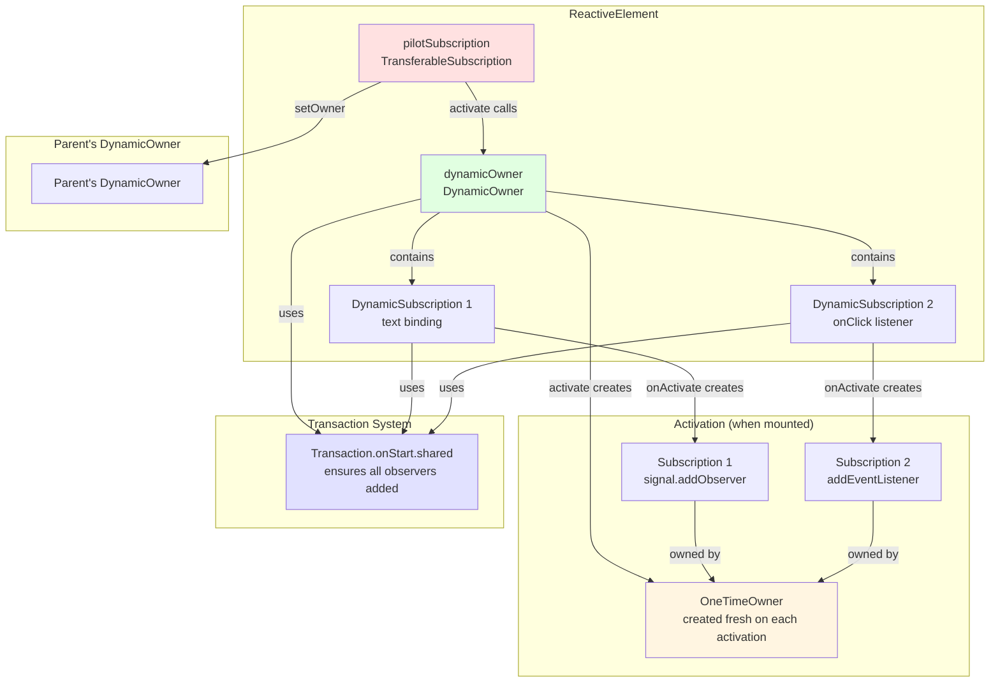
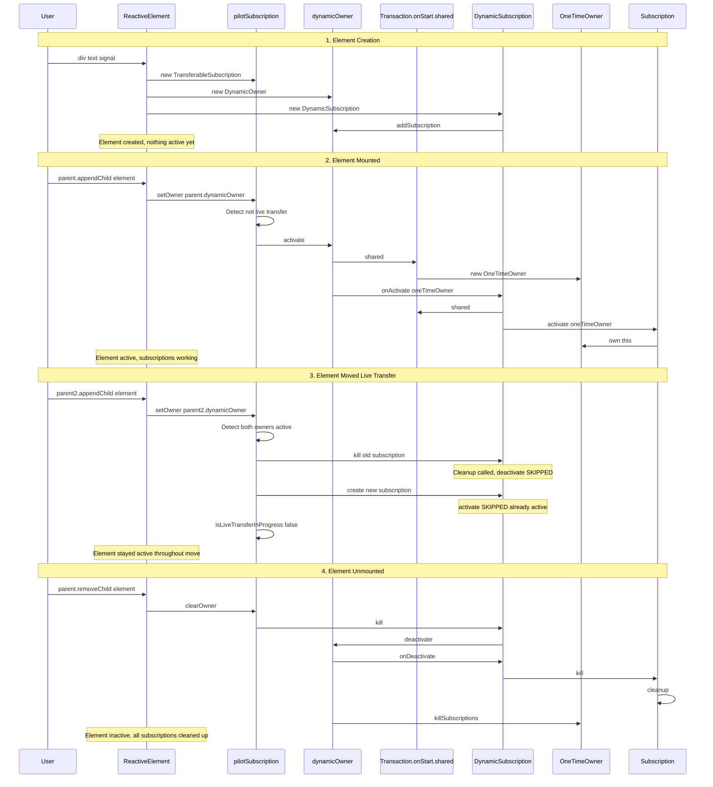

# Core Concepts Relationships: The Five Pillars of Laminar's Reactive Lifecycle

## Table of Contents
1. [Executive Summary](#executive-summary)
2. [The Five Core Concepts](#the-five-core-concepts)
3. [Relationship Diagram](#relationship-diagram)
4. [Common Confusions Addressed](#common-confusions-addressed)
5. [Complete Lifecycle Example](#complete-lifecycle-example)
6. [Comparison Table](#comparison-table)
7. [Mental Model Summary](#mental-model-summary)

---

## Executive Summary

Laminar's reactive element lifecycle is powered by **five interconnected concepts**, each solving a specific problem:

| Concept | What It Does | Key Insight |
|---------|-------------|-------------|
| **Transaction** | Batches reactive updates to prevent glitches | Ensures observables fire in correct order |
| **DynamicOwner** | Manages subscriptions that can activate/deactivate repeatedly | Lives for the element's lifetime, creates fresh OneTimeOwner on each activation |
| **DynamicSubscription** | A subscription that can be activated/deactivated multiple times | Wraps an activation function, owned by DynamicOwner |
| **TransferableSubscription** | A subscription that can transfer between owners without deactivating | Enables "live transfer" optimization when moving elements |
| **pilotSubscription** | The specific TransferableSubscription in every ReactiveElement | Bridges element lifecycle (mount/unmount) to subscription management |

**The Key Relationship**: 
```
pilotSubscription (TransferableSubscription)
  → activates → DynamicOwner
    → activates → DynamicSubscriptions
      → create → Subscriptions (owned by OneTimeOwner)
        → all within → Transaction.onStart.shared
```

---

## The Five Core Concepts

### 1. Transaction

**What it is**: A "moment in time" during which Airstream guarantees no FRP glitches.

**What problem it solves**: 
- **Glitches**: Prevents observables from seeing inconsistent intermediate states
- **Order**: Ensures observables fire in topological order (parents before children)
- **Batching**: Groups multiple reactive updates into a single atomic operation

**Where it lives**: `airstream/src/io/github/nguyenyou/airstream/core/Transaction.scala`

**When it's used**:
- Every reactive update (e.g., `Var.set()`, `EventBus.emit()`)
- DynamicOwner.activate() uses `Transaction.onStart.shared`
- DynamicSubscription.onActivate() uses `Transaction.onStart.shared`

**Key methods/properties**:
```scala
class Transaction(code: Transaction => Any) {
  // Execute transaction code and resolve pending observables
  private def run(transaction: Transaction): Unit
  
  // Process pending observables in topoRank order
  private def resolvePendingObservables(): Unit
  
  // Add observable to pending queue
  private def enqueuePendingObservable(observable: SyncObservable): Unit
}

object Transaction {
  // Create and schedule a new transaction
  def apply(code: Transaction => Unit): Unit
  
  // Get currently executing transaction
  def currentTransaction(): Option[Transaction]
  
  // Defer execution until all observers are added
  object onStart {
    def shared[A](code: => A): A
    def add(callback: Transaction => Unit): Unit
  }
}
```

**Example**:
```scala
val a = Var(1)
val b = a.signal.map(_ * 2)
val c = a.signal.map(_ * 3)
val d = b.combineWith(c)(_ + _)

a.set(2)  // Creates a Transaction
// Transaction ensures d only sees (4, 6) = 10, never glitches like (4, 3)
```

---

### 2. DynamicOwner

**What it is**: An owner that can be activated and deactivated repeatedly, creating a fresh OneTimeOwner on each activation.

**What problem it solves**:
- **Reusable ownership**: Elements can be mounted/unmounted multiple times
- **Automatic cleanup**: Kills all subscriptions when deactivated
- **Fresh state**: Each activation gets a new OneTimeOwner, preventing stale subscriptions

**Where it lives**: `airstream/src/io/github/nguyenyou/airstream/ownership/DynamicOwner.scala`

**When it's used**:
- Every ReactiveElement has a DynamicOwner (in ParentNode trait)
- Activated when element is mounted
- Deactivated when element is unmounted
- Can be reactivated when element is remounted

**Key methods/properties**:
```scala
class DynamicOwner(onAccessAfterKilled: () => Unit) {
  private val subscriptions: JsArray[DynamicSubscription]
  private var _maybeCurrentOwner: Option[Owner] = None
  
  def isActive: Boolean = _maybeCurrentOwner.isDefined
  
  def activate(): Unit = {
    Transaction.onStart.shared {  // ← CRITICAL!
      val newOwner = new OneTimeOwner(onAccessAfterKilled)
      _maybeCurrentOwner = Some(newOwner)
      subscriptions.forEach(_.onActivate(newOwner))
    }
  }
  
  def deactivate(): Unit = {
    subscriptions.forEach(_.onDeactivate())
    _maybeCurrentOwner.foreach(_._killSubscriptions())
    _maybeCurrentOwner = None
  }
  
  private[ownership] def addSubscription(sub: DynamicSubscription, prepend: Boolean): Unit
  private[ownership] def removeSubscription(sub: DynamicSubscription): Unit
}
```

**Example**:
```scala
val element = div("Content")
// element.dynamicOwner is created automatically

// When mounted:
element.dynamicOwner.activate()  // Creates OneTimeOwner, activates all subscriptions

// When unmounted:
element.dynamicOwner.deactivate()  // Kills all subscriptions, clears owner

// Can be remounted:
element.dynamicOwner.activate()  // Creates NEW OneTimeOwner, reactivates subscriptions
```

---

### 3. DynamicSubscription

**What it is**: A subscription that can be activated and deactivated multiple times, wrapping an activation function.

**What problem it solves**:
- **Reusable subscriptions**: Can be turned on/off repeatedly
- **Automatic management**: DynamicOwner handles activation/deactivation
- **Clean separation**: Activation logic is separate from lifecycle management

**Where it lives**: `airstream/src/io/github/nguyenyou/airstream/ownership/DynamicSubscription.scala`

**When it's used**:
- Reactive modifiers create DynamicSubscriptions (e.g., `text <-- signal`)
- Event listeners create DynamicSubscriptions (e.g., `onClick --> observer`)
- Mount hooks create DynamicSubscriptions (e.g., `onMountBind`)

**Key methods/properties**:
```scala
class DynamicSubscription private (
  dynamicOwner: DynamicOwner,
  activate: Owner => Option[Subscription],
  prepend: Boolean
) {
  private var maybeCurrentSubscription: Option[Subscription] = None
  
  def isOwnerActive: Boolean = dynamicOwner.isActive
  def isOwnedBy(owner: DynamicOwner): Boolean = owner == dynamicOwner
  
  def kill(): Unit = dynamicOwner.removeSubscription(this)
  
  private[ownership] def onActivate(owner: Owner): Unit = {
    Transaction.onStart.shared {  // ← CRITICAL!
      maybeCurrentSubscription = activate(owner)
    }
  }
  
  private[ownership] def onDeactivate(): Unit = {
    maybeCurrentSubscription.foreach(_.kill())
    maybeCurrentSubscription = None
  }
}

object DynamicSubscription {
  // For subscriptions that need cleanup
  def unsafe(dynamicOwner: DynamicOwner, activate: Owner => Subscription): DynamicSubscription
  
  // For subscriptions without cleanup
  def subscribeCallback(dynamicOwner: DynamicOwner, activate: Owner => Unit): DynamicSubscription
  
  // Convenience methods
  def subscribeSink[A](dynamicOwner: DynamicOwner, observable: Observable[A], sink: Sink[A]): DynamicSubscription
}
```

**Example**:
```scala
val element = div()
val count = Var(0)

// This creates a DynamicSubscription:
val sub = DynamicSubscription.unsafe(element.dynamicOwner, owner => {
  count.signal.addObserver(Observer(println))(using owner)
})

// When element mounts:
// → element.dynamicOwner.activate()
//   → sub.onActivate(newOwner)
//     → count.signal.addObserver(...) is called
//     → Returns a Subscription

// When element unmounts:
// → element.dynamicOwner.deactivate()
//   → sub.onDeactivate()
//     → Subscription is killed
```

---

### 4. TransferableSubscription

**What it is**: A special subscription that can transfer between DynamicOwners without deactivating, enabling "live transfer" optimization.

**What problem it solves**:
- **Expensive deactivate/reactivate**: Moving an element between active parents would normally deactivate then reactivate all subscriptions
- **Lost state**: Deactivating loses element state (focus, scroll position, etc.)
- **Performance**: Live transfer keeps subscriptions active, avoiding redundant work

**Where it lives**: `airstream/src/io/github/nguyenyou/airstream/ownership/TransferableSubscription.scala`

**When it's used**:
- Every ReactiveElement has exactly ONE TransferableSubscription (the pilotSubscription)
- Transfers when element moves between parents
- Live transfer when both old and new parents are active

**Key methods/properties**:
```scala
class TransferableSubscription(
  activate: () => Unit,
  deactivate: () => Unit
) {
  private var maybeSubscription: Option[DynamicSubscription] = None
  private var isLiveTransferInProgress: Boolean = false
  
  def hasOwner: Boolean = maybeSubscription.nonEmpty
  def isCurrentOwnerActive: Boolean = maybeSubscription.exists(_.isOwnerActive)
  
  def setOwner(nextOwner: DynamicOwner): Unit = {
    // Detect live transfer: both current and next owners are active
    if (isCurrentOwnerActive && nextOwner.isActive) {
      isLiveTransferInProgress = true
    }
    
    // Kill old subscription (skips deactivate if live transfer)
    maybeSubscription.foreach(_.kill())
    
    // Create new subscription (skips activate if live transfer)
    val newSub = DynamicSubscription.unsafe(nextOwner, owner => {
      if (!isLiveTransferInProgress) activate()
      new Subscription(owner, cleanup = () => {
        if (!isLiveTransferInProgress) deactivate()
      })
    })
    
    maybeSubscription = Some(newSub)
    isLiveTransferInProgress = false
  }
  
  def clearOwner(): Unit = {
    maybeSubscription.foreach(_.kill())
    maybeSubscription = None
  }
}
```

**Example**:
```scala
val parent1 = div()
val parent2 = div()
val child = div("Moving child")

// Mount parent1 and parent2
render(container, div(parent1, parent2))

// Add child to parent1
parent1.appendChild(child)
// → child.pilotSubscription.setOwner(parent1.dynamicOwner)
//   → isLiveTransferInProgress = false (no previous owner)
//   → activate() is called
//   → child.dynamicOwner.activate()

// Move child to parent2 (BOTH parents are active!)
parent2.appendChild(child)
// → child.pilotSubscription.setOwner(parent2.dynamicOwner)
//   → isLiveTransferInProgress = true (both owners active!)
//   → Old subscription killed, but deactivate() is SKIPPED
//   → New subscription created, but activate() is SKIPPED
//   → child stays active throughout the move!
```

---

### 5. pilotSubscription

**What it is**: The specific TransferableSubscription instance in every ReactiveElement that bridges element lifecycle to subscription management.

**What problem it solves**:
- **Automatic lifecycle**: Elements don't need manual activate/deactivate calls
- **Unified mechanism**: All elements use the same lifecycle management
- **Transparent to users**: Reactive modifiers "just work" when elements mount/unmount

**Where it lives**: `laminar/src/io/github/nguyenyou/laminar/nodes/ReactiveElement.scala:22-25`

**When it's used**:
- Created when ReactiveElement is instantiated
- setOwner() called when element's parent changes
- clearOwner() called when element is detached

**Key implementation**:
```scala
trait ReactiveElement[+Ref <: dom.Element] extends ChildNode[Ref], ParentNode[Ref] {
  
  private val pilotSubscription: TransferableSubscription = new TransferableSubscription(
    activate = dynamicOwner.activate,    // ← Activates the element's DynamicOwner
    deactivate = dynamicOwner.deactivate  // ← Deactivates the element's DynamicOwner
  )
  
  // Called by ChildNode.setParent()
  protected def unsafeSetPilotSubscriptionOwner(maybeNextOwner: Option[DynamicOwner]): Unit = {
    maybeNextOwner.fold(pilotSubscription.clearOwner()) { nextOwner =>
      pilotSubscription.setOwner(nextOwner)
    }
  }
}
```

**Example**:
```scala
val element = div(
  text <-- count.signal,  // Creates DynamicSubscription in element.dynamicOwner
  onClick --> observer    // Creates another DynamicSubscription
)

// When element is created:
// → pilotSubscription is created
// → 2 DynamicSubscriptions are added to element.dynamicOwner
// → Nothing is active yet!

// When element is mounted:
// → parent.appendChild(element)
//   → element.setParent(Some(parent))
//     → pilotSubscription.setOwner(parent.dynamicOwner)
//       → pilotSubscription.activate() is called
//         → element.dynamicOwner.activate()
//           → Both DynamicSubscriptions are activated
//           → text binding starts working
//           → onClick listener is registered

// When element is unmounted:
// → parent.removeChild(element)
//   → element.setParent(None)
//     → pilotSubscription.clearOwner()
//       → pilotSubscription.deactivate() is called
//         → element.dynamicOwner.deactivate()
//           → Both DynamicSubscriptions are deactivated
//           → text binding stops
//           → onClick listener is removed
```

---

## Relationship Diagram

### High-Level Architecture



### Detailed Lifecycle Flow



---

## Common Confusions Addressed

### Confusion 1: Why do we need both DynamicOwner AND DynamicSubscription?

**Answer**: They solve different problems at different levels:

**DynamicOwner**:
- **What**: Container for multiple DynamicSubscriptions
- **Lifecycle**: Lives for the element's entire lifetime
- **Purpose**: Manages activation/deactivation of ALL subscriptions together
- **Creates**: OneTimeOwner on each activation

**DynamicSubscription**:
- **What**: Individual subscription that can be activated/deactivated
- **Lifecycle**: Lives for the element's lifetime, but can be killed individually
- **Purpose**: Wraps a single activation function (e.g., one signal binding)
- **Creates**: Subscription on each activation

**Analogy**:
- DynamicOwner = Light switch (controls all lights in a room)
- DynamicSubscription = Individual light bulb (can be replaced individually)

**Example**:
```scala
val element = div(
  text <-- signal1,      // DynamicSubscription 1
  className <-- signal2, // DynamicSubscription 2
  onClick --> observer   // DynamicSubscription 3
)

// element.dynamicOwner contains all 3 DynamicSubscriptions
// When element mounts: dynamicOwner.activate() → activates all 3
// When element unmounts: dynamicOwner.deactivate() → deactivates all 3
```

---

### Confusion 2: What's the difference between TransferableSubscription and DynamicSubscription?

**Answer**: TransferableSubscription is a **wrapper** around DynamicSubscription with special transfer logic:

| Aspect | DynamicSubscription | TransferableSubscription |
|--------|---------------------|--------------------------|
| **Owner** | Owned by ONE DynamicOwner (fixed) | Can transfer between DynamicOwners |
| **Activation** | Always calls activate() on activation | Skips activate() during live transfer |
| **Deactivation** | Always calls deactivate() on deactivation | Skips deactivate() during live transfer |
| **Use case** | Individual reactive bindings | Element lifecycle management |
| **Count per element** | Multiple (one per binding) | Exactly ONE (the pilotSubscription) |

**Key Insight**: TransferableSubscription **contains** a DynamicSubscription internally, and recreates it when transferring to a new owner.

**Code**:
```scala
class TransferableSubscription(activate: () => Unit, deactivate: () => Unit) {
  private var maybeSubscription: Option[DynamicSubscription] = None  // ← Contains DynamicSubscription!

  def setOwner(nextOwner: DynamicOwner): Unit = {
    // Kill old DynamicSubscription
    maybeSubscription.foreach(_.kill())

    // Create NEW DynamicSubscription with new owner
    val newSub = DynamicSubscription.unsafe(nextOwner, owner => {
      if (!isLiveTransferInProgress) activate()  // ← Skip during live transfer
      new Subscription(owner, cleanup = () => {
        if (!isLiveTransferInProgress) deactivate()  // ← Skip during live transfer
      })
    })

    maybeSubscription = Some(newSub)
  }
}
```

---

### Confusion 3: How does pilotSubscription relate to TransferableSubscription?

**Answer**: **pilotSubscription IS a TransferableSubscription** - it's not a separate concept!

```scala
trait ReactiveElement[+Ref <: dom.Element] {
  private val pilotSubscription: TransferableSubscription = new TransferableSubscription(
    activate = dynamicOwner.activate,
    deactivate = dynamicOwner.deactivate
  )
}
```

**Key Points**:
1. **pilotSubscription** is just the **name** of the TransferableSubscription instance
2. Every ReactiveElement has exactly ONE pilotSubscription
3. It's called "pilot" because it **pilots** (controls) the element's lifecycle
4. Its activate() calls `dynamicOwner.activate()`
5. Its deactivate() calls `dynamicOwner.deactivate()`

**Analogy**:
- TransferableSubscription = Car (the type)
- pilotSubscription = "my_car" (the specific instance)

---

### Confusion 4: When does Transaction come into play with these ownership concepts?

**Answer**: Transaction is used in TWO critical places to ensure all observers are added before events fire:

**1. DynamicOwner.activate()**
```scala
def activate(): Unit = {
  Transaction.onStart.shared {  // ← Wraps entire activation
    val newOwner = new OneTimeOwner()
    _maybeCurrentOwner = Some(newOwner)
    subscriptions.forEach(_.onActivate(newOwner))
  }
}
```

**Why?** If we didn't use `Transaction.onStart.shared`:
```scala
// WITHOUT Transaction.onStart.shared:
sub1.onActivate(owner)  // Might trigger signal.changes
  → signal.changes emits in NEW transaction
  → Only sub1 receives the event!

sub2.onActivate(owner)  // signal.changes already emitted
  → sub2 MISSES the event!

// WITH Transaction.onStart.shared:
Transaction.onStart.shared {
  sub1.onActivate(owner)  // Deferred
  sub2.onActivate(owner)  // Deferred
}
// Now both are active, THEN signal.changes emits
// Both receive the event!
```

**2. DynamicSubscription.onActivate()**
```scala
private[ownership] def onActivate(owner: Owner): Unit = {
  Transaction.onStart.shared {  // ← Wraps activation function
    maybeCurrentSubscription = activate(owner)
  }
}
```

**Why?** Same reason - ensures all subscriptions within the activation function are added before any events fire.

---

### Confusion 5: Why does DynamicOwner.activate() use Transaction.onStart.shared?

**Answer**: To prevent the "missing events" problem when activating multiple subscriptions.

**The Problem**:
```scala
val element = div(
  text <-- signal,        // Subscription 1
  className <-- signal    // Subscription 2
)

// When element mounts:
dynamicOwner.activate()
  → sub1.onActivate(owner)
    → signal.addObserver(observer1)
      → signal.changes might emit NOW
        → Only observer1 receives it!
  → sub2.onActivate(owner)
    → signal.addObserver(observer2)
      → signal.changes already emitted
        → observer2 MISSES it!
```

**The Solution**:
```scala
Transaction.onStart.shared {
  sub1.onActivate(owner)  // Adds observer1, but defers signal.changes
  sub2.onActivate(owner)  // Adds observer2, but defers signal.changes
}
// NOW both observers are added
// THEN signal.changes emits in a new transaction
// Both observers receive the event!
```

**Key Insight**: `Transaction.onStart.shared` creates a "safe zone" where you can add multiple observers without any of them missing events.

---

## Complete Lifecycle Example

Let's trace through a complete example showing all five concepts working together:

```scala
// 1. Create element with reactive bindings
val count = Var(0)

val element = div(
  className := "counter",
  text <-- count.signal.map(_.toString),  // DynamicSubscription 1
  onClick --> Observer(_ => count.update(_ + 1))  // DynamicSubscription 2
)
```

### Step 1: Element Creation

```
ReactiveElement constructor runs:
  1. pilotSubscription = new TransferableSubscription(
       activate = dynamicOwner.activate,
       deactivate = dynamicOwner.deactivate
     )
     → pilotSubscription created
     → No owner yet (maybeSubscription = None)

  2. dynamicOwner = new DynamicOwner()
     → DynamicOwner created
     → Not active yet (_maybeCurrentOwner = None)

  3. text <-- count.signal creates:
     DynamicSubscription.unsafe(element.dynamicOwner, owner => {
       count.signal.addObserver(Observer(text => updateText(text)))(using owner)
     })
     → DynamicSubscription 1 added to dynamicOwner.subscriptions
     → Not activated yet (maybeCurrentSubscription = None)

  4. onClick --> observer creates:
     DynamicSubscription.unsafe(element.dynamicOwner, owner => {
       addEventListener("click", callback)(using owner)
     })
     → DynamicSubscription 2 added to dynamicOwner.subscriptions
     → Not activated yet (maybeCurrentSubscription = None)

State after creation:
  ✓ pilotSubscription exists (no owner)
  ✓ dynamicOwner exists (inactive)
  ✓ 2 DynamicSubscriptions exist (inactive)
  ✗ No Subscriptions exist yet
  ✗ No OneTimeOwner exists yet
```

### Step 2: Element Mounted

```scala
val container = dom.document.getElementById("app")
render(container, element)
```

```
Mounting sequence:
  1. RootNode.mount() is called
     → root.dynamicOwner.activate()

  2. root.appendChild(element)
     → ParentNode.appendChild(root, element)
       → element.willSetParent(Some(root))
       → DOM operation: root.ref.appendChild(element.ref)
       → element.setParent(Some(root))

  3. element.setParent(Some(root))
     → pilotSubscription.setOwner(root.dynamicOwner)

  4. pilotSubscription.setOwner(root.dynamicOwner)
     → isCurrentOwnerActive? No (no previous owner)
     → nextOwner.isActive? Yes (root is active)
     → isLiveTransferInProgress = false (not a live transfer)

     → Create new DynamicSubscription:
       DynamicSubscription.unsafe(root.dynamicOwner, owner => {
         if (!isLiveTransferInProgress) {  // false, so execute
           activate()  // Calls element.dynamicOwner.activate()
         }
         new Subscription(owner, cleanup = () => {
           if (!isLiveTransferInProgress) {
             deactivate()  // Calls element.dynamicOwner.deactivate()
           }
         })
       })

     → root.dynamicOwner.addSubscription(newPilotSub)
       → root.dynamicOwner.isActive? Yes
       → Immediately call: newPilotSub.onActivate(root's OneTimeOwner)

  5. newPilotSub.onActivate(parentOwner)
     → Transaction.onStart.shared {
         maybeCurrentSubscription = activate(parentOwner)
       }
     → activate(parentOwner) executes:
       → if (!isLiveTransferInProgress) activate()  // true, so execute
       → activate() calls element.dynamicOwner.activate()

  6. element.dynamicOwner.activate()
     → Transaction.onStart.shared {  // ← NESTED shared block!
         val newOwner = new OneTimeOwner()
         _maybeCurrentOwner = Some(newOwner)

         subscriptions.forEach(_.onActivate(newOwner))
           → DynSub1.onActivate(newOwner)
           → DynSub2.onActivate(newOwner)
       }

  7. DynSub1.onActivate(newOwner)
     → Transaction.onStart.shared {  // ← NESTED shared block!
         maybeCurrentSubscription = activate(newOwner)
       }
     → activate(newOwner) executes:
       → count.signal.addObserver(Observer(updateText))(using newOwner)
       → Returns Subscription1
     → maybeCurrentSubscription = Some(Subscription1)

  8. DynSub2.onActivate(newOwner)
     → Transaction.onStart.shared {  // ← NESTED shared block!
         maybeCurrentSubscription = activate(newOwner)
       }
     → activate(newOwner) executes:
       → addEventListener("click", callback)(using newOwner)
       → Returns Subscription2
     → maybeCurrentSubscription = Some(Subscription2)

  9. All Transaction.onStart.shared blocks complete
     → Transaction.onStart.resolve() is called
     → Creates a new Transaction to execute all pending callbacks
     → count.signal.changes emits (if it has a current value)
     → Both observers receive the event!

State after mounting:
  ✓ pilotSubscription has owner (root.dynamicOwner)
  ✓ pilotSubscription is active (via root's DynamicOwner)
  ✓ element.dynamicOwner is active (has OneTimeOwner)
  ✓ DynSub1 is active (has Subscription1)
  ✓ DynSub2 is active (has Subscription2)
  ✓ Text binding is working
  ✓ Click listener is registered
```

### Step 3: Element Moved (Live Transfer)

```scala
val parent2 = div()
render(container, div(element, parent2))  // Both in DOM

parent2.appendChild(element)  // Move element
```

```
Moving sequence:
  1. parent2.appendChild(element)
     → ParentNode.appendChild(parent2, element)
       → element.willSetParent(Some(parent2))
       → DOM operation: parent2.ref.appendChild(element.ref)
         → This automatically removes element from old parent!
       → element.setParent(Some(parent2))

  2. element.setParent(Some(parent2))
     → pilotSubscription.setOwner(parent2.dynamicOwner)

  3. pilotSubscription.setOwner(parent2.dynamicOwner)
     → isCurrentOwnerActive? Yes (element is active)
     → nextOwner.isActive? Yes (parent2 is active)
     → isLiveTransferInProgress = true  // ← LIVE TRANSFER!

     → Kill old DynamicSubscription:
       oldPilotSub.kill()
         → root.dynamicOwner.removeSubscription(oldPilotSub)
         → oldPilotSub.onDeactivate()
           → maybeCurrentSubscription.foreach(_.kill())
           → Subscription.kill() calls cleanup():
             → if (!isLiveTransferInProgress) deactivate()
             → isLiveTransferInProgress = true, so SKIP deactivate()!

     → Create new DynamicSubscription:
       newPilotSub = DynamicSubscription.unsafe(parent2.dynamicOwner, owner => {
         if (!isLiveTransferInProgress) activate()  // ← SKIP!
         new Subscription(owner, cleanup = () => {
           if (!isLiveTransferInProgress) deactivate()
         })
       })

     → parent2.dynamicOwner.addSubscription(newPilotSub)
       → parent2.dynamicOwner.isActive? Yes
       → Immediately call: newPilotSub.onActivate(parent2's OneTimeOwner)

     → newPilotSub.onActivate(parentOwner)
       → Transaction.onStart.shared {
           maybeCurrentSubscription = activate(parentOwner)
         }
       → activate(parentOwner) executes:
         → if (!isLiveTransferInProgress) activate()
         → isLiveTransferInProgress = true, so SKIP activate()!
         → Just creates Subscription with cleanup

     → isLiveTransferInProgress = false  // Reset flag

State after move:
  ✓ pilotSubscription has NEW owner (parent2.dynamicOwner)
  ✓ pilotSubscription is STILL active (never deactivated!)
  ✓ element.dynamicOwner is STILL active (same OneTimeOwner!)
  ✓ DynSub1 is STILL active (same Subscription1!)
  ✓ DynSub2 is STILL active (same Subscription2!)
  ✓ Text binding STILL working (never stopped!)
  ✓ Click listener STILL registered (never removed!)

Key insight: Element stayed active throughout the move!
No deactivate/reactivate happened!
```

### Step 4: Element Unmounted

```scala
parent2.removeChild(element)
```

```
Unmounting sequence:
  1. parent2.removeChild(element)
     → ParentNode.removeChild(parent2, element)
       → element.willSetParent(None)
       → DOM operation: parent2.ref.removeChild(element.ref)
       → element.setParent(None)

  2. element.setParent(None)
     → pilotSubscription.clearOwner()

  3. pilotSubscription.clearOwner()
     → maybeSubscription.foreach(_.kill())
       → pilotSub.kill()
         → parent2.dynamicOwner.removeSubscription(pilotSub)
         → pilotSub.onDeactivate()

  4. pilotSub.onDeactivate()
     → maybeCurrentSubscription.foreach(_.kill())
     → Subscription.kill() calls cleanup():
       → if (!isLiveTransferInProgress) deactivate()
       → isLiveTransferInProgress = false, so EXECUTE deactivate()!
       → deactivate() calls element.dynamicOwner.deactivate()

  5. element.dynamicOwner.deactivate()
     → subscriptions.forEach(_.onDeactivate())
       → DynSub1.onDeactivate()
       → DynSub2.onDeactivate()
     → _maybeCurrentOwner.foreach(_._killSubscriptions())
     → _maybeCurrentOwner = None

  6. DynSub1.onDeactivate()
     → maybeCurrentSubscription.foreach(_.kill())
     → Subscription1.kill() calls cleanup():
       → signal.removeObserver(observer)
     → maybeCurrentSubscription = None

  7. DynSub2.onDeactivate()
     → maybeCurrentSubscription.foreach(_.kill())
     → Subscription2.kill() calls cleanup():
       → removeEventListener("click", callback)
     → maybeCurrentSubscription = None

State after unmounting:
  ✗ pilotSubscription has no owner (maybeSubscription = None)
  ✗ element.dynamicOwner is inactive (_maybeCurrentOwner = None)
  ✗ DynSub1 is inactive (maybeCurrentSubscription = None)
  ✗ DynSub2 is inactive (maybeCurrentSubscription = None)
  ✗ Text binding stopped
  ✗ Click listener removed
  ✓ All cleanup completed
  ✓ No memory leaks
```

## Comparison Table

| Aspect | Transaction | DynamicOwner | DynamicSubscription | TransferableSubscription | pilotSubscription |
|--------|-------------|--------------|---------------------|--------------------------|-------------------|
| **What it manages** | Reactive updates | DynamicSubscriptions | Single activation function | Owner transfers | Element lifecycle |
| **Lifecycle** | One-time (per update) | Reusable (element lifetime) | Reusable (element lifetime) | Reusable (element lifetime) | Reusable (element lifetime) |
| **Activation mechanism** | `Transaction { ... }` | `activate()` creates OneTimeOwner | `onActivate(owner)` calls activate function | `setOwner(owner)` with live transfer detection | Same as TransferableSubscription |
| **Deactivation mechanism** | Automatic (after resolving) | `deactivate()` kills OneTimeOwner | `onDeactivate()` kills Subscription | `clearOwner()` or `setOwner()` | Same as TransferableSubscription |
| **Can be reused?** | No (one-time) | Yes (activate/deactivate repeatedly) | Yes (activate/deactivate repeatedly) | Yes (transfer between owners) | Yes (transfer between owners) |
| **Count per element** | N/A (global) | 1 (in ParentNode) | Multiple (one per binding) | 1 (the pilotSubscription) | 1 (the pilotSubscription) |
| **Primary use case** | Prevent glitches | Manage element subscriptions | Individual reactive binding | Element lifecycle management | Element lifecycle management |
| **Key method** | `Transaction.onStart.shared` | `activate()`, `deactivate()` | `onActivate()`, `onDeactivate()` | `setOwner()`, `clearOwner()` | Same as TransferableSubscription |
| **Creates** | N/A | OneTimeOwner | Subscription | DynamicSubscription | DynamicSubscription |
| **Owned by** | N/A | ReactiveElement | DynamicOwner | N/A (owns DynamicSubscription) | ReactiveElement |
| **File location** | `airstream/.../Transaction.scala` | `airstream/.../DynamicOwner.scala` | `airstream/.../DynamicSubscription.scala` | `airstream/.../TransferableSubscription.scala` | `laminar/.../ReactiveElement.scala` |

### Key Relationships

```
Transaction (global batching)
  ↓ used by
DynamicOwner (element's subscription manager)
  ↓ contains
DynamicSubscription (individual binding)
  ↓ creates
Subscription (actual resource)
  ↓ owned by
OneTimeOwner (created on each activation)

TransferableSubscription (wrapper)
  ↓ wraps
DynamicSubscription (recreated on transfer)
  ↓ activates
DynamicOwner (element's subscription manager)

pilotSubscription (specific instance)
  = TransferableSubscription (same type)
```

---

## Mental Model Summary

### The Big Picture

Think of Laminar's reactive lifecycle as a **four-layer system**:

1. **Transaction Layer** (Airstream)
   - **Purpose**: Prevent glitches by batching reactive updates
   - **Key mechanism**: `Transaction.onStart.shared` defers execution until all observers are added
   - **Scope**: Global (affects all reactive updates)

2. **Ownership Layer** (Airstream)
   - **Purpose**: Manage subscription lifecycle (activate/deactivate)
   - **Key types**: DynamicOwner, DynamicSubscription, TransferableSubscription
   - **Scope**: Per-element (each element has its own DynamicOwner)

3. **Element Layer** (Laminar)
   - **Purpose**: Bridge DOM lifecycle to subscription lifecycle
   - **Key mechanism**: pilotSubscription (TransferableSubscription instance)
   - **Scope**: Per-element (each element has exactly one pilotSubscription)

4. **DOM Layer** (Browser)
   - **Purpose**: Actual DOM operations (appendChild, removeChild, etc.)
   - **Key mechanism**: Browser's native DOM API
   - **Scope**: Global (browser's DOM tree)

### The Five Concepts as a Team

Each concept has a specific role:

| Concept | Role | Analogy |
|---------|------|---------|
| **Transaction** | Traffic controller | Ensures cars (events) arrive in correct order |
| **DynamicOwner** | Building manager | Manages all utilities (subscriptions) in a building (element) |
| **DynamicSubscription** | Individual utility | Water, electricity, internet (individual bindings) |
| **TransferableSubscription** | Moving company | Transfers utilities when moving to a new building |
| **pilotSubscription** | Master switch | The main switch that controls the building's power |

### The Critical Insight

**pilotSubscription is the bridge** between DOM lifecycle and subscription lifecycle:

```
DOM Event (appendChild)
  → element.setParent(Some(parent))
    → pilotSubscription.setOwner(parent.dynamicOwner)
      → pilotSubscription.activate()
        → element.dynamicOwner.activate()
          → All DynamicSubscriptions activate
            → All reactive bindings start working
```

**Transaction.onStart.shared is the safety net** that prevents missing events:

```
Without Transaction.onStart.shared:
  sub1.activate() → signal emits → only sub1 receives
  sub2.activate() → signal already emitted → sub2 MISSES event

With Transaction.onStart.shared:
  Transaction.onStart.shared {
    sub1.activate()  // Deferred
    sub2.activate()  // Deferred
  }
  → Both activated
  → THEN signal emits
  → Both receive event
```

### Common Patterns

**Pattern 1: Element Creation**
```scala
val element = div(text <-- signal)
// Creates: pilotSubscription, dynamicOwner, DynamicSubscription
// Nothing is active yet!
```

**Pattern 2: Element Mounting**
```scala
parent.appendChild(element)
// pilotSubscription.setOwner(parent.dynamicOwner)
// → activate() → dynamicOwner.activate() → all subscriptions activate
```

**Pattern 3: Element Moving (Live Transfer)**
```scala
parent2.appendChild(element)  // Both parents active
// pilotSubscription.setOwner(parent2.dynamicOwner)
// → Detects live transfer → skips deactivate/activate
// → Element stays active throughout move!
```

**Pattern 4: Element Unmounting**
```scala
parent.removeChild(element)
// pilotSubscription.clearOwner()
// → deactivate() → dynamicOwner.deactivate() → all subscriptions deactivate
```

### Debugging Tips

**1. Check if element is active**
```scala
element.dynamicOwner.isActive  // true if mounted, false if unmounted
```

**2. Check if pilotSubscription has owner**
```scala
element.pilotSubscription.hasOwner  // true if has parent, false if detached
```

**3. Check if live transfer is happening**
```scala
// Look for this in TransferableSubscription.setOwner():
isCurrentOwnerActive && nextOwner.isActive  // true = live transfer
```

**4. Check Transaction.onStart.shared nesting**
```scala
// Multiple nested shared blocks are OK:
Transaction.onStart.shared {
  Transaction.onStart.shared {
    Transaction.onStart.shared {
      // All deferred until outermost block completes
    }
  }
}
```

### Further Reading

- [TRANSACTION_SYSTEM_DEEP_DIVE.md](TRANSACTION_SYSTEM_DEEP_DIVE.md) - Complete guide to Transaction mechanism
- [PILOT_SUBSCRIPTION_DEEP_DIVE.md](PILOT_SUBSCRIPTION_DEEP_DIVE.md) - Complete guide to pilotSubscription
- [MOUNT_HOOKS_SYSTEM.md](MOUNT_HOOKS_SYSTEM.md) - Mount hooks and lifecycle callbacks
- [LEARNING_ROADMAP.md](LEARNING_ROADMAP.md) - Structured learning path for Laminar/Airstream

---

**End of Document**

