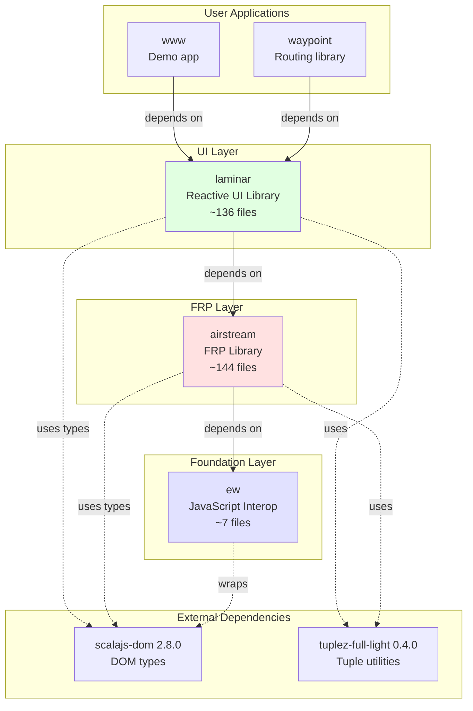
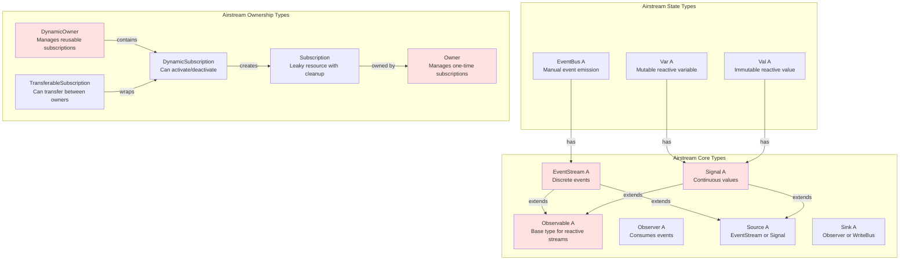
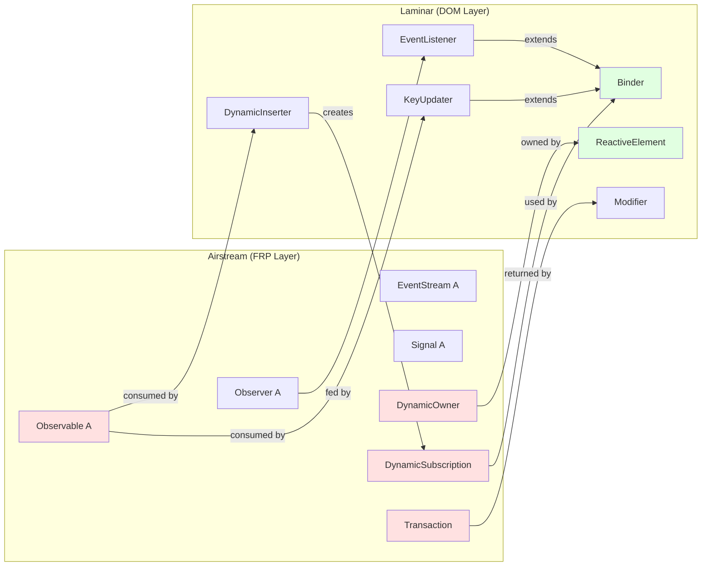
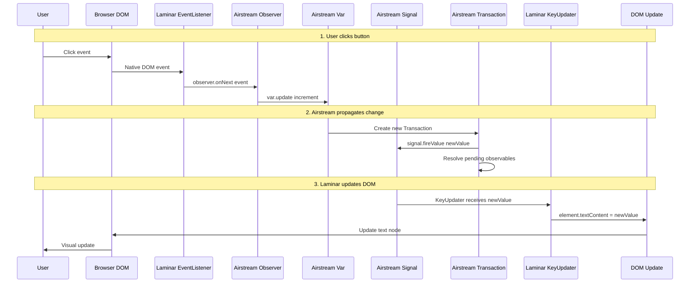
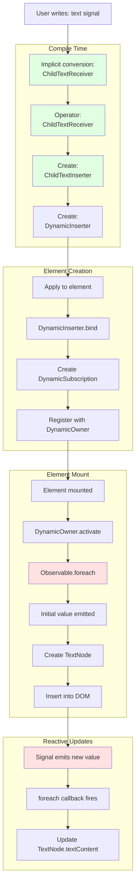
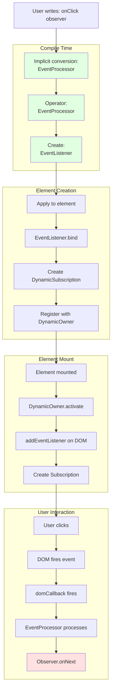
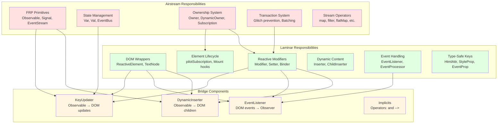

# Laminar & Airstream Architecture: Separation of Concerns

## Table of Contents
1. [Executive Summary](#executive-summary)
2. [Library Dependency Diagram](#library-dependency-diagram)
3. [Separation of Concerns](#separation-of-concerns)
4. [Bridge Points Between Libraries](#bridge-points-between-libraries)
5. [Type Hierarchy and Integration](#type-hierarchy-and-integration)
6. [Data Flow Architecture](#data-flow-architecture)
7. [Component Responsibility Matrix](#component-responsibility-matrix)
8. [Code Examples](#code-examples)
9. [Design Philosophy](#design-philosophy)
10. [Major Bridge Components](#major-bridge-components)

---

## Executive Summary

**Laminar** and **Airstream** are **two distinct libraries** with well-defined responsibilities, connected through specific bridge points:

| Library | Responsibility | Key Insight |
|---------|---------------|-------------|
| **Airstream** | FRP (Functional Reactive Programming) primitives | Pure reactive streams with no DOM knowledge |
| **Laminar** | Reactive UI library for DOM manipulation | Uses Airstream types to create reactive DOM bindings |
| **ew** | JavaScript interop utilities | Foundation for both libraries |

**The Key Relationship**:
```
ew (JavaScript interop)
  ↓ used by
Airstream (FRP primitives: Observable, Signal, EventStream, Observer, Ownership)
  ↓ used by
Laminar (DOM: ReactiveElement, Modifier, Binder, Inserter, EventListener)
  ↓ used by
User Application
```

**Critical Insight**: Airstream has **zero knowledge of the DOM**. Laminar bridges Airstream's reactive primitives to DOM operations through specific integration points (Binder, Inserter, EventListener, Modifier).

---

## Library Dependency Diagram

### Module Dependencies (from build.mill)



**Key Points**:
- **ew** has no dependencies on other modules (foundation)
- **airstream** depends only on **ew** (no DOM manipulation)
- **laminar** depends on **airstream** (uses FRP primitives for reactive DOM)
- Both use **scalajs-dom** for DOM types, but only Laminar manipulates the DOM

---

## Separation of Concerns

### What Airstream is Responsible For

**File**: `airstream/src/io/github/nguyenyou/airstream/`

**Core Responsibilities**:
1. **FRP Primitives**:
   - `Observable[A]` - Base type for reactive streams
   - `EventStream[A]` - Discrete events over time
   - `Signal[A]` - Continuous values (always has current value)
   - `Observer[A]` - Consumes events from observables

2. **State Management**:
   - `Var[A]` - Mutable reactive variable
   - `Val[A]` - Immutable reactive value
   - `EventBus[A]` - Manual event emission

3. **Ownership System**:
   - `Owner` - Manages one-time subscriptions
   - `DynamicOwner` - Manages reusable subscriptions
   - `DynamicSubscription` - Subscription that can activate/deactivate
   - `TransferableSubscription` - Subscription that can transfer between owners
   - `Subscription` - Represents a leaky resource with cleanup

4. **Transaction System**:
   - `Transaction` - Batches reactive updates to prevent glitches
   - `Transaction.onStart.shared` - Defers execution until all observers added
   - Topological ordering to ensure correct firing order

5. **Stream Operators**:
   - `map`, `filter`, `collect`, `flatMap`, `combineWith`, `split`, etc.
   - Timing operators: `debounce`, `throttle`, `delay`
   - Flattening strategies: `SwitchStreamStrategy`, `ConcurrentStreamStrategy`

**What Airstream Does NOT Do**:
- ❌ No DOM manipulation
- ❌ No knowledge of HTML elements
- ❌ No event listeners (DOM events)
- ❌ No rendering
- ❌ No mounting/unmounting

---

### What Laminar is Responsible For

**File**: `laminar/src/io/github/nguyenyou/laminar/`

**Core Responsibilities**:
1. **DOM Node Wrappers**:
   - `ReactiveElement` - Wrapper around `dom.Element`
   - `ReactiveHtmlElement` - Wrapper around `dom.html.Element`
   - `ReactiveSvgElement` - Wrapper around `dom.svg.Element`
   - `TextNode` - Wrapper around `dom.Text`
   - `CommentNode` - Wrapper around `dom.Comment`

2. **Element Lifecycle**:
   - `pilotSubscription` - Manages element mount/unmount
   - `ParentNode` trait - Contains `DynamicOwner` for managing subscriptions
   - `ChildNode` trait - Can be a child of another node
   - Mount hooks: `onMountCallback`, `onMountBind`, `onMountInsert`, etc.

3. **Reactive Modifiers**:
   - `Modifier[El]` - Base trait for element modifications
   - `Setter[El]` - Idempotent modifier (static configuration)
   - `Binder[El]` - Non-idempotent modifier (creates subscriptions)
   - `KeyUpdater` - Updates attributes/properties/styles from Observable

4. **Dynamic Content Insertion**:
   - `Inserter` - Base for inserting child nodes
   - `DynamicInserter` - Reactive child insertion
   - `ChildInserter` - Single child from Observable
   - `ChildrenInserter` - Multiple children from Observable
   - `ChildTextInserter` - Text content from Observable

5. **Event Handling**:
   - `EventListener` - Attaches DOM event listeners
   - `EventProcessor` - Transforms/filters events
   - `EventProp` - Represents event types (onClick, onInput, etc.)

6. **Type-Safe Keys**:
   - `HtmlAttr[V]` - HTML attributes
   - `HtmlProp[V, DomV]` - HTML properties
   - `StyleProp[V]` - CSS styles
   - `SvgAttr[V]` - SVG attributes
   - `EventProp[Ev]` - DOM events

**What Laminar Does NOT Do**:
- ❌ No FRP implementation (uses Airstream)
- ❌ No transaction management (uses Airstream's Transaction)
- ❌ No ownership implementation (uses Airstream's DynamicOwner)

---

## Bridge Points Between Libraries

### Overview

Laminar integrates with Airstream through **specific, well-defined bridge points**. These are the only places where Laminar code directly uses Airstream types.

### Bridge Point 1: Airstream Type Aliases

**File**: `laminar/src/io/github/nguyenyou/laminar/api/AirstreamAliases.scala`

Laminar re-exports Airstream types for user convenience:

```scala
trait AirstreamAliases {
  // Core FRP types
  type EventStream[+A] = airstream.core.EventStream[A]
  type Signal[+A] = airstream.core.Signal[A]
  type Observable[+A] = airstream.core.Observable[A]
  type Observer[-A] = airstream.core.Observer[A]
  type Source[+A] = airstream.core.Source[A]
  type Sink[-A] = airstream.core.Sink[A]

  // State types
  type Var[A] = airstream.state.Var[A]
  type Val[A] = airstream.state.Val[A]
  type EventBus[A] = airstream.eventbus.EventBus[A]

  // Ownership types
  type Owner = airstream.ownership.Owner
  type DynamicOwner = airstream.ownership.DynamicOwner
  type DynamicSubscription = airstream.ownership.DynamicSubscription
  type Subscription = airstream.ownership.Subscription
}
```

**Why**: Users can write `import io.github.nguyenyou.laminar.api.L._` and get both Laminar and Airstream types.

---

### Bridge Point 2: ReactiveElement Uses DynamicOwner

**File**: `laminar/src/io/github/nguyenyou/laminar/nodes/ParentNode.scala:12-15`

```scala
private[nodes] val dynamicOwner: DynamicOwner = new DynamicOwner(() => {
  val path = DomApi.debugPath(ref).mkString(" > ")
  throw new Exception(s"Attempting to use owner of unmounted element: $path")
})
```

**What**: Every `ReactiveElement` has a `DynamicOwner` (from Airstream) that manages all subscriptions for that element.

**Why**: When element mounts, `dynamicOwner.activate()` activates all subscriptions. When unmounted, `dynamicOwner.deactivate()` cleans up.

---

### Bridge Point 3: Binder Creates DynamicSubscription

**File**: `laminar/src/io/github/nguyenyou/laminar/modifiers/Binder.scala`

```scala
import io.github.nguyenyou.airstream.ownership.DynamicSubscription

trait Binder[-El <: ReactiveElement.Base] extends Modifier[El] {
  def bind(element: El): DynamicSubscription  // ← Returns Airstream type!

  final override def apply(element: El): Unit = bind(element)
}
```

**What**: `Binder` is Laminar's abstraction for creating reactive bindings. It returns an Airstream `DynamicSubscription`.

**Why**: The `DynamicSubscription` is registered with the element's `DynamicOwner`, enabling automatic activation/deactivation on mount/unmount.

---

### Bridge Point 4: KeyUpdater Binds Observable to DOM

**File**: `laminar/src/io/github/nguyenyou/laminar/modifiers/KeyUpdater.scala`

```scala
import io.github.nguyenyou.airstream.core.Observable
import io.github.nguyenyou.airstream.ownership.DynamicSubscription

class KeyUpdater[-El <: ReactiveElement.Base, +K <: Key, V](
  val key: K,
  val values: Observable[V],  // ← Airstream Observable!
  val update: (El, V, Modifier.Any) => Unit
) extends Binder[El] {

  override def bind(element: El): DynamicSubscription = {
    element.onBoundKeyUpdater(key)
    ReactiveElement.bindFn(element, values) { value =>
      update(element, value, self)
    }
  }
}
```

**What**: `KeyUpdater` connects an Airstream `Observable[V]` to a DOM update function.

**Example**: `href <-- urlSignal` creates a `KeyUpdater` that updates the `href` attribute whenever `urlSignal` emits.

---

### Bridge Point 5: Inserters Use Observable for Dynamic Children

**File**: `laminar/src/io/github/nguyenyou/laminar/inserters/ChildTextInserter.scala`

```scala
import io.github.nguyenyou.airstream.core.Observable

object ChildTextInserter {
  def apply[Component](
    textSource: Observable[Component],  // ← Airstream Observable!
    renderable: RenderableText[Component]
  ): DynamicInserter = {
    new DynamicInserter(
      insertFn = (ctx, owner, _) => {
        textSource.foreach { newValue =>  // ← Subscribe to Observable
          // Update DOM text node
          textNode.ref.textContent = renderable.asString(newValue)
        }(using owner)  // ← Uses Airstream Owner!
      }
    )
  }
}
```

**What**: Inserters subscribe to Airstream `Observable` and update DOM children when values emit.

**Example**: `child.text <-- countSignal` creates a `ChildTextInserter` that updates text content.

---

### Bridge Point 6: EventListener Connects DOM Events to Observer

**File**: `laminar/src/io/github/nguyenyou/laminar/modifiers/EventListener.scala`

```scala
import io.github.nguyenyou.airstream.ownership.{DynamicSubscription, Subscription}

class EventListener[Ev <: dom.Event, Out](
  val eventProcessor: EventProcessor[Ev, Out],
  val callback: Out => Unit  // ← This is Observer.onNext!
) extends Binder[ReactiveElement.Base] {

  override def bind(element: ReactiveElement.Base): DynamicSubscription = {
    val subscribe = (ctx: MountContext[ReactiveElement.Base]) => {
      DomApi.addEventListener(element.ref, this)  // ← DOM operation
      new Subscription(  // ← Airstream Subscription!
        ctx.owner,
        cleanup = () => DomApi.removeEventListener(element.ref, this)
      )
    }
    ReactiveElement.bindSubscriptionUnsafe(element)(subscribe)
  }
}
```

**What**: `EventListener` bridges DOM events to Airstream `Observer`.

**Example**: `onClick --> observer` creates an `EventListener` that calls `observer.onNext(event)` when clicked.

---

### Bridge Point 7: ReactiveElement.events() Creates EventStream

**File**: `laminar/src/io/github/nguyenyou/laminar/nodes/ReactiveElement.scala:138-149`

```scala
import io.github.nguyenyou.airstream.core.EventStream
import io.github.nguyenyou.airstream.eventbus.EventBus

def events[Ev <: dom.Event, Out](
  prop: EventProcessor[Ev, Out]
): EventStream[Out] = {  // ← Returns Airstream EventStream!
  val eventBus = new EventBus[Out]  // ← Airstream EventBus!
  val listener = new EventListener[Ev, Out](
    prop,
    eventBus.writer.onNext  // ← Feed DOM events into EventBus
  )
  listener(this)
  eventBus.events  // ← Return the EventStream
}
```

**What**: Converts DOM events into Airstream `EventStream`.

**Example**: `element.events(onClick).map(_.clientX)` creates a stream of click X coordinates.

### Bridge Point 8: Modifier Uses Transaction.onStart.shared

**File**: `laminar/src/io/github/nguyenyou/laminar/modifiers/Modifier.scala`

```scala
import io.github.nguyenyou.airstream.core.Transaction

object Modifier {
  def apply[El <: ReactiveElement.Base](f: El => Unit): Modifier[El] = {
    new Modifier[El] {
      override def apply(element: El): Unit = {
        Transaction.onStart.shared {  // ← Airstream Transaction!
          f(element)
        }
      }
    }
  }
}
```

**What**: Laminar uses Airstream's `Transaction.onStart.shared` to ensure all observers are added before events fire.

**Why**: Prevents the "missing events" problem when multiple subscriptions are created simultaneously.

---

### Bridge Point 9: Receivers Use Source and Observable

**File**: `laminar/src/io/github/nguyenyou/laminar/receivers/ChildReceiver.scala`

```scala
import io.github.nguyenyou.airstream.core.Source

object ChildReceiver {
  def <--(childSource: Source[ChildNode.Base]): DynamicInserter = {
    ChildInserter(childSource.toObservable, ...)  // ← Convert Source to Observable
  }
}
```

**What**: Receivers accept Airstream `Source` (which can be `EventStream` or `Signal`) and convert to `Observable`.

**Example**: `child <-- signal` or `child <-- stream` both work because `Source` is the common supertype.

---

### Bridge Point 10: Implicits Enrich Source with --> Operator

**File**: `laminar/src/io/github/nguyenyou/laminar/api/Implicits.scala`

```scala
import io.github.nguyenyou.airstream.core.{Sink, Source}

@inline implicit def enrichSource[A](source: Source[A]): RichSource[A] = {
  new RichSource(source)
}

class RichSource[A](val source: Source[A]) extends AnyVal {
  def -->(sink: Sink[A]): Binder.Base = {
    Binder(ReactiveElement.bindSink(_, source.toObservable)(sink))
  }

  def -->(onNext: A => Unit): Binder.Base = {
    Binder(ReactiveElement.bindFn(_, source.toObservable)(onNext))
  }
}
```

**What**: Laminar adds the `-->` operator to Airstream's `Source` type via implicit conversion.

**Example**: `signal --> observer` creates a `Binder` that subscribes the observer to the signal.

---

## Type Hierarchy and Integration

### Airstream Type Hierarchy



### Laminar Type Hierarchy

```mermaid
graph TB
    subgraph "Laminar DOM Nodes"
        REACTIVENODE[ReactiveNode<br/>Base for all nodes]
        CHILDNODE[ChildNode<br/>Can be a child]
        PARENTNODE[ParentNode<br/>Can have children]
        REACTIVEELEMENT[ReactiveElement<br/>Combines ChildNode + ParentNode]
        HTMLELEMENT[ReactiveHtmlElement<br/>HTML elements]
        SVGELEMENT[ReactiveSvgElement<br/>SVG elements]
        TEXTNODE[TextNode<br/>Text content]
    end

    subgraph "Laminar Modifiers"
        MODIFIER[Modifier El<br/>Base for modifications]
        SETTER[Setter El<br/>Idempotent]
        BINDER[Binder El<br/>Creates subscriptions]
        KEYUPDATER[KeyUpdater<br/>Observable to DOM]
        EVENTLISTENER[EventListener<br/>DOM events to Observer]
    end

    subgraph "Laminar Inserters"
        INSERTER[Inserter<br/>Base for inserters]
        STATICINSERTER[StaticInserter<br/>Static content]
        DYNAMICINSERTER[DynamicInserter<br/>Reactive content]
        CHILDINSERTER[ChildInserter<br/>Single child]
        CHILDRENINSERTER[ChildrenInserter<br/>Multiple children]
    end

    CHILDNODE -->|extends| REACTIVENODE
    PARENTNODE -->|extends| REACTIVENODE
    REACTIVEELEMENT -->|extends| CHILDNODE
    REACTIVEELEMENT -->|extends| PARENTNODE
    HTMLELEMENT -->|extends| REACTIVEELEMENT
    SVGELEMENT -->|extends| REACTIVEELEMENT
    TEXTNODE -->|extends| CHILDNODE

    SETTER -->|extends| MODIFIER
    BINDER -->|extends| MODIFIER
    KEYUPDATER -->|extends| BINDER
    EVENTLISTENER -->|extends| BINDER

    STATICINSERTER -->|extends| INSERTER
    DYNAMICINSERTER -->|extends| INSERTER

    style REACTIVEELEMENT fill:#e1ffe1
    style MODIFIER fill:#e1ffe1
    style BINDER fill:#e1ffe1
    style INSERTER fill:#e1ffe1
```



### Integration: How Laminar Uses Airstream Types



## Data Flow Architecture

### Complete Data Flow: From User Action to DOM Update



### Reactive Binding Flow: `text <-- signal`



### Event Handling Flow: `onClick --> observer`



---

## Component Responsibility Matrix

| Component | Library | Responsibility | Depends On | Used By |
|-----------|---------|---------------|------------|---------|
| **Observable[A]** | Airstream | Base type for reactive streams | - | Signal, EventStream, KeyUpdater, Inserter |
| **EventStream[A]** | Airstream | Discrete events over time | Observable | Var, EventBus, User code |
| **Signal[A]** | Airstream | Continuous values (always has current value) | Observable | Var, Val, User code |
| **Observer[A]** | Airstream | Consumes events from observables | - | EventListener, User code |
| **Var[A]** | Airstream | Mutable reactive variable | Signal | User code |
| **EventBus[A]** | Airstream | Manual event emission | EventStream | ReactiveElement.events(), User code |
| **Owner** | Airstream | Manages one-time subscriptions | - | DynamicOwner, User code |
| **DynamicOwner** | Airstream | Manages reusable subscriptions | Owner | ReactiveElement (ParentNode) |
| **DynamicSubscription** | Airstream | Subscription that can activate/deactivate | Owner | Binder, Inserter |
| **TransferableSubscription** | Airstream | Subscription that can transfer between owners | DynamicSubscription | ReactiveElement (pilotSubscription) |
| **Transaction** | Airstream | Batches reactive updates to prevent glitches | - | Modifier, DynamicOwner |
| **ReactiveElement** | Laminar | Wrapper around DOM element | DynamicOwner, TransferableSubscription | User code |
| **Modifier[El]** | Laminar | Base trait for element modifications | Transaction | Setter, Binder, Inserter |
| **Setter[El]** | Laminar | Idempotent modifier (static configuration) | Modifier | User code |
| **Binder[El]** | Laminar | Non-idempotent modifier (creates subscriptions) | Modifier, DynamicSubscription | KeyUpdater, EventListener |
| **KeyUpdater** | Laminar | Updates attributes/properties/styles from Observable | Binder, Observable | User code (via `<--`) |
| **Inserter** | Laminar | Base for inserting child nodes | Modifier | DynamicInserter, StaticInserter |
| **DynamicInserter** | Laminar | Reactive child insertion | Inserter, Observable, DynamicSubscription | ChildInserter, ChildrenInserter |
| **EventListener** | Laminar | Attaches DOM event listeners | Binder, Observer, Subscription | User code (via `-->`) |
| **EventProcessor** | Laminar | Transforms/filters events | - | EventListener |

### Visual Responsibility Matrix



## Code Examples

### Example 1: Pure Airstream Code (No DOM)

```scala
import io.github.nguyenyou.airstream.core._
import io.github.nguyenyou.airstream.state._
import io.github.nguyenyou.airstream.ownership.Owner

// Pure FRP - no DOM knowledge
val owner = new Owner {}

val count = Var(0)
val doubled = count.signal.map(_ * 2)
val tripled = count.signal.map(_ * 3)
val sum = doubled.combineWith(tripled)(_ + _)

sum.addObserver(Observer(println))(using owner)

count.set(1)  // Prints: 5
count.set(2)  // Prints: 10

owner.killSubscriptions()  // Cleanup
```

**Key Points**:
- ✅ Pure reactive streams
- ✅ No DOM manipulation
- ✅ Manual owner management
- ✅ Can be used in Node.js, JVM, or anywhere Scala.js runs

---

### Example 2: Pure Laminar Code (Uses Airstream Types)

```scala
import io.github.nguyenyou.laminar.api.L._

// Laminar uses Airstream types for reactive DOM
val count = Var(0)

val app = div(
  h1("Counter App"),

  // KeyUpdater: Observable[String] → DOM text content
  p(
    "Count: ",
    child.text <-- count.signal.map(_.toString)
  ),

  // KeyUpdater: Observable[String] → DOM attribute
  p(
    className <-- count.signal.map(c => if (c > 5) "high" else "low"),
    "Status"
  ),

  // EventListener: DOM click event → Observer
  button(
    "Increment",
    onClick --> Observer(_ => count.update(_ + 1))
  )
)

render(dom.document.getElementById("app"), app)
```

**Key Points**:
- ✅ Uses Airstream types (`Var`, `Signal`, `Observer`)
- ✅ Laminar provides DOM-specific operators (`<--`, `-->`)
- ✅ Automatic subscription management (no manual `owner.killSubscriptions()`)
- ✅ Reactive DOM updates

---

### Example 3: Bridge Code (KeyUpdater Implementation)

```scala
// This is how Laminar bridges Airstream Observable to DOM updates

// File: laminar/src/io/github/nguyenyou/laminar/modifiers/KeyUpdater.scala
import io.github.nguyenyou.airstream.core.Observable
import io.github.nguyenyou.airstream.ownership.DynamicSubscription

class KeyUpdater[-El <: ReactiveElement.Base, +K <: Key, V](
  val key: K,
  val values: Observable[V],  // ← Airstream type
  val update: (El, V, Modifier.Any) => Unit  // ← DOM update function
) extends Binder[El] {

  override def bind(element: El): DynamicSubscription = {  // ← Returns Airstream type
    element.onBoundKeyUpdater(key)

    // Bridge: Subscribe to Airstream Observable, update DOM on each value
    ReactiveElement.bindFn(element, values) { value =>
      update(element, value, self)  // ← DOM update!
    }
  }
}

// Usage:
// href <-- urlSignal
// Creates: KeyUpdater(key = href, values = urlSignal, update = (el, url, _) => el.ref.href = url)
```

**Key Points**:
- ✅ Accepts Airstream `Observable[V]`
- ✅ Returns Airstream `DynamicSubscription`
- ✅ Performs DOM updates in the `update` function
- ✅ This is the bridge between FRP and DOM

---

### Example 4: Bridge Code (EventListener Implementation)

```scala
// This is how Laminar bridges DOM events to Airstream Observer

// File: laminar/src/io/github/nguyenyou/laminar/modifiers/EventListener.scala
import io.github.nguyenyou.airstream.ownership.{DynamicSubscription, Subscription}
import org.scalajs.dom

class EventListener[Ev <: dom.Event, Out](
  val eventProcessor: EventProcessor[Ev, Out],
  val callback: Out => Unit  // ← This is Observer.onNext!
) extends Binder[ReactiveElement.Base] {

  val domCallback: js.Function1[Ev, Unit] = ev => {
    val processor = EventProcessor.processor(eventProcessor)
    processor(ev).foreach(callback)  // ← Call Airstream Observer!
  }

  override def bind(element: ReactiveElement.Base): DynamicSubscription = {
    val subscribe = (ctx: MountContext[ReactiveElement.Base]) => {
      // DOM operation: add native event listener
      DomApi.addEventListener(element.ref, this)

      // Return Airstream Subscription with cleanup
      new Subscription(
        ctx.owner,
        cleanup = () => DomApi.removeEventListener(element.ref, this)
      )
    }
    ReactiveElement.bindSubscriptionUnsafe(element)(subscribe)
  }
}

// Usage:
// onClick --> Observer(ev => println("Clicked!"))
// Creates: EventListener(eventProcessor = onClick, callback = ev => println("Clicked!"))
```

**Key Points**:
- ✅ Accepts Airstream `Observer` (via `callback: Out => Unit`)
- ✅ Returns Airstream `DynamicSubscription`
- ✅ Performs DOM operations (`addEventListener`, `removeEventListener`)
- ✅ This is the bridge between DOM events and FRP

---

### Example 5: Bridge Code (DynamicInserter Implementation)

```scala
// This is how Laminar bridges Airstream Observable to dynamic DOM children

// File: laminar/src/io/github/nguyenyou/laminar/inserters/ChildTextInserter.scala
import io.github.nguyenyou.airstream.core.Observable
import io.github.nguyenyou.airstream.ownership.{Owner, Subscription}

object ChildTextInserter {
  def apply[Component](
    textSource: Observable[Component],  // ← Airstream Observable
    renderable: RenderableText[Component]
  ): DynamicInserter = {
    new DynamicInserter(
      insertFn = (ctx, owner, _) => {  // ← owner is Airstream Owner
        var maybeTextNode: js.UndefOr[TextNode] = js.undefined

        // Subscribe to Airstream Observable
        textSource.foreach { newValue =>
          maybeTextNode.fold {
            // First emission: create TextNode
            val newTextNode = new TextNode(renderable.asString(newValue))
            switchToText(newTextNode, ctx)  // ← DOM operation
            maybeTextNode = newTextNode
          } { textNode =>
            // Subsequent emissions: update existing TextNode
            textNode.ref.textContent = renderable.asString(newValue)  // ← DOM operation
          }
        }(using owner)  // ← Use Airstream Owner for subscription management
      }
    )
  }
}

// Usage:
// child.text <-- countSignal.map(_.toString)
// Creates: ChildTextInserter(textSource = countSignal.map(_.toString), renderable = stringRenderable)
```

**Key Points**:
- ✅ Accepts Airstream `Observable[Component]`
- ✅ Uses Airstream `Owner` for subscription management
- ✅ Performs DOM operations (create/update TextNode)
- ✅ This is the bridge between FRP streams and dynamic DOM content

---

## Design Philosophy

### Why Are They Separate Libraries?

**1. Separation of Concerns**
- **Airstream** focuses on FRP primitives (Observable, Signal, EventStream, Owner)
- **Laminar** focuses on DOM manipulation (ReactiveElement, Modifier, Inserter)
- Each library has a single, well-defined responsibility

**2. Reusability**
- Airstream can be used without Laminar (e.g., for non-DOM reactive programming)
- Airstream can be used in Node.js, JVM, or any Scala.js environment
- Laminar depends on Airstream, but Airstream has no knowledge of Laminar

**3. Testability**
- Airstream logic can be tested without DOM
- Laminar DOM logic can be tested with Airstream mocks
- Clear boundaries make testing easier

**4. Maintainability**
- Changes to FRP logic don't affect DOM code
- Changes to DOM code don't affect FRP logic
- Each library can evolve independently

---

### What Would Break If You Tried to Use Airstream Without Laminar?

**Nothing!** Airstream is a standalone FRP library.

```scala
// Pure Airstream code (no Laminar)
import io.github.nguyenyou.airstream.core._
import io.github.nguyenyou.airstream.state._

val owner = new Owner {}
val count = Var(0)
val doubled = count.signal.map(_ * 2)

doubled.addObserver(Observer(println))(using owner)
count.set(5)  // Prints: 10

// Works perfectly! No DOM needed.
```

**Use Cases for Airstream Without Laminar**:
- Server-side reactive programming
- Node.js applications
- CLI tools
- Data processing pipelines
- Testing FRP logic

---

### What Would Break If You Tried to Use Laminar Without Airstream?

**Everything!** Laminar fundamentally depends on Airstream.

**Why**:
1. **ReactiveElement uses DynamicOwner** (from Airstream)
2. **Binder returns DynamicSubscription** (from Airstream)
3. **KeyUpdater accepts Observable** (from Airstream)
4. **EventListener uses Observer** (from Airstream)
5. **Modifier uses Transaction** (from Airstream)

**Laminar's core value proposition** is bridging Airstream's FRP primitives to DOM operations. Without Airstream, Laminar would just be a thin wrapper around the DOM with no reactive capabilities.

---

### Could Laminar Theoretically Use a Different FRP Library?

**Theoretically yes, but practically no.**

**What Would Need to Change**:
1. Replace all Airstream imports with new FRP library
2. Reimplement ownership system (Owner, DynamicOwner, DynamicSubscription)
3. Reimplement transaction system (Transaction, glitch prevention)
4. Reimplement Observable, Signal, EventStream interfaces
5. Update all bridge components (Binder, KeyUpdater, Inserter, EventListener)

**Why It's Unlikely**:
- Airstream's ownership system is deeply integrated into Laminar's lifecycle
- Airstream's Transaction system is critical for glitch prevention
- Airstream's API is designed specifically for Laminar's use cases
- The integration is so tight that replacing Airstream would essentially mean rewriting Laminar

**Better Approach**:
- If you want a different FRP library, use it alongside Airstream
- Convert between the two libraries at the boundaries
- Example: `otherLibrarySignal.map(value => airstreamVar.set(value))`

## Major Bridge Components

### Complete List of Bridge Components with File Paths

| Component | Type | File Path | Airstream Types Used | Purpose |
|-----------|------|-----------|---------------------|---------|
| **AirstreamAliases** | Trait | `laminar/src/.../api/AirstreamAliases.scala` | All (type aliases) | Re-exports Airstream types for user convenience |
| **ReactiveElement** | Trait | `laminar/src/.../nodes/ReactiveElement.scala` | `Observable`, `Observer`, `EventStream`, `EventBus`, `Transaction`, `DynamicOwner`, `DynamicSubscription`, `TransferableSubscription` | Core element with lifecycle management |
| **ParentNode** | Trait | `laminar/src/.../nodes/ParentNode.scala` | `DynamicOwner` | Contains DynamicOwner for managing subscriptions |
| **Modifier** | Trait | `laminar/src/.../modifiers/Modifier.scala` | `Transaction` | Base for element modifications, uses Transaction.onStart.shared |
| **Binder** | Trait | `laminar/src/.../modifiers/Binder.scala` | `DynamicSubscription` | Creates subscriptions, returns DynamicSubscription |
| **KeyUpdater** | Class | `laminar/src/.../modifiers/KeyUpdater.scala` | `Observable`, `DynamicSubscription` | Binds Observable to DOM attribute/property/style |
| **EventListener** | Class | `laminar/src/.../modifiers/EventListener.scala` | `DynamicSubscription`, `Subscription` | Connects DOM events to Observer |
| **Inserter** | Trait | `laminar/src/.../inserters/Inserter.scala` | `DynamicSubscription`, `Owner`, `Subscription` | Base for inserting child nodes |
| **DynamicInserter** | Class | `laminar/src/.../inserters/Inserter.scala` | `Owner`, `Subscription` | Reactive child insertion |
| **ChildInserter** | Object | `laminar/src/.../inserters/ChildInserter.scala` | `Observable` | Single child from Observable |
| **ChildrenInserter** | Object | `laminar/src/.../inserters/ChildrenInserter.scala` | `Observable` | Multiple children from Observable |
| **ChildTextInserter** | Object | `laminar/src/.../inserters/ChildTextInserter.scala` | `Observable` | Text content from Observable |
| **ChildrenCommandInserter** | Object | `laminar/src/.../inserters/ChildrenCommandInserter.scala` | `EventStream` | Imperative child commands from EventStream |
| **ChildReceiver** | Object | `laminar/src/.../receivers/ChildReceiver.scala` | `Source` | Provides `<--` operator for single child |
| **ChildrenReceiver** | Object | `laminar/src/.../receivers/ChildrenReceiver.scala` | `Source` | Provides `<--` operator for multiple children |
| **ChildTextReceiver** | Object | `laminar/src/.../receivers/ChildTextReceiver.scala` | `Source` | Provides `<--` operator for text content |
| **ChildOptionReceiver** | Object | `laminar/src/.../receivers/ChildOptionReceiver.scala` | `Source` | Provides `<--` operator for optional child |
| **ChildrenCommandReceiver** | Object | `laminar/src/.../receivers/ChildrenCommandReceiver.scala` | `Source.EventSource` | Provides `<--` operator for child commands |
| **FocusReceiver** | Object | `laminar/src/.../receivers/FocusReceiver.scala` | `Source` | Provides `<--` operator for focus management |
| **Implicits** | Trait | `laminar/src/.../api/Implicits.scala` | `Source`, `Sink` | Adds `-->` operator to Source, `<--` to Keys |
| **EventProcessor** | Class | `laminar/src/.../keys/EventProcessor.scala` | `Sink`, `Observer` | Transforms/filters events, provides `-->` operator |
| **LockedEventKey** | Class | `laminar/src/.../keys/LockedEventKey.scala` | `EventStream`, `Observable`, `Sink`, `Observer` | Composed event stream with `-->` operator |

---

### Detailed Bridge Component Descriptions

#### 1. Binder (Connects Observable to DOM)

**File**: `laminar/src/io/github/nguyenyou/laminar/modifiers/Binder.scala`

**Purpose**: Creates reactive subscriptions that bind Airstream observables to DOM updates.

**Key Methods**:
```scala
trait Binder[-El <: ReactiveElement.Base] extends Modifier[El] {
  def bind(element: El): DynamicSubscription  // ← Returns Airstream type
}
```

**Implementations**:
- `KeyUpdater` - Binds Observable to attribute/property/style
- `EventListener` - Binds DOM events to Observer

**Example**:
```scala
href <-- urlSignal  // Creates KeyUpdater (Binder)
onClick --> observer  // Creates EventListener (Binder)
```

---

#### 2. Inserter (Connects Observable to Dynamic Children)

**File**: `laminar/src/io/github/nguyenyou/laminar/inserters/Inserter.scala`

**Purpose**: Inserts child nodes reactively based on Airstream observables.

**Key Types**:
- `StaticInserter` - For static (non-reactive) content
- `DynamicInserter` - For reactive content (subscribes to Observable)

**Implementations**:
- `ChildInserter` - Single child from Observable
- `ChildrenInserter` - Multiple children from Observable
- `ChildTextInserter` - Text content from Observable
- `ChildrenCommandInserter` - Imperative commands from EventStream

**Example**:
```scala
child <-- childSignal  // Creates ChildInserter (DynamicInserter)
children <-- childrenSignal  // Creates ChildrenInserter (DynamicInserter)
child.text <-- textSignal  // Creates ChildTextInserter (DynamicInserter)
```

---

#### 3. EventListener (Connects DOM Events to Observer)

**File**: `laminar/src/io/github/nguyenyou/laminar/modifiers/EventListener.scala`

**Purpose**: Bridges DOM events to Airstream Observer.

**Key Properties**:
```scala
class EventListener[Ev <: dom.Event, Out](
  val eventProcessor: EventProcessor[Ev, Out],
  val callback: Out => Unit  // ← This is Observer.onNext!
) extends Binder[ReactiveElement.Base]
```

**How It Works**:
1. Registers native DOM event listener on mount
2. When DOM event fires, calls `callback(processedEvent)`
3. `callback` is typically `Observer.onNext` or a function that updates a Var
4. Removes DOM event listener on unmount

**Example**:
```scala
onClick --> Observer(ev => println("Clicked!"))
onClick --> (_ => count.update(_ + 1))
onClick.mapToValue --> textVar.writer
```

---

#### 4. KeyUpdater (Connects Observable to DOM Attribute/Property/Style)

**File**: `laminar/src/io/github/nguyenyou/laminar/modifiers/KeyUpdater.scala`

**Purpose**: Updates DOM attributes, properties, or styles reactively from Airstream Observable.

**Key Properties**:
```scala
class KeyUpdater[-El <: ReactiveElement.Base, +K <: Key, V](
  val key: K,
  val values: Observable[V],  // ← Airstream Observable
  val update: (El, V, Modifier.Any) => Unit  // ← DOM update function
) extends Binder[El]
```

**How It Works**:
1. Subscribes to `values` Observable on mount
2. When Observable emits, calls `update(element, newValue, this)`
3. `update` function performs actual DOM operation (e.g., `element.ref.href = newValue`)
4. Unsubscribes on unmount

**Example**:
```scala
href <-- urlSignal  // Updates href attribute
className <-- classSignal  // Updates className property
backgroundColor <-- colorSignal  // Updates background-color style
```

---

#### 5. Implicits (Adds Operators to Airstream Types)

**File**: `laminar/src/io/github/nguyenyou/laminar/api/Implicits.scala`

**Purpose**: Enriches Airstream types with Laminar-specific operators.

**Key Implicits**:
```scala
// Adds --> operator to Source (EventStream or Signal)
implicit def enrichSource[A](source: Source[A]): RichSource[A]

class RichSource[A](val source: Source[A]) extends AnyVal {
  def -->(sink: Sink[A]): Binder.Base
  def -->(onNext: A => Unit): Binder.Base
}
```

**How It Works**:
1. Implicit conversion from `Source[A]` to `RichSource[A]`
2. `RichSource` provides `-->` operator
3. `-->` creates a `Binder` that subscribes to the source

**Example**:
```scala
signal --> observer  // Implicit: enrichSource(signal).-->(observer)
stream --> (value => println(value))  // Implicit: enrichSource(stream).-->(...)
```

---

#### 6. Receivers (Provide `<--` Operator for Different Content Types)

**Files**: `laminar/src/io/github/nguyenyou/laminar/receivers/*.scala`

**Purpose**: Provide type-safe `<--` operator for different types of dynamic content.

**Key Receivers**:
- `ChildReceiver` - `child <-- nodeSource`
- `ChildrenReceiver` - `children <-- nodesSource`
- `ChildTextReceiver` - `child.text <-- textSource`
- `ChildOptionReceiver` - `child.maybe <-- optionSource`
- `ChildrenCommandReceiver` - `children.command <-- commandsSource`
- `FocusReceiver` - `focus <-- booleanSource`

**How It Works**:
1. Receiver object provides `<--` method
2. `<--` method accepts Airstream `Source` (EventStream or Signal)
3. Returns appropriate `DynamicInserter` or `Binder`

**Example**:
```scala
child <-- childSignal  // ChildReceiver.<--(childSignal)
children <-- childrenSignal  // ChildrenReceiver.<--(childrenSignal)
child.text <-- textSignal  // ChildTextReceiver.<--(textSignal)
```

---

#### 7. EventProcessor (Transforms Events Before Observer)

**File**: `laminar/src/io/github/nguyenyou/laminar/keys/EventProcessor.scala`

**Purpose**: Transforms, filters, and processes DOM events before they reach the Observer.

**Key Methods**:
```scala
class EventProcessor[Ev <: dom.Event, V] {
  def -->(sink: Sink[V]): EventListener[Ev, V]
  def -->(onNext: V => Unit): EventListener[Ev, V]

  def preventDefault: EventProcessor[Ev, V]
  def stopPropagation: EventProcessor[Ev, V]
  def filter(passes: V => Boolean): EventProcessor[Ev, V]
  def map[Out](project: V => Out): EventProcessor[Ev, Out]
  def mapToValue: EventProcessor[Ev, String]
  def mapToChecked: EventProcessor[Ev, Boolean]
  def compose[Out](operator: EventStream[V] => Observable[Out]): LockedEventKey[Ev, V, Out]
}
```

**How It Works**:
1. Chains transformations on events
2. Each transformation returns new EventProcessor
3. Final `-->` creates EventListener with all transformations applied

**Example**:
```scala
onClick.preventDefault --> observer
onInput.mapToValue --> textVar.writer
onClick.filter(_.shiftKey).mapToUnit --> observer
onScroll.compose(_.throttle(100)) --> observer
```

---

### Summary: The Bridge Architecture

```
┌─────────────────────────────────────────────────────────────┐
│                    User Application                          │
│  div(                                                        │
│    href <-- urlSignal,           // KeyUpdater              │
│    onClick --> observer,          // EventListener           │
│    child.text <-- textSignal     // ChildTextInserter       │
│  )                                                           │
└─────────────────────────────────────────────────────────────┘
                            ↓
┌─────────────────────────────────────────────────────────────┐
│                  Laminar Bridge Layer                        │
│  • Binder (returns DynamicSubscription)                     │
│  • KeyUpdater (Observable → DOM updates)                    │
│  • EventListener (DOM events → Observer)                    │
│  • Inserter (Observable → DOM children)                     │
│  • Implicits (adds --> and <-- operators)                   │
└─────────────────────────────────────────────────────────────┘
                            ↓
┌─────────────────────────────────────────────────────────────┐
│                    Airstream FRP Layer                       │
│  • Observable, Signal, EventStream                          │
│  • Observer, Var, EventBus                                  │
│  • Owner, DynamicOwner, DynamicSubscription                 │
│  • Transaction (glitch prevention)                          │
└─────────────────────────────────────────────────────────────┘
                            ↓
┌─────────────────────────────────────────────────────────────┐
│                    ew (JavaScript Interop)                   │
│  • JsArray, JsMap, JsSet extensions                         │
│  • String utilities                                          │
└─────────────────────────────────────────────────────────────┘
                            ↓
┌─────────────────────────────────────────────────────────────┐
│                    Browser DOM API                           │
│  • document.createElement, appendChild, etc.                │
│  • addEventListener, removeEventListener                     │
│  • element.textContent, element.href, etc.                  │
└─────────────────────────────────────────────────────────────┘
```

---

**End of Document**

