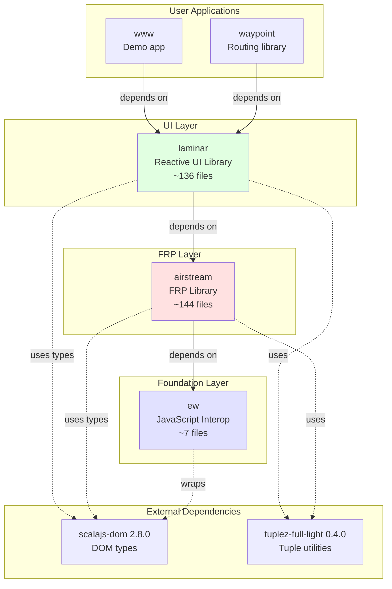

# Laminar & Airstream Architecture: Separation of Concerns

## Table of Contents
1. [Executive Summary](#executive-summary)
2. [Library Dependency Diagram](#library-dependency-diagram)
3. [Separation of Concerns](#separation-of-concerns)
4. [Bridge Points Between Libraries](#bridge-points-between-libraries)
5. [Type Hierarchy and Integration](#type-hierarchy-and-integration)
6. [Data Flow Architecture](#data-flow-architecture)
7. [Component Responsibility Matrix](#component-responsibility-matrix)
8. [Code Examples](#code-examples)
9. [Design Philosophy](#design-philosophy)
10. [Major Bridge Components](#major-bridge-components)

---

## Executive Summary

**Laminar** and **Airstream** are **two distinct libraries** with well-defined responsibilities, connected through specific bridge points:

| Library | Responsibility | Key Insight |
|---------|---------------|-------------|
| **Airstream** | FRP (Functional Reactive Programming) primitives | Pure reactive streams with no DOM knowledge |
| **Laminar** | Reactive UI library for DOM manipulation | Uses Airstream types to create reactive DOM bindings |
| **ew** | JavaScript interop utilities | Foundation for both libraries |

**The Key Relationship**:
```
ew (JavaScript interop)
  ↓ used by
Airstream (FRP primitives: Observable, Signal, EventStream, Observer, Ownership)
  ↓ used by
Laminar (DOM: ReactiveElement, Modifier, Binder, Inserter, EventListener)
  ↓ used by
User Application
```

**Critical Insight**: Airstream has **zero knowledge of the DOM**. Laminar bridges Airstream's reactive primitives to DOM operations through specific integration points (Binder, Inserter, EventListener, Modifier).

---

## Library Dependency Diagram

### Module Dependencies (from build.mill)



**Key Points**:
- **ew** has no dependencies on other modules (foundation)
- **airstream** depends only on **ew** (no DOM manipulation)
- **laminar** depends on **airstream** (uses FRP primitives for reactive DOM)
- Both use **scalajs-dom** for DOM types, but only Laminar manipulates the DOM

---

## Separation of Concerns

### What Airstream is Responsible For

**File**: `airstream/src/io/github/nguyenyou/airstream/`

**Core Responsibilities**:
1. **FRP Primitives**:
   - `Observable[A]` - Base type for reactive streams
   - `EventStream[A]` - Discrete events over time
   - `Signal[A]` - Continuous values (always has current value)
   - `Observer[A]` - Consumes events from observables

2. **State Management**:
   - `Var[A]` - Mutable reactive variable
   - `Val[A]` - Immutable reactive value
   - `EventBus[A]` - Manual event emission

3. **Ownership System**:
   - `Owner` - Manages one-time subscriptions
   - `DynamicOwner` - Manages reusable subscriptions
   - `DynamicSubscription` - Subscription that can activate/deactivate
   - `TransferableSubscription` - Subscription that can transfer between owners
   - `Subscription` - Represents a leaky resource with cleanup

4. **Transaction System**:
   - `Transaction` - Batches reactive updates to prevent glitches
   - `Transaction.onStart.shared` - Defers execution until all observers added
   - Topological ordering to ensure correct firing order

5. **Stream Operators**:
   - `map`, `filter`, `collect`, `flatMap`, `combineWith`, `split`, etc.
   - Timing operators: `debounce`, `throttle`, `delay`
   - Flattening strategies: `SwitchStreamStrategy`, `ConcurrentStreamStrategy`

**What Airstream Does NOT Do**:
- ❌ No DOM manipulation
- ❌ No knowledge of HTML elements
- ❌ No event listeners (DOM events)
- ❌ No rendering
- ❌ No mounting/unmounting

---

### What Laminar is Responsible For

**File**: `laminar/src/io/github/nguyenyou/laminar/`

**Core Responsibilities**:
1. **DOM Node Wrappers**:
   - `ReactiveElement` - Wrapper around `dom.Element`
   - `ReactiveHtmlElement` - Wrapper around `dom.html.Element`
   - `ReactiveSvgElement` - Wrapper around `dom.svg.Element`
   - `TextNode` - Wrapper around `dom.Text`
   - `CommentNode` - Wrapper around `dom.Comment`

2. **Element Lifecycle**:
   - `pilotSubscription` - Manages element mount/unmount
   - `ParentNode` trait - Contains `DynamicOwner` for managing subscriptions
   - `ChildNode` trait - Can be a child of another node
   - Mount hooks: `onMountCallback`, `onMountBind`, `onMountInsert`, etc.

3. **Reactive Modifiers**:
   - `Modifier[El]` - Base trait for element modifications
   - `Setter[El]` - Idempotent modifier (static configuration)
   - `Binder[El]` - Non-idempotent modifier (creates subscriptions)
   - `KeyUpdater` - Updates attributes/properties/styles from Observable

4. **Dynamic Content Insertion**:
   - `Inserter` - Base for inserting child nodes
   - `DynamicInserter` - Reactive child insertion
   - `ChildInserter` - Single child from Observable
   - `ChildrenInserter` - Multiple children from Observable
   - `ChildTextInserter` - Text content from Observable

5. **Event Handling**:
   - `EventListener` - Attaches DOM event listeners
   - `EventProcessor` - Transforms/filters events
   - `EventProp` - Represents event types (onClick, onInput, etc.)

6. **Type-Safe Keys**:
   - `HtmlAttr[V]` - HTML attributes
   - `HtmlProp[V, DomV]` - HTML properties
   - `StyleProp[V]` - CSS styles
   - `SvgAttr[V]` - SVG attributes
   - `EventProp[Ev]` - DOM events

**What Laminar Does NOT Do**:
- ❌ No FRP implementation (uses Airstream)
- ❌ No transaction management (uses Airstream's Transaction)
- ❌ No ownership implementation (uses Airstream's DynamicOwner)

---


