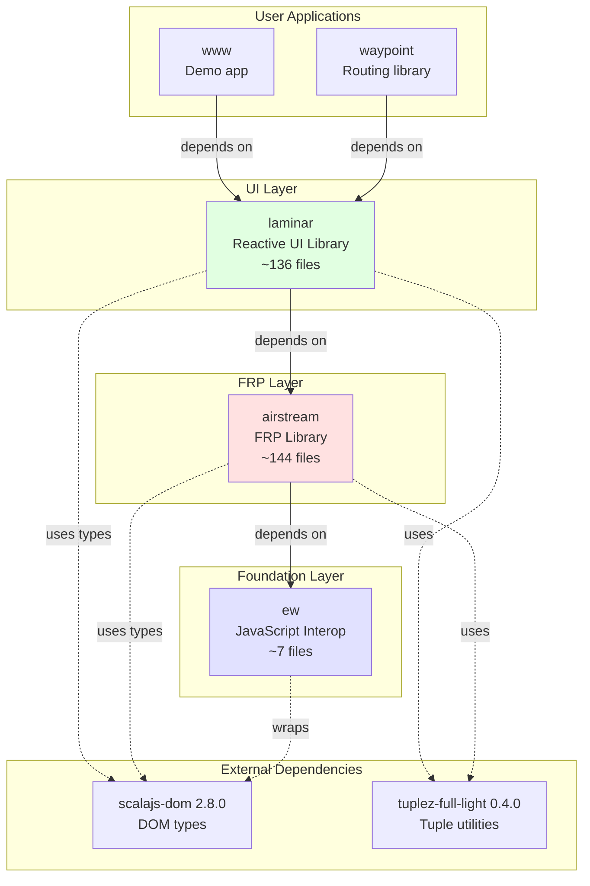
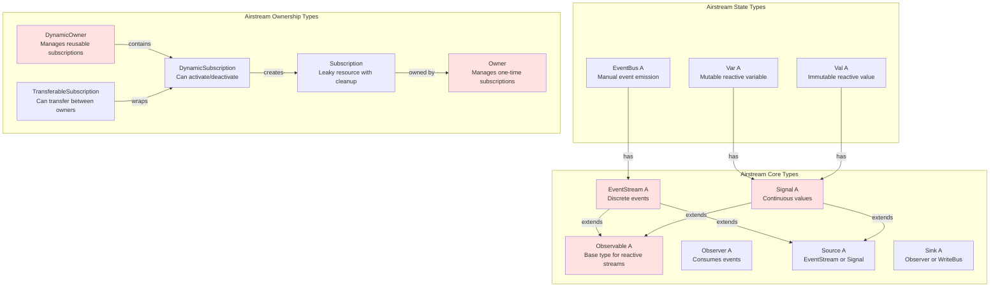
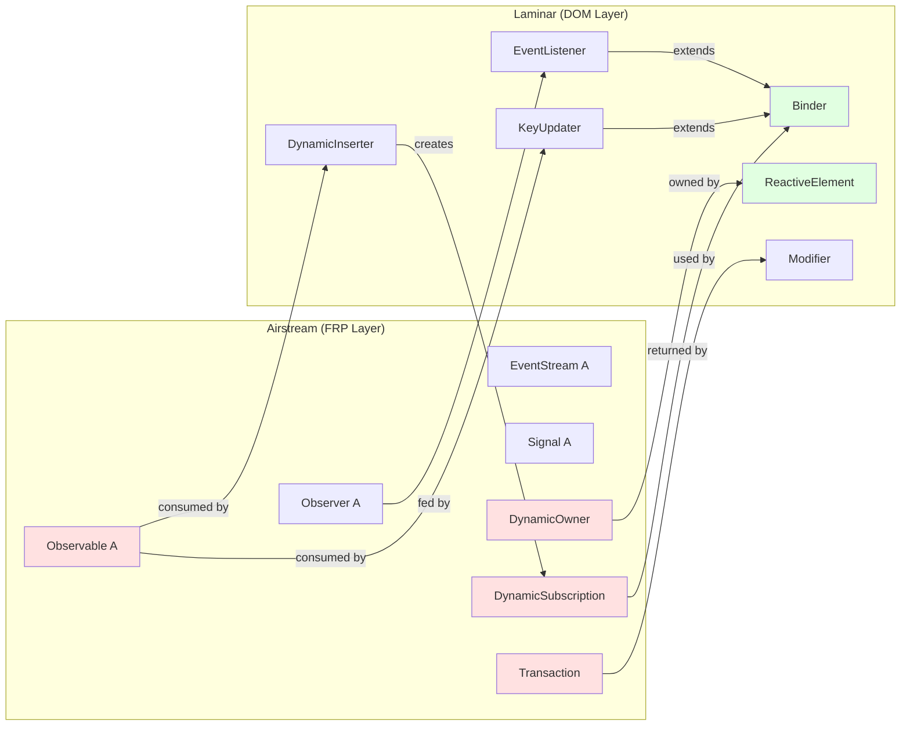

# Laminar & Airstream Architecture: Separation of Concerns

## Table of Contents
1. [Executive Summary](#executive-summary)
2. [Library Dependency Diagram](#library-dependency-diagram)
3. [Separation of Concerns](#separation-of-concerns)
4. [Bridge Points Between Libraries](#bridge-points-between-libraries)
5. [Type Hierarchy and Integration](#type-hierarchy-and-integration)
6. [Data Flow Architecture](#data-flow-architecture)
7. [Component Responsibility Matrix](#component-responsibility-matrix)
8. [Code Examples](#code-examples)
9. [Design Philosophy](#design-philosophy)
10. [Major Bridge Components](#major-bridge-components)

---

## Executive Summary

**Laminar** and **Airstream** are **two distinct libraries** with well-defined responsibilities, connected through specific bridge points:

| Library | Responsibility | Key Insight |
|---------|---------------|-------------|
| **Airstream** | FRP (Functional Reactive Programming) primitives | Pure reactive streams with no DOM knowledge |
| **Laminar** | Reactive UI library for DOM manipulation | Uses Airstream types to create reactive DOM bindings |
| **ew** | JavaScript interop utilities | Foundation for both libraries |

**The Key Relationship**:
```
ew (JavaScript interop)
  ↓ used by
Airstream (FRP primitives: Observable, Signal, EventStream, Observer, Ownership)
  ↓ used by
Laminar (DOM: ReactiveElement, Modifier, Binder, Inserter, EventListener)
  ↓ used by
User Application
```

**Critical Insight**: Airstream has **zero knowledge of the DOM**. Laminar bridges Airstream's reactive primitives to DOM operations through specific integration points (Binder, Inserter, EventListener, Modifier).

---

## Library Dependency Diagram

### Module Dependencies (from build.mill)



**Key Points**:
- **ew** has no dependencies on other modules (foundation)
- **airstream** depends only on **ew** (no DOM manipulation)
- **laminar** depends on **airstream** (uses FRP primitives for reactive DOM)
- Both use **scalajs-dom** for DOM types, but only Laminar manipulates the DOM

---

## Separation of Concerns

### What Airstream is Responsible For

**File**: `airstream/src/io/github/nguyenyou/airstream/`

**Core Responsibilities**:
1. **FRP Primitives**:
   - `Observable[A]` - Base type for reactive streams
   - `EventStream[A]` - Discrete events over time
   - `Signal[A]` - Continuous values (always has current value)
   - `Observer[A]` - Consumes events from observables

2. **State Management**:
   - `Var[A]` - Mutable reactive variable
   - `Val[A]` - Immutable reactive value
   - `EventBus[A]` - Manual event emission

3. **Ownership System**:
   - `Owner` - Manages one-time subscriptions
   - `DynamicOwner` - Manages reusable subscriptions
   - `DynamicSubscription` - Subscription that can activate/deactivate
   - `TransferableSubscription` - Subscription that can transfer between owners
   - `Subscription` - Represents a leaky resource with cleanup

4. **Transaction System**:
   - `Transaction` - Batches reactive updates to prevent glitches
   - `Transaction.onStart.shared` - Defers execution until all observers added
   - Topological ordering to ensure correct firing order

5. **Stream Operators**:
   - `map`, `filter`, `collect`, `flatMap`, `combineWith`, `split`, etc.
   - Timing operators: `debounce`, `throttle`, `delay`
   - Flattening strategies: `SwitchStreamStrategy`, `ConcurrentStreamStrategy`

**What Airstream Does NOT Do**:
- ❌ No DOM manipulation
- ❌ No knowledge of HTML elements
- ❌ No event listeners (DOM events)
- ❌ No rendering
- ❌ No mounting/unmounting

---

### What Laminar is Responsible For

**File**: `laminar/src/io/github/nguyenyou/laminar/`

**Core Responsibilities**:
1. **DOM Node Wrappers**:
   - `ReactiveElement` - Wrapper around `dom.Element`
   - `ReactiveHtmlElement` - Wrapper around `dom.html.Element`
   - `ReactiveSvgElement` - Wrapper around `dom.svg.Element`
   - `TextNode` - Wrapper around `dom.Text`
   - `CommentNode` - Wrapper around `dom.Comment`

2. **Element Lifecycle**:
   - `pilotSubscription` - Manages element mount/unmount
   - `ParentNode` trait - Contains `DynamicOwner` for managing subscriptions
   - `ChildNode` trait - Can be a child of another node
   - Mount hooks: `onMountCallback`, `onMountBind`, `onMountInsert`, etc.

3. **Reactive Modifiers**:
   - `Modifier[El]` - Base trait for element modifications
   - `Setter[El]` - Idempotent modifier (static configuration)
   - `Binder[El]` - Non-idempotent modifier (creates subscriptions)
   - `KeyUpdater` - Updates attributes/properties/styles from Observable

4. **Dynamic Content Insertion**:
   - `Inserter` - Base for inserting child nodes
   - `DynamicInserter` - Reactive child insertion
   - `ChildInserter` - Single child from Observable
   - `ChildrenInserter` - Multiple children from Observable
   - `ChildTextInserter` - Text content from Observable

5. **Event Handling**:
   - `EventListener` - Attaches DOM event listeners
   - `EventProcessor` - Transforms/filters events
   - `EventProp` - Represents event types (onClick, onInput, etc.)

6. **Type-Safe Keys**:
   - `HtmlAttr[V]` - HTML attributes
   - `HtmlProp[V, DomV]` - HTML properties
   - `StyleProp[V]` - CSS styles
   - `SvgAttr[V]` - SVG attributes
   - `EventProp[Ev]` - DOM events

**What Laminar Does NOT Do**:
- ❌ No FRP implementation (uses Airstream)
- ❌ No transaction management (uses Airstream's Transaction)
- ❌ No ownership implementation (uses Airstream's DynamicOwner)

---

## Bridge Points Between Libraries

### Overview

Laminar integrates with Airstream through **specific, well-defined bridge points**. These are the only places where Laminar code directly uses Airstream types.

### Bridge Point 1: Airstream Type Aliases

**File**: `laminar/src/io/github/nguyenyou/laminar/api/AirstreamAliases.scala`

Laminar re-exports Airstream types for user convenience:

```scala
trait AirstreamAliases {
  // Core FRP types
  type EventStream[+A] = airstream.core.EventStream[A]
  type Signal[+A] = airstream.core.Signal[A]
  type Observable[+A] = airstream.core.Observable[A]
  type Observer[-A] = airstream.core.Observer[A]
  type Source[+A] = airstream.core.Source[A]
  type Sink[-A] = airstream.core.Sink[A]

  // State types
  type Var[A] = airstream.state.Var[A]
  type Val[A] = airstream.state.Val[A]
  type EventBus[A] = airstream.eventbus.EventBus[A]

  // Ownership types
  type Owner = airstream.ownership.Owner
  type DynamicOwner = airstream.ownership.DynamicOwner
  type DynamicSubscription = airstream.ownership.DynamicSubscription
  type Subscription = airstream.ownership.Subscription
}
```

**Why**: Users can write `import io.github.nguyenyou.laminar.api.L._` and get both Laminar and Airstream types.

---

### Bridge Point 2: ReactiveElement Uses DynamicOwner

**File**: `laminar/src/io/github/nguyenyou/laminar/nodes/ParentNode.scala:12-15`

```scala
private[nodes] val dynamicOwner: DynamicOwner = new DynamicOwner(() => {
  val path = DomApi.debugPath(ref).mkString(" > ")
  throw new Exception(s"Attempting to use owner of unmounted element: $path")
})
```

**What**: Every `ReactiveElement` has a `DynamicOwner` (from Airstream) that manages all subscriptions for that element.

**Why**: When element mounts, `dynamicOwner.activate()` activates all subscriptions. When unmounted, `dynamicOwner.deactivate()` cleans up.

---

### Bridge Point 3: Binder Creates DynamicSubscription

**File**: `laminar/src/io/github/nguyenyou/laminar/modifiers/Binder.scala`

```scala
import io.github.nguyenyou.airstream.ownership.DynamicSubscription

trait Binder[-El <: ReactiveElement.Base] extends Modifier[El] {
  def bind(element: El): DynamicSubscription  // ← Returns Airstream type!

  final override def apply(element: El): Unit = bind(element)
}
```

**What**: `Binder` is Laminar's abstraction for creating reactive bindings. It returns an Airstream `DynamicSubscription`.

**Why**: The `DynamicSubscription` is registered with the element's `DynamicOwner`, enabling automatic activation/deactivation on mount/unmount.

---

### Bridge Point 4: KeyUpdater Binds Observable to DOM

**File**: `laminar/src/io/github/nguyenyou/laminar/modifiers/KeyUpdater.scala`

```scala
import io.github.nguyenyou.airstream.core.Observable
import io.github.nguyenyou.airstream.ownership.DynamicSubscription

class KeyUpdater[-El <: ReactiveElement.Base, +K <: Key, V](
  val key: K,
  val values: Observable[V],  // ← Airstream Observable!
  val update: (El, V, Modifier.Any) => Unit
) extends Binder[El] {

  override def bind(element: El): DynamicSubscription = {
    element.onBoundKeyUpdater(key)
    ReactiveElement.bindFn(element, values) { value =>
      update(element, value, self)
    }
  }
}
```

**What**: `KeyUpdater` connects an Airstream `Observable[V]` to a DOM update function.

**Example**: `href <-- urlSignal` creates a `KeyUpdater` that updates the `href` attribute whenever `urlSignal` emits.

---

### Bridge Point 5: Inserters Use Observable for Dynamic Children

**File**: `laminar/src/io/github/nguyenyou/laminar/inserters/ChildTextInserter.scala`

```scala
import io.github.nguyenyou.airstream.core.Observable

object ChildTextInserter {
  def apply[Component](
    textSource: Observable[Component],  // ← Airstream Observable!
    renderable: RenderableText[Component]
  ): DynamicInserter = {
    new DynamicInserter(
      insertFn = (ctx, owner, _) => {
        textSource.foreach { newValue =>  // ← Subscribe to Observable
          // Update DOM text node
          textNode.ref.textContent = renderable.asString(newValue)
        }(using owner)  // ← Uses Airstream Owner!
      }
    )
  }
}
```

**What**: Inserters subscribe to Airstream `Observable` and update DOM children when values emit.

**Example**: `child.text <-- countSignal` creates a `ChildTextInserter` that updates text content.

---

### Bridge Point 6: EventListener Connects DOM Events to Observer

**File**: `laminar/src/io/github/nguyenyou/laminar/modifiers/EventListener.scala`

```scala
import io.github.nguyenyou.airstream.ownership.{DynamicSubscription, Subscription}

class EventListener[Ev <: dom.Event, Out](
  val eventProcessor: EventProcessor[Ev, Out],
  val callback: Out => Unit  // ← This is Observer.onNext!
) extends Binder[ReactiveElement.Base] {

  override def bind(element: ReactiveElement.Base): DynamicSubscription = {
    val subscribe = (ctx: MountContext[ReactiveElement.Base]) => {
      DomApi.addEventListener(element.ref, this)  // ← DOM operation
      new Subscription(  // ← Airstream Subscription!
        ctx.owner,
        cleanup = () => DomApi.removeEventListener(element.ref, this)
      )
    }
    ReactiveElement.bindSubscriptionUnsafe(element)(subscribe)
  }
}
```

**What**: `EventListener` bridges DOM events to Airstream `Observer`.

**Example**: `onClick --> observer` creates an `EventListener` that calls `observer.onNext(event)` when clicked.

---

### Bridge Point 7: ReactiveElement.events() Creates EventStream

**File**: `laminar/src/io/github/nguyenyou/laminar/nodes/ReactiveElement.scala:138-149`

```scala
import io.github.nguyenyou.airstream.core.EventStream
import io.github.nguyenyou.airstream.eventbus.EventBus

def events[Ev <: dom.Event, Out](
  prop: EventProcessor[Ev, Out]
): EventStream[Out] = {  // ← Returns Airstream EventStream!
  val eventBus = new EventBus[Out]  // ← Airstream EventBus!
  val listener = new EventListener[Ev, Out](
    prop,
    eventBus.writer.onNext  // ← Feed DOM events into EventBus
  )
  listener(this)
  eventBus.events  // ← Return the EventStream
}
```

**What**: Converts DOM events into Airstream `EventStream`.

**Example**: `element.events(onClick).map(_.clientX)` creates a stream of click X coordinates.

### Bridge Point 8: Modifier Uses Transaction.onStart.shared

**File**: `laminar/src/io/github/nguyenyou/laminar/modifiers/Modifier.scala`

```scala
import io.github.nguyenyou.airstream.core.Transaction

object Modifier {
  def apply[El <: ReactiveElement.Base](f: El => Unit): Modifier[El] = {
    new Modifier[El] {
      override def apply(element: El): Unit = {
        Transaction.onStart.shared {  // ← Airstream Transaction!
          f(element)
        }
      }
    }
  }
}
```

**What**: Laminar uses Airstream's `Transaction.onStart.shared` to ensure all observers are added before events fire.

**Why**: Prevents the "missing events" problem when multiple subscriptions are created simultaneously.

---

### Bridge Point 9: Receivers Use Source and Observable

**File**: `laminar/src/io/github/nguyenyou/laminar/receivers/ChildReceiver.scala`

```scala
import io.github.nguyenyou.airstream.core.Source

object ChildReceiver {
  def <--(childSource: Source[ChildNode.Base]): DynamicInserter = {
    ChildInserter(childSource.toObservable, ...)  // ← Convert Source to Observable
  }
}
```

**What**: Receivers accept Airstream `Source` (which can be `EventStream` or `Signal`) and convert to `Observable`.

**Example**: `child <-- signal` or `child <-- stream` both work because `Source` is the common supertype.

---

### Bridge Point 10: Implicits Enrich Source with --> Operator

**File**: `laminar/src/io/github/nguyenyou/laminar/api/Implicits.scala`

```scala
import io.github.nguyenyou.airstream.core.{Sink, Source}

@inline implicit def enrichSource[A](source: Source[A]): RichSource[A] = {
  new RichSource(source)
}

class RichSource[A](val source: Source[A]) extends AnyVal {
  def -->(sink: Sink[A]): Binder.Base = {
    Binder(ReactiveElement.bindSink(_, source.toObservable)(sink))
  }

  def -->(onNext: A => Unit): Binder.Base = {
    Binder(ReactiveElement.bindFn(_, source.toObservable)(onNext))
  }
}
```

**What**: Laminar adds the `-->` operator to Airstream's `Source` type via implicit conversion.

**Example**: `signal --> observer` creates a `Binder` that subscribes the observer to the signal.

---

## Type Hierarchy and Integration

### Airstream Type Hierarchy



### Laminar Type Hierarchy

```mermaid
graph TB
    subgraph "Laminar DOM Nodes"
        REACTIVENODE[ReactiveNode<br/>Base for all nodes]
        CHILDNODE[ChildNode<br/>Can be a child]
        PARENTNODE[ParentNode<br/>Can have children]
        REACTIVEELEMENT[ReactiveElement<br/>Combines ChildNode + ParentNode]
        HTMLELEMENT[ReactiveHtmlElement<br/>HTML elements]
        SVGELEMENT[ReactiveSvgElement<br/>SVG elements]
        TEXTNODE[TextNode<br/>Text content]
    end

    subgraph "Laminar Modifiers"
        MODIFIER[Modifier El<br/>Base for modifications]
        SETTER[Setter El<br/>Idempotent]
        BINDER[Binder El<br/>Creates subscriptions]
        KEYUPDATER[KeyUpdater<br/>Observable to DOM]
        EVENTLISTENER[EventListener<br/>DOM events to Observer]
    end

    subgraph "Laminar Inserters"
        INSERTER[Inserter<br/>Base for inserters]
        STATICINSERTER[StaticInserter<br/>Static content]
        DYNAMICINSERTER[DynamicInserter<br/>Reactive content]
        CHILDINSERTER[ChildInserter<br/>Single child]
        CHILDRENINSERTER[ChildrenInserter<br/>Multiple children]
    end

    CHILDNODE -->|extends| REACTIVENODE
    PARENTNODE -->|extends| REACTIVENODE
    REACTIVEELEMENT -->|extends| CHILDNODE
    REACTIVEELEMENT -->|extends| PARENTNODE
    HTMLELEMENT -->|extends| REACTIVEELEMENT
    SVGELEMENT -->|extends| REACTIVEELEMENT
    TEXTNODE -->|extends| CHILDNODE

    SETTER -->|extends| MODIFIER
    BINDER -->|extends| MODIFIER
    KEYUPDATER -->|extends| BINDER
    EVENTLISTENER -->|extends| BINDER

    STATICINSERTER -->|extends| INSERTER
    DYNAMICINSERTER -->|extends| INSERTER

    style REACTIVEELEMENT fill:#e1ffe1
    style MODIFIER fill:#e1ffe1
    style BINDER fill:#e1ffe1
    style INSERTER fill:#e1ffe1
```



### Integration: How Laminar Uses Airstream Types



---

