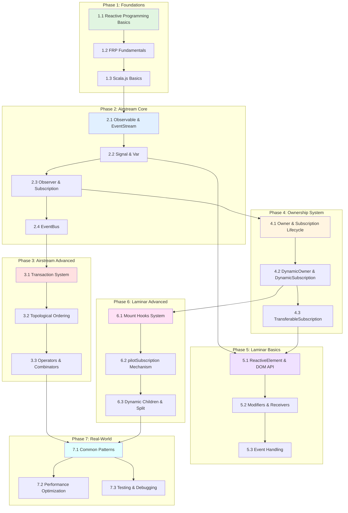

# Laminar & Airstream Learning Roadmap

## Table of Contents
1. [Quick Start Guide](#quick-start-guide)
2. [Learning Path Overview](#learning-path-overview)
3. [Phase 1: Foundations](#phase-1-foundations)
4. [Phase 2: Airstream Core](#phase-2-airstream-core)
5. [Phase 3: Airstream Advanced](#phase-3-airstream-advanced)
6. [Phase 4: Ownership System](#phase-4-ownership-system)
7. [Phase 5: Laminar Basics](#phase-5-laminar-basics)
8. [Phase 6: Laminar Advanced](#phase-6-laminar-advanced)
9. [Phase 7: Real-World Patterns](#phase-7-real-world-patterns)
10. [Checkpoints & Projects](#checkpoints--projects)

---

## Quick Start Guide

**"I want to..."**

| Goal | Start Here | Modules Needed |
|------|-----------|----------------|
| **Build a simple counter app** | [Module 1.1](#module-11-reactive-programming-basics) | 1.1 → 2.1 → 2.2 → 5.1 → 5.2 |
| **Understand how Laminar works internally** | [Module 1.2](#module-12-frp-fundamentals) | All modules in order |
| **Debug reactive issues** | [Module 3.1](#module-31-transaction-system) | 2.1 → 2.2 → 2.3 → 3.1 → 3.2 |
| **Build dynamic lists** | [Module 6.3](#module-63-dynamic-children-split) | 1.1 → 2.1 → 2.2 → 5.1 → 6.3 |
| **Understand mount/unmount lifecycle** | [Module 6.1](#module-61-mount-hooks-system) | 4.1 → 4.2 → 5.1 → 6.1 |
| **Optimize performance** | [Module 7.2](#module-72-performance-optimization) | All modules → 7.2 |

---

## Learning Path Overview

### Dependency Graph



### Estimated Total Time

- **Quick Start (build simple apps)**: 8-12 hours
- **Intermediate (understand core concepts)**: 30-40 hours
- **Advanced (deep internals understanding)**: 60-80 hours
- **Expert (contribute to codebase)**: 100+ hours

---

## Phase 1: Foundations

### Module 1.1: Reactive Programming Basics

**Difficulty**: 🟢 Beginner  
**Prerequisites**: Basic Scala knowledge  
**Estimated Time**: 2-3 hours

#### Core Concepts

1. **What is Reactive Programming?**
   - Data flows and automatic propagation of changes
   - Push-based vs pull-based systems
   - Declarative vs imperative updates

2. **The Observer Pattern**
   - Observable (data source) and Observer (data consumer)
   - Subscription lifecycle
   - Memory management concerns

3. **Why Reactive?**
   - Eliminates manual DOM updates
   - Automatic dependency tracking
   - Composable data transformations

#### Key Files to Study

- `www/src/www/index.scala:1-18` - Simple counter example
- `airstream/src/io/github/nguyenyou/airstream/core/Observer.scala:9-20` - Observer trait

#### Hands-on Exercise

```scala
// Exercise 1: Manual reactive system (understand the problem)
var count = 0
var doubled = 0

def updateCount(newValue: Int): Unit = {
  count = newValue
  doubled = count * 2  // Manual update - easy to forget!
  updateUI()
}

// Exercise 2: With Airstream (see the solution)
val count = Var(0)
val doubled = count.signal.map(_ * 2)

// doubled automatically updates when count changes!
```

#### Common Pitfalls

- ❌ Forgetting to update dependent values manually
- ❌ Creating memory leaks by not unsubscribing
- ❌ Mixing imperative and reactive styles

#### Related Documentation

- [TRANSACTION_SYSTEM_DEEP_DIVE.md](TRANSACTION_SYSTEM_DEEP_DIVE.md#the-problem-transaction-solves) - Why reactive systems need transactions

---

### Module 1.2: FRP Fundamentals

**Difficulty**: 🟢 Beginner  
**Prerequisites**: Module 1.1  
**Estimated Time**: 3-4 hours

#### Core Concepts

1. **Functional Reactive Programming (FRP)**
   - Time-varying values (Signals)
   - Discrete events (EventStreams)
   - Pure functions for transformations

2. **FRP Glitches**
   - Diamond dependency problem
   - Inconsistent intermediate states
   - Why order matters

3. **Topological Ordering**
   - Dependency graphs
   - Parent-child relationships
   - Execution order guarantees

#### Key Files to Study

- `airstream/test/src/com/raquo/airstream/core/GlitchSpec.scala:13-51` - Glitch prevention examples
- [TRANSACTION_SYSTEM_DEEP_DIVE.md](TRANSACTION_SYSTEM_DEEP_DIVE.md#the-problem-transaction-solves)

#### Hands-on Exercise

```scala
// Exercise: Diamond dependency
val a = Var(1)
val b = a.signal.map(_ * 2)      // b = 2
val c = a.signal.map(_ * 3)      // c = 3
val d = b.combineWith(c)(_ + _)  // d = 5

// Question: When a.set(2), what values does d see?
// Answer: Only (4, 6) = 10, never glitches like (4, 3) or (2, 6)

// Try it yourself and observe!
d.addObserver(Observer(println))
a.set(2)
```

#### Common Pitfalls

- ❌ Assuming synchronous execution order
- ❌ Not understanding why glitches are bad
- ❌ Trying to manually control update order

#### Related Documentation

- [TRANSACTION_SYSTEM_DEEP_DIVE.md](TRANSACTION_SYSTEM_DEEP_DIVE.md#topological-ordering-and-glitch-prevention)

---

### Module 1.3: Scala.js Basics

**Difficulty**: 🟢 Beginner  
**Prerequisites**: Scala knowledge  
**Estimated Time**: 2-3 hours

#### Core Concepts

1. **Scala.js Compilation**
   - Scala → JavaScript compilation
   - JavaScript interop
   - DOM access from Scala

2. **JavaScript Types**
   - `js.Array`, `js.Map`, `js.Set`
   - `js.UndefOr[A]` for optional values
   - `dom.Element`, `dom.Event` types

3. **Build System**
   - Mill build tool
   - `fullLinkJS` for production
   - Vite for development

#### Key Files to Study

- `ew/src/io/github/nguyenyou/ew/JsArray.scala` - JavaScript array extensions
- `build.mill` - Build configuration

#### Hands-on Exercise

```scala
// Exercise: JavaScript interop
import scala.scalajs.js
import org.scalajs.dom

// Create a JavaScript array
val jsArr = js.Array(1, 2, 3)

// Access DOM
val element = dom.document.getElementById("app")

// Optional values
val maybeValue: js.UndefOr[String] = js.undefined
maybeValue.foreach(println)  // Won't print
```

#### Common Pitfalls

- ❌ Using Scala collections instead of `js.Array` for performance
- ❌ Not handling `js.UndefOr` properly
- ❌ Forgetting to run `fullLinkJS` before production

---

## Phase 2: Airstream Core

### Module 2.1: Observable & EventStream

**Difficulty**: 🟡 Intermediate  
**Prerequisites**: Modules 1.1, 1.2, 1.3  
**Estimated Time**: 4-5 hours

#### Core Concepts

1. **Observable Trait**
   - Base type for all reactive streams
   - `map`, `filter`, `collect` operators
   - Lazy evaluation (only active when observed)

2. **EventStream**
   - Discrete events over time
   - No current value
   - Examples: clicks, HTTP responses

3. **Observable Lifecycle**
   - Started vs stopped
   - Internal vs external observers
   - topoRank for ordering

#### Key Files to Study

- `airstream/src/io/github/nguyenyou/airstream/core/Observable.scala:11-16` - Observable trait
- `airstream/src/io/github/nguyenyou/airstream/core/EventStream.scala:1-50` - EventStream definition
- `airstream/src/io/github/nguyenyou/airstream/core/BaseObservable.scala` - Core implementation

#### Hands-on Exercise

```scala
// Exercise 1: Create and transform streams
val clicks = EventBus[Unit]
val clickCount = clicks.events.foldLeft(0)((acc, _) => acc + 1)

clickCount.addObserver(Observer(count => println(s"Clicks: $count")))

clicks.writer.onNext(())  // Prints: Clicks: 1
clicks.writer.onNext(())  // Prints: Clicks: 2

// Exercise 2: Map and filter
val numbers = EventBus[Int]
val evenDoubled = numbers.events
  .filter(_ % 2 == 0)
  .map(_ * 2)

evenDoubled.addObserver(Observer(println))

numbers.writer.onNext(1)  // Nothing
numbers.writer.onNext(2)  // Prints: 4
numbers.writer.onNext(3)  // Nothing
numbers.writer.onNext(4)  // Prints: 8
```

#### Common Pitfalls

- ❌ Expecting EventStream to have a current value
- ❌ Not understanding lazy evaluation
- ❌ Forgetting that streams need observers to be active

#### Related Documentation

- [TRANSACTION_SYSTEM_DEEP_DIVE.md](TRANSACTION_SYSTEM_DEEP_DIVE.md#scenario-3-eventbus-creating-new-transaction)

---

### Module 2.2: Signal & Var

**Difficulty**: 🟡 Intermediate
**Prerequisites**: Module 2.1
**Estimated Time**: 4-5 hours

#### Core Concepts

1. **Signal**
   - Always has a current value
   - Represents state over time
   - `.now()` to read current value
   - `.changes` to get EventStream of changes

2. **Var**
   - Writable Signal
   - `.set(value)` to update
   - `.update(fn)` to transform
   - Source of truth for mutable state

3. **Signal vs EventStream**
   - Signal: continuous value (temperature)
   - EventStream: discrete events (button clicks)
   - When to use which

#### Key Files to Study

- `airstream/src/io/github/nguyenyou/airstream/core/Signal.scala:25-50` - Signal trait
- `airstream/src/io/github/nguyenyou/airstream/state/Var.scala` - Var implementation
- `www/src/www/index.scala:7-16` - Simple Var usage

#### Hands-on Exercise

```scala
// Exercise 1: Basic Var usage
val count = Var(0)

// Read current value
println(count.now())  // 0

// Update value
count.set(5)
println(count.now())  // 5

// Transform value
count.update(_ + 1)
println(count.now())  // 6

// Exercise 2: Signal transformations
val doubled = count.signal.map(_ * 2)
val isEven = count.signal.map(_ % 2 == 0)

doubled.addObserver(Observer(println))  // Prints: 12
isEven.addObserver(Observer(println))   // Prints: true

count.set(7)
// doubled prints: 14
// isEven prints: false

// Exercise 3: Combining signals
val a = Var(2)
val b = Var(3)
val sum = a.signal.combineWith(b.signal)(_ + _)

sum.addObserver(Observer(println))  // Prints: 5

a.set(10)  // Prints: 13
b.set(20)  // Prints: 30
```

#### Common Pitfalls

- ❌ Using `.now()` in reactive code (breaks reactivity)
- ❌ Not understanding that Signal always has a value
- ❌ Confusing `.signal` (the Signal) with `.changes` (EventStream)

#### Related Documentation

- [TRANSACTION_SYSTEM_DEEP_DIVE.md](TRANSACTION_SYSTEM_DEEP_DIVE.md#scenario-1-simple-signal-update)

---

### Module 2.3: Observer & Subscription

**Difficulty**: 🟡 Intermediate
**Prerequisites**: Modules 2.1, 2.2
**Estimated Time**: 3-4 hours

#### Core Concepts

1. **Observer**
   - Consumes events from Observables
   - `onNext(value)` callback
   - `onError(error)` for error handling
   - Side effects happen here

2. **Subscription**
   - Represents the connection between Observable and Observer
   - Must be cleaned up to prevent memory leaks
   - `.kill()` to unsubscribe

3. **Owner**
   - Manages subscription lifecycle
   - Automatically kills subscriptions when owner is killed
   - Prevents memory leaks

#### Key Files to Study

- `airstream/src/io/github/nguyenyou/airstream/core/Observer.scala:9-30` - Observer trait
- `airstream/src/io/github/nguyenyou/airstream/ownership/Subscription.scala` - Subscription
- `airstream/src/io/github/nguyenyou/airstream/ownership/Owner.scala` - Owner trait

#### Hands-on Exercise

```scala
// Exercise 1: Manual subscription (BAD - memory leak!)
val stream = EventBus[Int]
val subscription = stream.events.addObserver(Observer(println))

// Later... you must remember to clean up!
subscription.kill()

// Exercise 2: With Owner (GOOD - automatic cleanup)
given owner: Owner = new Owner {}

stream.events.addObserver(Observer(println))  // Uses implicit owner

// When owner is killed, all subscriptions are automatically cleaned up
owner.killSubscriptions()

// Exercise 3: Multiple observers
val count = Var(0)

count.signal.addObserver(Observer { value =>
  println(s"Observer 1: $value")
})

count.signal.addObserver(Observer { value =>
  println(s"Observer 2: $value")
})

count.set(5)
// Prints:
// Observer 1: 5
// Observer 2: 5
```

#### Common Pitfalls

- ❌ Forgetting to kill subscriptions (memory leaks!)
- ❌ Not using Owner for automatic cleanup
- ❌ Throwing exceptions in Observer callbacks

#### Related Documentation

- [MOUNT_HOOKS_SYSTEM.md](MOUNT_HOOKS_SYSTEM.md#ownership-system-integration)

---

### Module 2.4: EventBus

**Difficulty**: 🟡 Intermediate
**Prerequisites**: Modules 2.1, 2.2, 2.3
**Estimated Time**: 2-3 hours

#### Core Concepts

1. **EventBus**
   - Combines WriteBus (input) and EventStream (output)
   - Manual event emission
   - Bridge between imperative and reactive code

2. **WriteBus**
   - Write-only interface
   - `.onNext(value)` to emit events
   - Permission management (pass only writer to functions)

3. **Use Cases**
   - User interactions (button clicks)
   - External events (WebSocket messages)
   - Custom event sources

#### Key Files to Study

- `airstream/src/io/github/nguyenyou/airstream/eventbus/EventBus.scala:8-30` - EventBus class
- `airstream/src/io/github/nguyenyou/airstream/eventbus/WriteBus.scala` - WriteBus implementation
- `airstream/src/io/github/nguyenyou/airstream/eventbus/EventBusStream.scala:36-46` - Transaction creation

#### Hands-on Exercise

```scala
// Exercise 1: Basic EventBus
val clickBus = new EventBus[String]

clickBus.events.addObserver(Observer(println))

clickBus.writer.onNext("Hello")   // Prints: Hello
clickBus.writer.onNext("World")   // Prints: World

// Exercise 2: Permission management
def handleClicks(writer: WriteBus[String]): Unit = {
  // This function can only WRITE, not read events
  writer.onNext("Click!")
}

handleClicks(clickBus.writer)  // Prints: Click!

// Exercise 3: Multiple EventBuses
val bus1 = new EventBus[Int]
val bus2 = new EventBus[Int]

val merged = bus1.events.merge(bus2.events)
merged.addObserver(Observer(println))

bus1.writer.onNext(1)  // Prints: 1
bus2.writer.onNext(2)  // Prints: 2
bus1.writer.onNext(3)  // Prints: 3
```

#### Common Pitfalls

- ❌ Exposing EventBus instead of just writer or events
- ❌ Not understanding that each emit creates a new transaction
- ❌ Trying to emit multiple values in one transaction

#### Related Documentation

- [TRANSACTION_SYSTEM_DEEP_DIVE.md](TRANSACTION_SYSTEM_DEEP_DIVE.md#scenario-3-eventbus-creating-new-transaction)

---

## Phase 3: Airstream Advanced

### Module 3.1: Transaction System

**Difficulty**: 🔴 Advanced
**Prerequisites**: Modules 2.1, 2.2, 2.3, 2.4
**Estimated Time**: 6-8 hours

#### Core Concepts

1. **What is a Transaction?**
   - A "moment in time" for reactive updates
   - Guarantees no FRP glitches
   - Batches multiple updates atomically

2. **Transaction Lifecycle**
   - Creation → Execution → Resolve pending → Completion
   - Depth-first execution of child transactions
   - Depth limit to prevent infinite loops

3. **Transaction.onStart.shared**
   - Defers execution until all observers are added
   - Critical for DynamicOwner.activate()
   - Prevents observers from missing events

#### Key Files to Study

- `airstream/src/io/github/nguyenyou/airstream/core/Transaction.scala:12-65` - Transaction class
- `airstream/src/io/github/nguyenyou/airstream/core/Transaction.scala:394-414` - run() method
- [TRANSACTION_SYSTEM_DEEP_DIVE.md](TRANSACTION_SYSTEM_DEEP_DIVE.md) - Complete deep dive

#### Hands-on Exercise

```scala
// Exercise 1: Observe transaction batching
val a = Var(1)
val b = a.signal.map { value =>
  println(s"b computing: $value * 2")
  value * 2
}
val c = a.signal.map { value =>
  println(s"c computing: $value * 3")
  value * 3
}
val d = b.combineWith(c) { (b, c) =>
  println(s"d computing: $b + $c")
  b + c
}

given owner: Owner = new Owner {}
d.addObserver(Observer(result => println(s"Result: $result")))

a.set(2)
// Observe: Each computation happens exactly once!
// b computing: 2 * 2
// c computing: 2 * 3
// d computing: 4 + 6
// Result: 10

// Exercise 2: Manual transaction
Transaction { trx =>
  println("Inside transaction")
  a.set(5)
  println("Still inside transaction")
}
println("Transaction completed")
```

#### Common Pitfalls

- ❌ Not understanding why transactions are needed
- ❌ Creating infinite loops (exceeding depth limit)
- ❌ Trying to manually control transaction execution

#### Related Documentation

- [TRANSACTION_SYSTEM_DEEP_DIVE.md](TRANSACTION_SYSTEM_DEEP_DIVE.md) - **READ THIS ENTIRE DOCUMENT**

---

### Module 3.2: Topological Ordering

**Difficulty**: 🔴 Advanced
**Prerequisites**: Module 3.1
**Estimated Time**: 4-5 hours

#### Core Concepts

1. **topoRank**
   - Integer representing depth in dependency graph
   - `topoRank = max(parent ranks) + 1`
   - Ensures parents fire before children

2. **Priority Queue**
   - Pending observables sorted by topoRank
   - Dequeue lowest rank first
   - Prevents glitches

3. **Glitch Prevention**
   - Diamond dependencies handled correctly
   - Observables only see consistent states
   - Single emission per transaction

#### Key Files to Study

- `airstream/src/io/github/nguyenyou/airstream/core/Protected.scala:27-62` - topoRank calculation
- `airstream/src/io/github/nguyenyou/airstream/util/JsPriorityQueue.scala` - Priority queue
- `airstream/src/io/github/nguyenyou/airstream/misc/MapSignal.scala:27` - topoRank example
- [TRANSACTION_SYSTEM_DEEP_DIVE.md](TRANSACTION_SYSTEM_DEEP_DIVE.md#topological-ordering-and-glitch-prevention)

#### Hands-on Exercise

```scala
// Exercise: Verify glitch prevention
val calculations = mutable.Buffer[(Int, Int)]()

val a = Var(1)
val b = a.signal.map(_ * 2)
val c = a.signal.map(_ * 3)
val d = b.combineWith(c) { (b, c) =>
  calculations += ((b, c))  // Track all values seen
  b + c
}

given owner: Owner = new Owner {}
d.addObserver(Observer.empty)

a.set(2)

println(calculations)
// Expected: Buffer((4, 6))
// WITHOUT transactions: Buffer((4, 3), (4, 6)) or Buffer((2, 6), (4, 6))
// WITH transactions: Buffer((4, 6)) - NO GLITCHES!
```

#### Common Pitfalls

- ❌ Not understanding why order matters
- ❌ Assuming observables fire in creation order
- ❌ Manually trying to control firing order

#### Related Documentation

- [TRANSACTION_SYSTEM_DEEP_DIVE.md](TRANSACTION_SYSTEM_DEEP_DIVE.md#topological-ordering-and-glitch-prevention)

---

### Module 3.3: Operators & Combinators

**Difficulty**: 🟡 Intermediate
**Prerequisites**: Modules 2.1, 2.2, 3.1
**Estimated Time**: 5-6 hours

#### Core Concepts

1. **Transformation Operators**
   - `map`, `filter`, `collect`
   - `flatMap`, `flatten`
   - `distinct`, `distinctBy`

2. **Combination Operators**
   - `combineWith`, `combineWithFn`
   - `merge`, `mergeWith`
   - `sample`, `withCurrentValueOf`

3. **Timing Operators**
   - `delay`, `debounce`, `throttle`
   - `foldLeft`, `scanLeft`

#### Key Files to Study

- `airstream/src/io/github/nguyenyou/airstream/core/EventStream.scala` - Stream operators
- `airstream/src/io/github/nguyenyou/airstream/core/Signal.scala` - Signal operators
- `airstream/src/io/github/nguyenyou/airstream/combine/` - Combination operators

#### Hands-on Exercise

```scala
// Exercise 1: Transformation
val numbers = EventBus[Int]
val doubled = numbers.events.map(_ * 2)
val evens = numbers.events.filter(_ % 2 == 0)
val squares = numbers.events.collect { case n if n > 0 => n * n }

// Exercise 2: Combination
val a = Var(2)
val b = Var(3)
val sum = a.signal.combineWith(b.signal)(_ + _)
val product = a.signal.combineWith(b.signal)(_ * _)

// Exercise 3: Timing
val clicks = EventBus[Unit]
val debounced = clicks.events.debounce(300)  // Wait 300ms after last click
val throttled = clicks.events.throttle(1000)  // Max once per second
```

#### Common Pitfalls

- ❌ Overusing `flatMap` (creates new transactions)
- ❌ Not understanding `sample` vs `combineWith`
- ❌ Forgetting that timing operators are async

---

## Phase 4: Ownership System

### Module 4.1: Owner & Subscription Lifecycle

**Difficulty**: 🟡 Intermediate
**Prerequisites**: Module 2.3
**Estimated Time**: 3-4 hours

#### Core Concepts

1. **Owner**
   - Manages one-time subscriptions
   - Killed permanently when `.killSubscriptions()` called
   - Prevents memory leaks

2. **Subscription**
   - Represents a leaky resource
   - Must be cleaned up
   - Owned by an Owner

3. **Lifecycle**
   - Create → Active → Killed
   - Cannot be reused after killing
   - Automatic cleanup on owner kill

#### Key Files to Study

- `airstream/src/io/github/nguyenyou/airstream/ownership/Owner.scala` - Owner trait
- `airstream/src/io/github/nguyenyou/airstream/ownership/Subscription.scala` - Subscription
- `airstream/src/io/github/nguyenyou/airstream/ownership/OneTimeOwner.scala` - OneTimeOwner

#### Hands-on Exercise

```scala
// Exercise 1: Manual owner management
val owner = new Owner {}
val stream = EventBus[Int]

stream.events.addObserver(Observer(println))(using owner)

stream.writer.onNext(1)  // Prints: 1
stream.writer.onNext(2)  // Prints: 2

owner.killSubscriptions()  // Clean up

stream.writer.onNext(3)  // Nothing (subscription killed)

// Exercise 2: Multiple subscriptions
val owner2 = new Owner {}

stream.events.addObserver(Observer(x => println(s"A: $x")))(using owner2)
stream.events.addObserver(Observer(x => println(s"B: $x")))(using owner2)

stream.writer.onNext(10)
// Prints:
// A: 10
// B: 10

owner2.killSubscriptions()  // Kills both subscriptions
```

#### Common Pitfalls

- ❌ Reusing killed owners
- ❌ Not killing owners (memory leaks)
- ❌ Confusing Owner with DynamicOwner

#### Related Documentation

- [MOUNT_HOOKS_SYSTEM.md](MOUNT_HOOKS_SYSTEM.md#ownership-system-integration)

---

### Module 4.2: DynamicOwner & DynamicSubscription

**Difficulty**: 🔴 Advanced
**Prerequisites**: Module 4.1
**Estimated Time**: 5-6 hours

#### Core Concepts

1. **DynamicOwner**
   - Can be activated and deactivated repeatedly
   - Creates new OneTimeOwner on each activation
   - Used by ReactiveElement for mount/unmount

2. **DynamicSubscription**
   - Reusable subscription
   - `onActivate(owner)` and `onDeactivate()` callbacks
   - Managed by DynamicOwner

3. **Activation Lifecycle**
   - Inactive → Active → Inactive → Active (repeatable)
   - New OneTimeOwner created each time
   - Uses Transaction.onStart.shared for safety

#### Key Files to Study

- `airstream/src/io/github/nguyenyou/airstream/ownership/DynamicOwner.scala:51-83` - activate() method
- `airstream/src/io/github/nguyenyou/airstream/ownership/DynamicSubscription.scala` - DynamicSubscription
- `laminar/src/io/github/nguyenyou/laminar/nodes/ParentNode.scala:12-15` - DynamicOwner in elements

#### Hands-on Exercise

```scala
// Exercise 1: DynamicOwner lifecycle
val dynamicOwner = new DynamicOwner(() =>
  throw new Exception("Owner accessed after deactivation")
)

val stream = EventBus[Int]

// Create a dynamic subscription
val sub = DynamicSubscription.subscribeCallback(dynamicOwner) { owner =>
  stream.events.addObserver(Observer(println))(using owner)
}

// Activate
dynamicOwner.activate()
stream.writer.onNext(1)  // Prints: 1

// Deactivate
dynamicOwner.deactivate()
stream.writer.onNext(2)  // Nothing (deactivated)

// Reactivate
dynamicOwner.activate()
stream.writer.onNext(3)  // Prints: 3

// Exercise 2: Multiple activations
println(s"Is active: ${dynamicOwner.isActive}")  // true
dynamicOwner.deactivate()
println(s"Is active: ${dynamicOwner.isActive}")  // false
dynamicOwner.activate()
println(s"Is active: ${dynamicOwner.isActive}")  // true
```

#### Common Pitfalls

- ❌ Accessing owner when deactivated
- ❌ Not understanding Transaction.onStart.shared usage
- ❌ Confusing DynamicOwner with regular Owner

#### Related Documentation

- [MOUNT_HOOKS_SYSTEM.md](MOUNT_HOOKS_SYSTEM.md#dynamicowner-and-subscription-management)
- [TRANSACTION_SYSTEM_DEEP_DIVE.md](TRANSACTION_SYSTEM_DEEP_DIVE.md#scenario-4-transactiononstartshared-with-dynamicowner)

---

### Module 4.3: TransferableSubscription

**Difficulty**: 🔴 Advanced
**Prerequisites**: Module 4.2
**Estimated Time**: 4-5 hours

#### Core Concepts

1. **TransferableSubscription**
   - Special subscription that can transfer between owners
   - Used by pilotSubscription in ReactiveElement
   - Enables "live transfer" optimization

2. **Live Transfer**
   - Moving element from active parent to active parent
   - Subscription stays active (no deactivate/reactivate)
   - Prevents observers from missing events

3. **Transfer Conditions**
   - Old parent is active
   - New parent is active
   - Element is moving (not mounting/unmounting)

#### Key Files to Study

- `airstream/src/io/github/nguyenyou/airstream/ownership/TransferableSubscription.scala` - TransferableSubscription
- `laminar/src/io/github/nguyenyou/laminar/nodes/ReactiveElement.scala:22-25` - pilotSubscription
- [PILOT_SUBSCRIPTION_DEEP_DIVE.md](PILOT_SUBSCRIPTION_DEEP_DIVE.md) - Complete deep dive

#### Hands-on Exercise

```scala
// Exercise: Observe live transfer (conceptual)
// This happens automatically in Laminar when moving elements

val parent1 = div()
val parent2 = div()
val child = div("Moving child")

// Mount parent1
render(container, parent1)
parent1.appendChild(child)  // child activates

// Move to parent2 (both parents active)
parent2.appendChild(child)  // Live transfer! No deactivate/reactivate

// The child's subscriptions stay active throughout the move
```

#### Common Pitfalls

- ❌ Not understanding when live transfer happens
- ❌ Assuming all moves trigger deactivate/reactivate
- ❌ Confusing live transfer with normal transfer

#### Related Documentation

- [PILOT_SUBSCRIPTION_DEEP_DIVE.md](PILOT_SUBSCRIPTION_DEEP_DIVE.md) - **READ THIS ENTIRE DOCUMENT**

---

## Phase 5: Laminar Basics

### Module 5.1: ReactiveElement & DOM API

**Difficulty**: 🟡 Intermediate
**Prerequisites**: Modules 2.2, 4.2
**Estimated Time**: 4-5 hours

#### Core Concepts

1. **ReactiveElement**
   - Laminar wrapper around DOM elements
   - Combines ChildNode and ParentNode traits
   - Contains DynamicOwner and pilotSubscription

2. **DOM API**
   - Low-level DOM operations
   - `appendChild`, `insertBefore`, `removeChild`
   - Used by Laminar internally

3. **Element Lifecycle**
   - Created → Mounted → Unmounted → Mounted (repeatable)
   - pilotSubscription manages activation
   - DynamicOwner manages subscriptions

#### Key Files to Study

- `laminar/src/io/github/nguyenyou/laminar/nodes/ReactiveElement.scala:15-25` - ReactiveElement trait
- `laminar/src/io/github/nguyenyou/laminar/nodes/ParentNode.scala:12-15` - DynamicOwner
- `laminar/src/io/github/nguyenyou/laminar/DomApi.scala:27-38` - appendChild
- `laminar/src/io/github/nguyenyou/laminar/nodes/ChildNode.scala:24-48` - ChildNode trait

#### Hands-on Exercise

```scala
// Exercise 1: Create elements
val myDiv = div(
  className := "container",
  "Hello, World!"
)

// Exercise 2: Nest elements
val app = div(
  h1("Title"),
  p("Paragraph 1"),
  p("Paragraph 2"),
  div(
    span("Nested span")
  )
)

// Exercise 3: Access underlying DOM
val element = div("Content")
val domNode: dom.HTMLDivElement = element.ref
println(domNode.textContent)  // "Content"

// Exercise 4: Mount to DOM
render(
  dom.document.getElementById("app"),
  app
)
```

#### Common Pitfalls

- ❌ Manually manipulating DOM (breaks Laminar's state)
- ❌ Not understanding element lifecycle
- ❌ Accessing `.ref` before element is mounted

#### Related Documentation

- [RENDERING_QUICK_REFERENCE.md](RENDERING_QUICK_REFERENCE.md)
- [node-hierarchy.md](node-hierarchy.md)

---

### Module 5.2: Modifiers & Receivers

**Difficulty**: 🟡 Intermediate
**Prerequisites**: Module 5.1
**Estimated Time**: 4-5 hours

#### Core Concepts

1. **Modifier**
   - Something that can be applied to an element
   - Static modifiers: `attr := "value"`
   - Reactive modifiers: `attr <-- signal`

2. **Receiver**
   - Reactive binding that creates subscriptions
   - `<--` operator for binding
   - Different receivers for different targets

3. **Common Receivers**
   - `text <-- signal` - Text content
   - `child <-- stream` - Single child
   - `children <-- signal` - Multiple children
   - `attr <-- signal` - Attributes

#### Key Files to Study

- `laminar/src/io/github/nguyenyou/laminar/modifiers/Modifier.scala` - Modifier trait
- `laminar/src/io/github/nguyenyou/laminar/receivers/TextReceiver.scala` - Text binding
- `laminar/src/io/github/nguyenyou/laminar/receivers/ChildReceiver.scala` - Child binding
- `laminar/src/io/github/nguyenyou/laminar/api/Implicits.scala` - Implicit conversions

#### Hands-on Exercise

```scala
// Exercise 1: Static modifiers
val staticDiv = div(
  className := "container",
  idAttr := "my-div",
  title := "Tooltip text",
  "Static content"
)

// Exercise 2: Reactive text
val count = Var(0)
val counterDisplay = div(
  "Count: ",
  text <-- count.signal.map(_.toString)
)

count.set(5)  // Display updates to "Count: 5"

// Exercise 3: Reactive attributes
val isActive = Var(false)
val button = button(
  "Toggle",
  className <-- isActive.signal.map(active =>
    if (active) "btn-active" else "btn-inactive"
  )
)

// Exercise 4: Reactive children
val showDetails = Var(false)
val container = div(
  child <-- showDetails.signal.map { show =>
    if (show) div("Details visible")
    else emptyNode
  }
)
```

#### Common Pitfalls

- ❌ Mixing static and reactive modifiers incorrectly
- ❌ Not understanding that `<--` creates subscriptions
- ❌ Forgetting that receivers need DynamicOwner to be active

#### Related Documentation

- [MODIFIER_TYPE_HIERARCHY.md](MODIFIER_TYPE_HIERARCHY.md)

---

### Module 5.3: Event Handling

**Difficulty**: 🟡 Intermediate
**Prerequisites**: Modules 5.1, 5.2
**Estimated Time**: 3-4 hours

#### Core Concepts

1. **Event Listeners**
   - `onClick --> observer` syntax
   - Creates DynamicSubscription
   - Activated when element is mounted

2. **Event Processors**
   - Transform/filter events
   - `.preventDefault`, `.stopPropagation`
   - Custom event processors

3. **Event Streams**
   - `element.events(onClick)` creates stream
   - Can be transformed like any stream
   - Useful for complex event handling

#### Key Files to Study

- `laminar/src/io/github/nguyenyou/laminar/modifiers/EventListener.scala` - EventListener
- `laminar/src/io/github/nguyenyou/laminar/keys/EventProcessor.scala` - Event processing
- `laminar/src/io/github/nguyenyou/laminar/receivers/EventPropReceiver.scala` - Event binding

#### Hands-on Exercise

```scala
// Exercise 1: Basic event handling
val clickCount = Var(0)

val button1 = button(
  "Click me",
  onClick --> Observer { _ =>
    clickCount.update(_ + 1)
  }
)

// Exercise 2: Event transformation
val button2 = button(
  "Click me",
  onClick.preventDefault --> Observer { ev =>
    println("Clicked!")
  }
)

// Exercise 3: Event streams
val myButton = button("Click")
val clicks = myButton.events(onClick)
val clickCount2 = clicks.foldLeft(0)((acc, _) => acc + 1)

clickCount2.addObserver(Observer(println))

// Exercise 4: Multiple event types
val input = input(
  onInput --> Observer { ev =>
    println(s"Input: ${ev.target.value}")
  },
  onFocus --> Observer { _ =>
    println("Focused")
  },
  onBlur --> Observer { _ =>
    println("Blurred")
  }
)
```

#### Common Pitfalls

- ❌ Not understanding event propagation
- ❌ Forgetting to use `.preventDefault` when needed
- ❌ Creating memory leaks with event listeners

#### Related Documentation

- [EVENT_HANDLING_QUICK_REFERENCE.md](EVENT_HANDLING_QUICK_REFERENCE.md)

---

## Phase 6: Laminar Advanced

### Module 6.1: Mount Hooks System

**Difficulty**: 🔴 Advanced
**Prerequisites**: Modules 4.2, 5.1
**Estimated Time**: 6-8 hours

#### Core Concepts

1. **Mount Hooks**
   - Callbacks that execute on mount/unmount
   - 8 different hook types
   - Access to element and implicit owner

2. **Hook Types**
   - `onMountCallback` - Simple callback
   - `onMountBind` - Bind observable
   - `onMountInsert` - Insert child
   - `onMountSet` - Set property
   - And 4 more...

3. **MountContext**
   - Provides access to element
   - Provides implicit Owner
   - Available during mount callbacks

#### Key Files to Study

- `laminar/src/io/github/nguyenyou/laminar/lifecycle/MountHooks.scala` - All hook types
- `laminar/src/io/github/nguyenyou/laminar/lifecycle/MountContext.scala` - MountContext
- [MOUNT_HOOKS_SYSTEM.md](MOUNT_HOOKS_SYSTEM.md) - Complete deep dive

#### Hands-on Exercise

```scala
// Exercise 1: onMountCallback
val myDiv = div(
  "Content",
  onMountCallback { ctx =>
    println("Element mounted!")
    println(s"Element: ${ctx.thisNode.ref}")
  }
)

// Exercise 2: onMountBind
val stream = EventBus[String]
val display = div(
  onMountBind { ctx =>
    stream.events --> Observer(msg => println(s"Message: $msg"))
  }
)

// Exercise 3: onMountInsert
val dynamicChild = Var(div("Initial"))
val container = div(
  onMountInsert { ctx =>
    child <-- dynamicChild.signal
  }
)

// Exercise 4: onUnmountCallback
val cleanup = div(
  onMountCallback { _ =>
    println("Mounted")
  },
  onUnmountCallback { _ =>
    println("Unmounted")
  }
)
```

#### Common Pitfalls

- ❌ Not understanding when hooks execute
- ❌ Confusing different hook types
- ❌ Not using implicit owner from MountContext

#### Related Documentation

- [MOUNT_HOOKS_SYSTEM.md](MOUNT_HOOKS_SYSTEM.md) - **READ THIS ENTIRE DOCUMENT**

---

### Module 6.2: pilotSubscription Mechanism

**Difficulty**: 🔴 Advanced
**Prerequisites**: Modules 4.3, 6.1
**Estimated Time**: 6-8 hours

#### Core Concepts

1. **pilotSubscription**
   - TransferableSubscription in every ReactiveElement
   - Bridges element lifecycle to subscription management
   - Activates DynamicOwner on mount

2. **Lifecycle Integration**
   - `willSetParent` → Prepare for transfer
   - `setParent` → Execute transfer
   - Live transfer when both parents active

3. **Why It's Critical**
   - Automatic subscription management
   - No manual activate/deactivate needed
   - Enables reactive modifiers to work

#### Key Files to Study

- `laminar/src/io/github/nguyenyou/laminar/nodes/ReactiveElement.scala:22-25` - pilotSubscription creation
- `laminar/src/io/github/nguyenyou/laminar/nodes/ChildNode.scala:43-48` - willSetParent
- [PILOT_SUBSCRIPTION_DEEP_DIVE.md](PILOT_SUBSCRIPTION_DEEP_DIVE.md) - Complete deep dive

#### Hands-on Exercise

```scala
// Exercise: Observe pilotSubscription in action
val count = Var(0)

val child = div(
  "Count: ",
  text <-- count.signal,  // This subscription is managed by pilotSubscription
  onMountCallback { _ =>
    println("Child mounted - subscriptions activated")
  },
  onUnmountCallback { _ =>
    println("Child unmounted - subscriptions deactivated")
  }
)

val parent1 = div()
val parent2 = div()

// Mount parent1
render(container, parent1)

// Add child to parent1
parent1.appendChild(child)  // Prints: "Child mounted..."
count.set(1)  // Text updates

// Move child to parent2 (if parent2 is also mounted, this is a live transfer!)
parent2.appendChild(child)  // No unmount/mount if live transfer!
count.set(2)  // Text still updates

// Remove child
parent2.removeChild(child)  // Prints: "Child unmounted..."
count.set(3)  // Text doesn't update (deactivated)
```

#### Common Pitfalls

- ❌ Not understanding when live transfer happens
- ❌ Manually managing subscriptions (pilotSubscription does it)
- ❌ Confusing pilotSubscription with regular subscriptions

#### Related Documentation

- [PILOT_SUBSCRIPTION_DEEP_DIVE.md](PILOT_SUBSCRIPTION_DEEP_DIVE.md) - **READ THIS ENTIRE DOCUMENT**

---

### Module 6.3: Dynamic Children & Split

**Difficulty**: 🔴 Advanced
**Prerequisites**: Modules 5.2, 6.2
**Estimated Time**: 5-6 hours

#### Core Concepts

1. **Dynamic Children**
   - `children <-- signal` for lists
   - Efficient updates (only changed elements)
   - Preserves element identity

2. **Split Operator**
   - `signal.split(key)(project)` for keyed lists
   - Reuses elements when keys match
   - Triggers live transfer on reordering

3. **Why Split?**
   - Preserves element state (focus, scroll position)
   - Efficient DOM updates
   - Maintains subscriptions during reordering

#### Key Files to Study

- `laminar/src/io/github/nguyenyou/laminar/inserters/ChildrenInserter.scala:88-203` - Children diffing
- `airstream/src/io/github/nguyenyou/airstream/split/SplitSignal.scala` - Split implementation
- [PILOT_SUBSCRIPTION_DEEP_DIVE.md](PILOT_SUBSCRIPTION_DEEP_DIVE.md#why-does-changing-position-cause-live-transfer)

#### Hands-on Exercise

```scala
// Exercise 1: Simple dynamic children
val items = Var(List("A", "B", "C"))

val list = ul(
  children <-- items.signal.map { items =>
    items.map(item => li(item))
  }
)

items.set(List("A", "B", "C", "D"))  // Adds "D"
items.set(List("A", "C", "D"))       // Removes "B"

// Exercise 2: Split for keyed lists
val todos = Var(List(
  Todo(1, "Buy milk"),
  Todo(2, "Write code"),
  Todo(3, "Sleep")
))

val todoList = ul(
  children <-- todos.signal.split(_.id) { (id, initial, signal) =>
    li(
      text <-- signal.map(_.text),
      onMountCallback { _ =>
        println(s"Todo $id mounted")
      }
    )
  }
)

// Reorder todos - elements are reused (live transfer!)
todos.set(List(
  Todo(3, "Sleep"),
  Todo(1, "Buy milk"),
  Todo(2, "Write code")
))
// No unmount/mount! Elements just move position

// Exercise 3: Split with dynamic content
val users = Var(List(
  User(1, "Alice", 25),
  User(2, "Bob", 30),
  User(3, "Charlie", 35)
))

val userList = div(
  children <-- users.signal.split(_.id) { (id, initial, userSignal) =>
    div(
      className := "user-card",
      h3(text <-- userSignal.map(_.name)),
      p(text <-- userSignal.map(u => s"Age: ${u.age}")),
      button(
        "Update",
        onClick --> Observer { _ =>
          users.update { users =>
            users.map { u =>
              if (u.id == id) u.copy(age = u.age + 1)
              else u
            }
          }
        }
      )
    )
  }
)
```

#### Common Pitfalls

- ❌ Not using split for keyed lists (loses element state)
- ❌ Using unstable keys (index, random values)
- ❌ Not understanding when elements are reused vs recreated

#### Related Documentation

- [PILOT_SUBSCRIPTION_DEEP_DIVE.md](PILOT_SUBSCRIPTION_DEEP_DIVE.md#real-world-example-1-dynamic-lists-with-split)

---

## Phase 7: Real-World Patterns

### Module 7.1: Common Patterns

**Difficulty**: 🟡 Intermediate
**Prerequisites**: All previous modules
**Estimated Time**: 6-8 hours

#### Core Concepts

1. **State Management**
   - Single source of truth with Var
   - Derived state with Signal
   - Event handling with EventBus

2. **Component Patterns**
   - Reusable components as functions
   - Props as parameters
   - Local state management

3. **Form Handling**
   - Input binding
   - Validation
   - Submission handling

#### Hands-on Exercise

```scala
// Pattern 1: Component as function
def Counter(initial: Int = 0) = {
  val count = Var(initial)

  div(
    className := "counter",
    button("-", onClick --> (_ => count.update(_ - 1))),
    span(text <-- count.signal.map(_.toString)),
    button("+", onClick --> (_ => count.update(_ + 1)))
  )
}

// Usage
val app = div(
  Counter(0),
  Counter(10),
  Counter(100)
)

// Pattern 2: Form handling
case class FormData(name: String, email: String)

def ContactForm() = {
  val name = Var("")
  val email = Var("")
  val errors = Var(List.empty[String])

  def validate(): List[String] = {
    var errs = List.empty[String]
    if (name.now().isEmpty) errs = "Name required" :: errs
    if (!email.now().contains("@")) errs = "Invalid email" :: errs
    errs
  }

  def submit(): Unit = {
    val errs = validate()
    if (errs.isEmpty) {
      println(s"Submitting: ${FormData(name.now(), email.now())}")
    } else {
      errors.set(errs)
    }
  }

  form(
    onSubmit.preventDefault --> (_ => submit()),

    div(
      label("Name:"),
      input(
        typ := "text",
        value <-- name.signal,
        onInput --> Observer(ev => name.set(ev.target.value))
      )
    ),

    div(
      label("Email:"),
      input(
        typ := "email",
        value <-- email.signal,
        onInput --> Observer(ev => email.set(ev.target.value))
      )
    ),

    div(
      className := "errors",
      children <-- errors.signal.map { errs =>
        errs.map(err => div(className := "error", err))
      }
    ),

    button(typ := "submit", "Submit")
  )
}

// Pattern 3: Conditional rendering
def ConditionalContent(showDetails: Signal[Boolean]) = {
  div(
    child <-- showDetails.map { show =>
      if (show) div("Details visible")
      else div("Details hidden")
    }
  )
}

// Pattern 4: Loading states
sealed trait LoadingState[+A]
case object Loading extends LoadingState[Nothing]
case class Loaded[A](data: A) extends LoadingState[A]
case class Failed(error: String) extends LoadingState[Nothing]

def DataDisplay[A](state: Signal[LoadingState[A]], render: A => Element) = {
  div(
    child <-- state.map {
      case Loading => div("Loading...")
      case Loaded(data) => render(data)
      case Failed(err) => div(className := "error", s"Error: $err")
    }
  )
}
```

#### Common Pitfalls

- ❌ Creating too many Vars (prefer derived Signals)
- ❌ Not validating form input
- ❌ Mixing business logic with UI code

---

### Module 7.2: Performance Optimization

**Difficulty**: 🔴 Advanced
**Prerequisites**: All previous modules
**Estimated Time**: 4-5 hours

#### Core Concepts

1. **Minimize Recomputations**
   - Use `.distinct` to avoid redundant updates
   - Cache expensive computations
   - Avoid creating new observables in loops

2. **Efficient List Rendering**
   - Always use `split` for keyed lists
   - Avoid recreating elements unnecessarily
   - Use live transfer for reordering

3. **Memory Management**
   - Kill subscriptions when done
   - Use Owner for automatic cleanup
   - Avoid circular references

#### Hands-on Exercise

```scala
// Optimization 1: Use distinct
val count = Var(0)
val isEven = count.signal.map(_ % 2 == 0).distinct  // Only updates when even/odd changes

// Optimization 2: Cache expensive computations
val data = Var(List(1, 2, 3, 4, 5))
val expensiveComputation = data.signal.map { items =>
  // Expensive operation
  items.map(x => x * x * x).sum
}.distinct  // Only recompute when result changes

// Optimization 3: Efficient list rendering
val items = Var(List(
  Item(1, "A"),
  Item(2, "B"),
  Item(3, "C")
))

// BAD: Recreates all elements on every update
val badList = ul(
  children <-- items.signal.map { items =>
    items.map(item => li(item.name))
  }
)

// GOOD: Reuses elements with split
val goodList = ul(
  children <-- items.signal.split(_.id) { (id, initial, signal) =>
    li(text <-- signal.map(_.name))
  }
)

// Optimization 4: Avoid creating observables in loops
// BAD
for (i <- 1 to 100) {
  val stream = EventBus[Int]  // Creates 100 EventBuses!
}

// GOOD
val streams = (1 to 100).map(_ => EventBus[Int])  // Creates once
```

#### Common Pitfalls

- ❌ Not using `.distinct` for expensive computations
- ❌ Recreating elements instead of reusing with split
- ❌ Creating memory leaks by not killing subscriptions

---

### Module 7.3: Testing & Debugging

**Difficulty**: 🟡 Intermediate
**Prerequisites**: All previous modules
**Estimated Time**: 4-5 hours

#### Core Concepts

1. **Testing Reactive Code**
   - TestableOwner for controlled subscriptions
   - Observing effects and calculations
   - Testing async behavior

2. **Debugging Tools**
   - Transaction logging
   - Observable debugging methods
   - Browser DevTools integration

3. **Common Issues**
   - Memory leaks
   - Glitches
   - Subscription lifecycle problems

#### Hands-on Exercise

```scala
// Testing pattern 1: Using TestableOwner
import io.github.nguyenyou.airstream.fixtures.{TestableOwner, Effect}

class CounterSpec extends UnitSpec {
  it("should increment count") {
    val owner = new TestableOwner
    val count = Var(0)
    val effects = mutable.Buffer[Effect[Int]]()

    count.signal.addObserver(Observer { value =>
      effects += Effect("count", value)
    })(using owner)

    count.set(1)
    count.set(2)

    effects shouldBe mutable.Buffer(
      Effect("count", 0),  // Initial value
      Effect("count", 1),
      Effect("count", 2)
    )

    owner.killSubscriptions()
  }
}

// Debugging pattern 1: Enable transaction logging
// Uncomment debug statements in Transaction.scala

// Debugging pattern 2: Use debug methods
val stream = EventBus[Int]
stream.events
  .debugLog("stream")  // Logs all events
  .debugSpy(x => println(s"Value: $x"))  // Custom logging
  .addObserver(Observer.empty)

// Debugging pattern 3: Check subscription state
val owner = new Owner {}
val sub = stream.events.addObserver(Observer(println))(using owner)

println(s"Is killed: ${owner.isKilled}")  // false
owner.killSubscriptions()
println(s"Is killed: ${owner.isKilled}")  // true
```

#### Common Pitfalls

- ❌ Not testing subscription cleanup
- ❌ Not using TestableOwner in tests
- ❌ Forgetting to check for memory leaks

#### Related Documentation

- [TRANSACTION_SYSTEM_DEEP_DIVE.md](TRANSACTION_SYSTEM_DEEP_DIVE.md#debugging-and-troubleshooting)

---

## Checkpoints & Projects

### Checkpoint 1: After Phase 1 (Foundations)

**Quiz Questions**:
1. What is the difference between push-based and pull-based reactive systems?
2. What is an FRP glitch and why is it a problem?
3. How does Scala.js compile to JavaScript?

**Mini Project**: Build a simple counter that displays a number and has +/- buttons (no Laminar yet, just understand the concepts).

---

### Checkpoint 2: After Phase 2 (Airstream Core)

**Quiz Questions**:
1. What's the difference between EventStream and Signal?
2. When should you use Var vs Signal?
3. Why do we need Owner for subscriptions?
4. What does EventBus do?

**Mini Project**: Build a todo list using only Airstream (no DOM, just console logging):
```scala
val todos = Var(List.empty[String])
val addTodo = EventBus[String]

addTodo.events.addObserver(Observer { todo =>
  todos.update(_ :+ todo)
})

todos.signal.addObserver(Observer { list =>
  println(s"Todos: ${list.mkString(", ")}")
})

addTodo.writer.onNext("Buy milk")
addTodo.writer.onNext("Write code")
```

---

### Checkpoint 3: After Phase 3 (Airstream Advanced)

**Quiz Questions**:
1. What is a Transaction and why is it needed?
2. How does topoRank prevent glitches?
3. What is Transaction.onStart.shared used for?
4. Name 5 common operators and their use cases.

**Mini Project**: Build a reactive calculator with diamond dependencies:
```scala
val a = Var(10)
val b = Var(5)
val sum = a.signal.combineWith(b.signal)(_ + _)
val product = a.signal.combineWith(b.signal)(_ * _)
val result = sum.combineWith(product)(_ + _)

// Verify no glitches occur when updating a or b
```

---

### Checkpoint 4: After Phase 4 (Ownership System)

**Quiz Questions**:
1. What's the difference between Owner and DynamicOwner?
2. When is TransferableSubscription used?
3. What happens during a "live transfer"?

**Mini Project**: Build a component that can be mounted/unmounted multiple times:
```scala
val dynamicOwner = new DynamicOwner(...)
val stream = EventBus[String]

// Create subscription that activates/deactivates
val sub = DynamicSubscription.subscribeCallback(dynamicOwner) { owner =>
  stream.events.addObserver(Observer(println))(using owner)
}

// Test activation/deactivation
dynamicOwner.activate()
stream.writer.onNext("Hello")  // Should print

dynamicOwner.deactivate()
stream.writer.onNext("World")  // Should NOT print

dynamicOwner.activate()
stream.writer.onNext("Again")  // Should print
```

---

### Checkpoint 5: After Phase 5 (Laminar Basics)

**Quiz Questions**:
1. What is ReactiveElement?
2. What's the difference between static and reactive modifiers?
3. How do event listeners work in Laminar?

**Mini Project**: Build a complete counter app with Laminar:
```scala
val count = Var(0)

val app = div(
  className := "counter-app",
  h1("Counter"),
  div(
    button("-", onClick --> (_ => count.update(_ - 1))),
    span(
      className := "count-display",
      text <-- count.signal.map(_.toString)
    ),
    button("+", onClick --> (_ => count.update(_ + 1)))
  ),
  div(
    "Double: ",
    text <-- count.signal.map(_ * 2).map(_.toString)
  )
)

render(dom.document.getElementById("app"), app)
```

---

### Checkpoint 6: After Phase 6 (Laminar Advanced)

**Quiz Questions**:
1. Name 4 different mount hook types and their use cases.
2. What is pilotSubscription and why is it important?
3. When does a live transfer occur?
4. Why use split instead of children <-- signal?

**Mini Project**: Build a dynamic todo list with split:
```scala
case class Todo(id: Int, text: String, done: Boolean)

val todos = Var(List(
  Todo(1, "Learn Airstream", true),
  Todo(2, "Learn Laminar", false),
  Todo(3, "Build app", false)
))

val app = div(
  h1("Todo List"),
  ul(
    children <-- todos.signal.split(_.id) { (id, initial, todoSignal) =>
      li(
        input(
          typ := "checkbox",
          checked <-- todoSignal.map(_.done),
          onChange --> Observer { ev =>
            todos.update { todos =>
              todos.map { t =>
                if (t.id == id) t.copy(done = ev.target.checked)
                else t
              }
            }
          }
        ),
        span(text <-- todoSignal.map(_.text)),
        button(
          "Delete",
          onClick --> Observer { _ =>
            todos.update(_.filterNot(_.id == id))
          }
        )
      )
    }
  )
)
```

---

### Final Project: After Phase 7 (Real-World Patterns)

**Build a complete application** with:
- Multiple components
- Form handling with validation
- Dynamic lists with split
- Loading states
- Error handling
- Proper memory management

**Example**: A contact management app with:
- List of contacts (with search/filter)
- Add/edit contact form
- Delete confirmation
- Local storage persistence
- Responsive UI

---

## Additional Resources

### Documentation

- [TRANSACTION_SYSTEM_DEEP_DIVE.md](TRANSACTION_SYSTEM_DEEP_DIVE.md) - Complete transaction system explanation
- [PILOT_SUBSCRIPTION_DEEP_DIVE.md](PILOT_SUBSCRIPTION_DEEP_DIVE.md) - pilotSubscription mechanism
- [MOUNT_HOOKS_SYSTEM.md](MOUNT_HOOKS_SYSTEM.md) - Mount hooks system
- [EVENT_HANDLING_QUICK_REFERENCE.md](EVENT_HANDLING_QUICK_REFERENCE.md) - Event handling guide
- [RENDERING_QUICK_REFERENCE.md](RENDERING_QUICK_REFERENCE.md) - Rendering guide

### Source Code

- `airstream/` - Airstream source code
- `laminar/` - Laminar source code
- `www/` - Example application
- `airstream/test/` - Airstream tests (great learning resource!)
- `laminar/test/` - Laminar tests

### External Resources

- [Laminar Official Docs](https://laminar.dev) - Official documentation
- [Airstream GitHub](https://github.com/raquo/Airstream) - Original Airstream repo
- [Laminar GitHub](https://github.com/raquo/Laminar) - Original Laminar repo

---

## Learning Tips

1. **Don't rush** - Each phase builds on previous knowledge
2. **Do the exercises** - Hands-on practice is essential
3. **Read the deep-dive docs** - They explain the "why" not just the "what"
4. **Study the tests** - Test files show real usage patterns
5. **Build projects** - Apply knowledge to real problems
6. **Debug actively** - Use debugging tools to understand behavior
7. **Ask questions** - If something doesn't make sense, investigate!

---

## Estimated Timeline

| Phase | Time (Quick) | Time (Thorough) |
|-------|-------------|-----------------|
| Phase 1: Foundations | 4 hours | 8 hours |
| Phase 2: Airstream Core | 8 hours | 16 hours |
| Phase 3: Airstream Advanced | 10 hours | 20 hours |
| Phase 4: Ownership System | 6 hours | 12 hours |
| Phase 5: Laminar Basics | 6 hours | 12 hours |
| Phase 6: Laminar Advanced | 10 hours | 20 hours |
| Phase 7: Real-World | 8 hours | 16 hours |
| **Total** | **52 hours** | **104 hours** |

**Quick path**: Focus on building apps, skip deep internals
**Thorough path**: Understand every detail, read all deep-dive docs

---

*Last updated: 2025-10-20*

