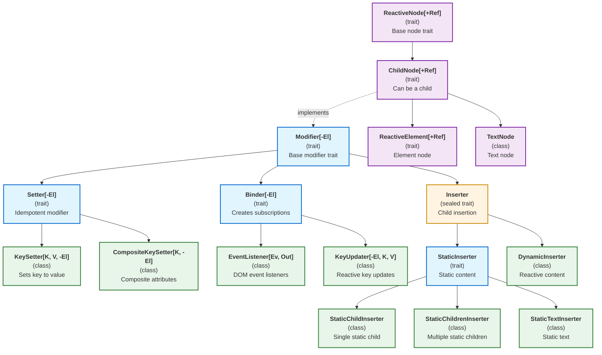

# Modifier Type Hierarchy in Laminar

This document provides a comprehensive view of the type hierarchy for all modifier types in the Laminar codebase.

## Table of Contents
- [Visual Hierarchy Diagram](#visual-hierarchy-diagram)
- [Detailed Type Descriptions](#detailed-type-descriptions)
- [Key Design Principles](#key-design-principles)
- [File Path Reference](#file-path-reference)

---

## Visual Hierarchy Diagram



---

## Detailed Type Descriptions

### Core Modifier Traits

#### **Modifier[-El <: ReactiveElement.Base]**
- **Type:** Trait (contravariant)
- **Path:** `laminar/src/io/github/nguyenyou/laminar/modifiers/Modifier.scala`
- **Description:** Root trait for all modifiers. Represents an operation with side effects on an element.
- **Key Method:** `def apply(element: El): Unit`
- **Contravariance:** The `-` allows more general modifiers to be used where specific ones are expected.

#### **Setter[-El <: ReactiveElement.Base]**
- **Type:** Trait (extends Modifier)
- **Path:** `laminar/src/io/github/nguyenyou/laminar/modifiers/Setter.scala`
- **Description:** Idempotent modifier that sets element properties. Applying multiple times has same effect as once.
- **Use Case:** Static configuration, used with `onMountSet`

#### **Binder[-El <: ReactiveElement.Base]**
- **Type:** Trait (extends Modifier)
- **Path:** `laminar/src/io/github/nguyenyou/laminar/modifiers/Binder.scala`
- **Description:** Non-idempotent modifier that creates subscriptions. Calling N times creates N subscriptions.
- **Key Method:** `def bind(element: El): DynamicSubscription`
- **Use Case:** Reactive bindings, used with `onMountBind`

---

### Key-Based Modifiers

#### **KeySetter[K <: Key, V, -El <: ReactiveElement.Base]**
- **Type:** Class (extends Setter)
- **Path:** `laminar/src/io/github/nguyenyou/laminar/modifiers/KeySetter.scala`
- **Description:** Sets a Key (attribute/property/style) to a specific value. Idempotent and undoable.
- **Type Aliases:**
  - `PropSetter[V, DomV]` - HTML properties
  - `HtmlAttrSetter[V]` - HTML attributes
  - `SvgAttrSetter[V]` - SVG attributes
  - `AriaAttrSetter[V]` - ARIA attributes
  - `StyleSetter` - CSS styles
- **Example:** `href := "http://example.com"`

#### **CompositeKeySetter[K <: Key, -El <: ReactiveElement.Base]**
- **Type:** Class (extends Setter, NOT KeySetter)
- **Path:** `laminar/src/io/github/nguyenyou/laminar/modifiers/CompositeKeySetter.scala`
- **Description:** For composite attributes (cls, role) where values accumulate rather than replace.
- **Key Difference:** NOT a subtype of KeySetter because it adds values instead of replacing them.
- **Example:** `cls := "foo"` then `cls := "bar"` results in both classes

#### **KeyUpdater[-El <: ReactiveElement.Base, K <: Key, V]**
- **Type:** Class (extends Binder)
- **Path:** `laminar/src/io/github/nguyenyou/laminar/modifiers/KeyUpdater.scala`
- **Description:** Updates a key from an Observable source. Creates a subscription.
- **Type Aliases:**
  - `PropUpdater[V, DomV]`
  - `HtmlAttrUpdater[V]`
  - `SvgAttrUpdater[V]`
  - `AriaAttrUpdater[V]`
  - `StyleUpdater[V]`
  - `DerivedStyleUpdater[InputV]`
- **Example:** `href <-- urlStream`

---

### Event Handling Modifiers

#### **EventListener[Ev <: dom.Event, Out]**
- **Type:** Class (extends Binder)
- **Path:** `laminar/src/io/github/nguyenyou/laminar/modifiers/EventListener.scala`
- **Description:** Attaches DOM event listeners. Manages registration/deregistration on mount/unmount.
- **Example:** `onClick --> observer`

---

### Inserter Hierarchy

#### **Inserter**
- **Type:** Sealed trait (extends Modifier)
- **Path:** `laminar/src/io/github/nguyenyou/laminar/inserters/Inserter.scala`
- **Description:** Base for all inserters. Can insert child nodes into InsertContext.
- **Sealed:** Only StaticInserter and DynamicInserter can extend it.

#### **StaticInserter**
- **Type:** Trait (extends Inserter)
- **Path:** `laminar/src/io/github/nguyenyou/laminar/inserters/Inserter.scala`
- **Description:** For static (non-reactive) content.
- **Key Method:** `def renderInContext(ctx: InsertContext): Unit`

#### **DynamicInserter**
- **Type:** Class (extends Inserter)
- **Path:** `laminar/src/io/github/nguyenyou/laminar/inserters/Inserter.scala`
- **Description:** For reactive content that creates subscriptions. Used by all `<--` child operators.
- **Key Method:** `def bind(element: ReactiveElement.Base): DynamicSubscription`

#### **StaticChildInserter**
- **Type:** Class (extends StaticInserter)
- **Path:** `laminar/src/io/github/nguyenyou/laminar/inserters/StaticChildInserter.scala`
- **Description:** Inserts a single static child node.
- **Example:** Implicitly created: `div(span("hello"))`

#### **StaticChildrenInserter**
- **Type:** Class (extends StaticInserter)
- **Path:** `laminar/src/io/github/nguyenyou/laminar/inserters/StaticChildrenInserter.scala`
- **Description:** Inserts multiple static child nodes.
- **Example:** Implicitly created: `div(List(span("a"), span("b")))`

#### **StaticTextInserter**
- **Type:** Class (extends StaticInserter)
- **Path:** `laminar/src/io/github/nguyenyou/laminar/inserters/StaticTextInserter.scala`
- **Description:** Inserts static text content.
- **Example:** Implicitly created: `div("hello")`, `div(42)`

---

### Node Types (Also Modifiers)

#### **ReactiveNode[+Ref <: dom.Node]**
- **Type:** Trait (covariant)
- **Path:** `laminar/src/io/github/nguyenyou/laminar/nodes/ReactiveNode.scala`
- **Description:** Base trait for all Laminar nodes. Wraps a DOM node reference.
- **Key Property:** `val ref: Ref`

#### **ChildNode[+Ref <: dom.Node]**
- **Type:** Trait (extends ReactiveNode, implements Modifier)
- **Path:** `laminar/src/io/github/nguyenyou/laminar/nodes/ChildNode.scala`
- **Description:** Nodes that can be children of other nodes. Implements Modifier to allow elements as modifiers.
- **Key Insight:** This is why `div(span("hello"))` works - span is both a ChildNode and a Modifier.

#### **ReactiveElement[+Ref <: dom.Element]**
- **Type:** Trait (extends ChildNode)
- **Path:** `laminar/src/io/github/nguyenyou/laminar/nodes/ReactiveElement.scala`
- **Description:** Laminar wrapper around DOM elements. Can have children and modifiers applied.

#### **TextNode**
- **Type:** Class (extends ChildNode)
- **Path:** `laminar/src/io/github/nguyenyou/laminar/nodes/TextNode.scala`
- **Description:** Laminar wrapper around DOM text nodes.
- **Example:** Created implicitly: `div("text")`

---

## Key Design Principles

### 1. Contravariance in Modifiers
All modifier types are contravariant in the element type (`-El`):
```scala
trait Modifier[-El <: ReactiveElement.Base]
```
This allows:
- A `Modifier[ReactiveElement.Base]` (more general) can be used as `Modifier[Div]` (more specific)
- Child elements to be used as modifiers for any parent element type
- Maximum flexibility in the type system

### 2. Idempotency Distinction
- **Setters are idempotent:** Applying `href := "url"` multiple times has the same effect as once
- **Binders are NOT idempotent:** Applying `href <-- stream` N times creates N subscriptions
- This distinction is crucial for lifecycle management with `onMountSet` vs `onMountBind`

### 3. Sealed Inserter Hierarchy
The `Inserter` trait is sealed, meaning only `StaticInserter` and `DynamicInserter` can extend it:
- Ensures exhaustive pattern matching
- Provides clear separation between static and dynamic content
- Enables compiler optimizations

### 4. Nodes as Modifiers
`ChildNode` implements `Modifier[ReactiveElement[dom.Element]]`:
```scala
trait ChildNode[+Ref <: dom.Node]
  extends ReactiveNode[Ref]
  with Modifier[ReactiveElement[dom.Element]]
```
This enables the elegant syntax:
```scala
div(
  span("hello"),  // span is a ChildNode, thus a Modifier
  "world"         // implicitly converted to TextNode, thus a Modifier
)
```

### 5. Variance Annotations
- **Modifiers:** Contravariant (`-El`) - can accept more specific element types
- **Nodes:** Covariant (`+Ref`) - can return more specific node types
- This combination provides maximum type safety and flexibility

---

## File Path Reference

### Core Modifiers
- `laminar/src/io/github/nguyenyou/laminar/modifiers/Modifier.scala`
- `laminar/src/io/github/nguyenyou/laminar/modifiers/Setter.scala`
- `laminar/src/io/github/nguyenyou/laminar/modifiers/Binder.scala`

### Key-Based Modifiers
- `laminar/src/io/github/nguyenyou/laminar/modifiers/KeySetter.scala`
- `laminar/src/io/github/nguyenyou/laminar/modifiers/CompositeKeySetter.scala`
- `laminar/src/io/github/nguyenyou/laminar/modifiers/KeyUpdater.scala`

### Event Modifiers
- `laminar/src/io/github/nguyenyou/laminar/modifiers/EventListener.scala`

### Inserters
- `laminar/src/io/github/nguyenyou/laminar/inserters/Inserter.scala` (Inserter, StaticInserter, DynamicInserter)
- `laminar/src/io/github/nguyenyou/laminar/inserters/StaticChildInserter.scala`
- `laminar/src/io/github/nguyenyou/laminar/inserters/StaticChildrenInserter.scala`
- `laminar/src/io/github/nguyenyou/laminar/inserters/StaticTextInserter.scala`

### Nodes
- `laminar/src/io/github/nguyenyou/laminar/nodes/ReactiveNode.scala`
- `laminar/src/io/github/nguyenyou/laminar/nodes/ChildNode.scala`
- `laminar/src/io/github/nguyenyou/laminar/nodes/ReactiveElement.scala`
- `laminar/src/io/github/nguyenyou/laminar/nodes/TextNode.scala`

### Lifecycle Hooks (Return Modifier[El])
- `laminar/src/io/github/nguyenyou/laminar/api/MountHooks.scala`
  - `onMountCallback`, `onUnmountCallback`, `onMountUnmountCallback`
  - `onMountSet`, `onMountBind`, `onMountInsert`, `onMountFocus`

---

**Last Updated:** 2025-10-20

