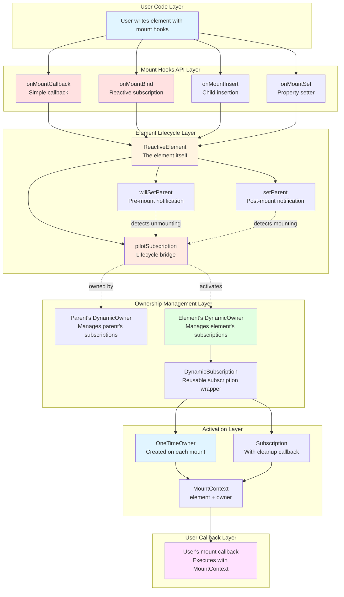
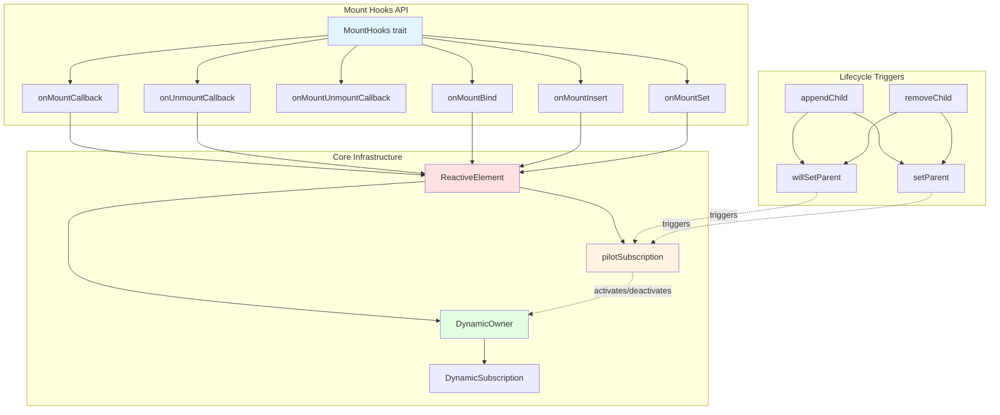
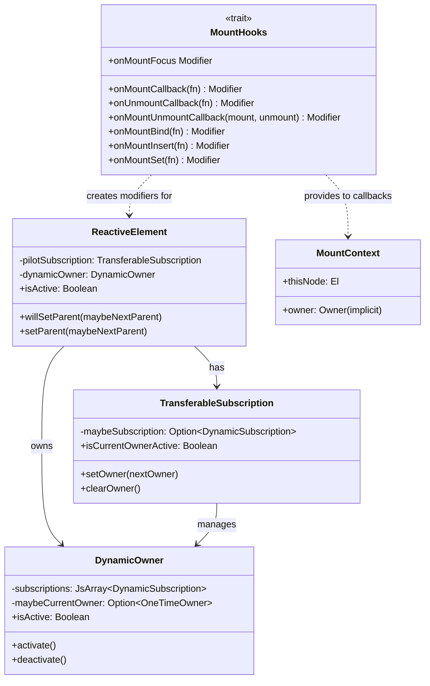
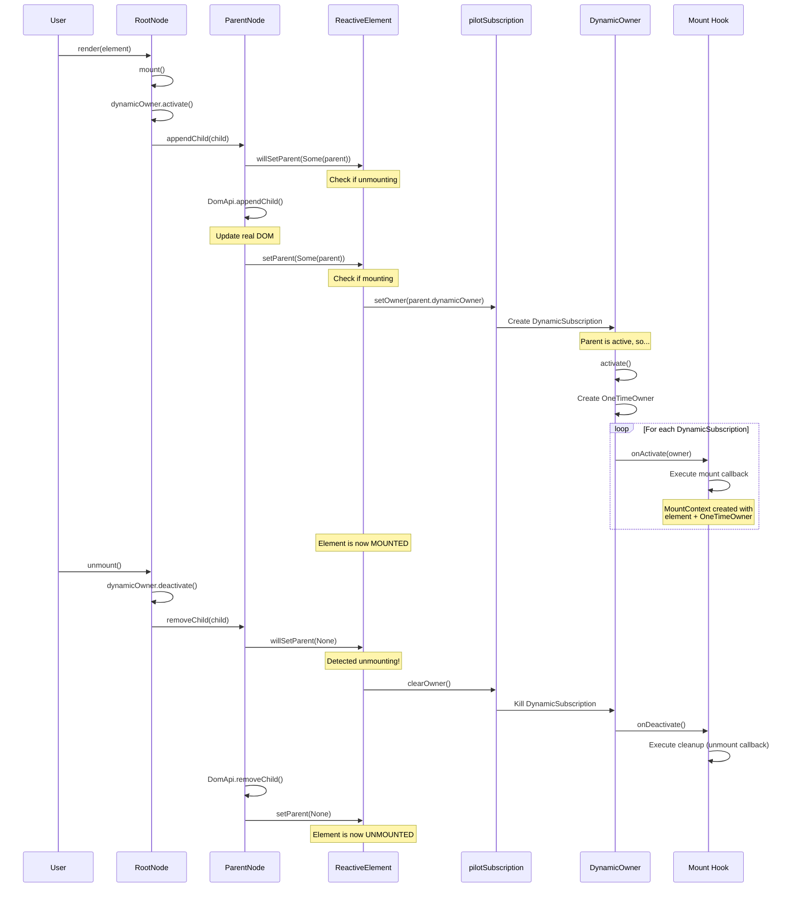
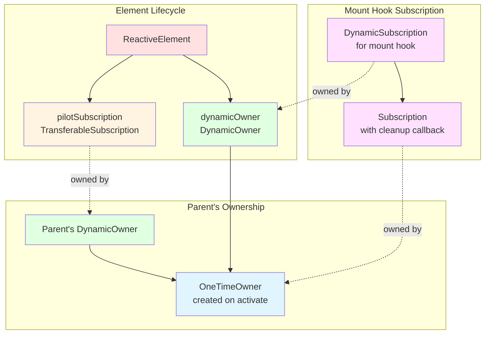
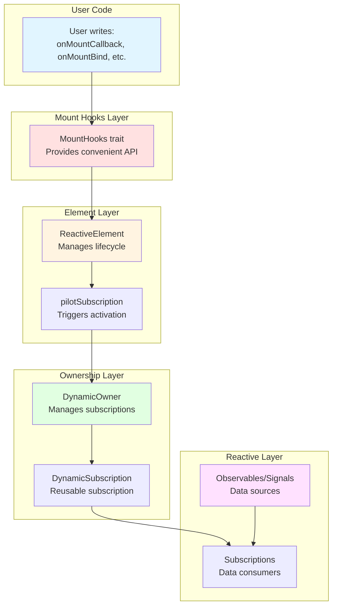

# Laminar Mount Hooks System

## Table of Contents
1. [Overview](#overview)
2. [Architecture](#architecture)
3. [Mount Hook Types](#mount-hook-types)
4. [Lifecycle Flow](#lifecycle-flow)
5. [Integration with Ownership System](#integration-with-ownership-system)
6. [Usage Patterns](#usage-patterns)
7. [Advanced Topics](#advanced-topics)

---

## Overview

The **Mount Hooks System** in Laminar provides a way to execute code when elements are mounted to (attached to) or unmounted from (detached from) the DOM. This system is crucial for:

- **Resource management**: Starting and stopping subscriptions, timers, or external integrations
- **Third-party library integration**: Initializing and cleaning up external JavaScript libraries
- **Lifecycle-aware operations**: Performing actions that should only happen when an element is visible in the DOM
- **Performance optimization**: Deferring expensive operations until elements are actually mounted

### Key Concepts

- **Mounting**: When an element is added to the DOM tree and becomes "active"
- **Unmounting**: When an element is removed from the DOM tree and becomes "inactive"
- **MountContext**: A context object provided to mount hooks containing the element reference and an implicit `Owner` for subscriptions
- **Automatic cleanup**: Mount hooks automatically manage subscription lifecycle to prevent memory leaks

### Complete System Overview



---

## Architecture

### Component Diagram



### Class Hierarchy



---

## Mount Hook Types

### 1. `onMountCallback`

**Purpose**: Execute a callback when the element is mounted to the DOM.

**File**: `laminar/src/io/github/nguyenyou/laminar/api/MountHooks.scala:98-109`

```scala
def onMountCallback[El <: ReactiveElement.Base](
  fn: MountContext[El] => Unit
): Modifier[El]
```

**Key Characteristics**:
- Runs on **every mount**, not just the first one
- Element is **already mounted** when callback executes
- Provides `MountContext` with implicit `Owner` for subscriptions
- If applied to already-mounted element, won't fire until unmount/remount cycle

**⚠️ Warning**: Don't create subscriptions inside without manual cleanup! Use `onMountBind` instead.

**Example**:
```scala
div(
  onMountCallback { ctx =>
    import ctx.owner  // Implicit owner for subscriptions
    println(s"Element ${ctx.thisNode.ref.tagName} mounted!")
    // Can access ctx.thisNode for the element reference
  }
)
```

### 2. `onUnmountCallback`

**Purpose**: Execute a callback when the element is unmounted from the DOM.

**File**: `laminar/src/io/github/nguyenyou/laminar/api/MountHooks.scala:118-124`

```scala
def onUnmountCallback[El <: ReactiveElement.Base](
  fn: El => Unit
): Modifier[El]
```

**Key Characteristics**:
- Element is **still mounted** when callback executes
- Good for cleanup operations
- Receives the element directly (not MountContext)

**Example**:
```scala
div(
  onUnmountCallback { element =>
    println(s"Element ${element.ref.tagName} unmounting!")
    // Cleanup external resources
  }
)
```

### 3. `onMountUnmountCallback`

**Purpose**: Combine mount and unmount callbacks for easier integration.

**File**: `laminar/src/io/github/nguyenyou/laminar/api/MountHooks.scala:130-135`

```scala
def onMountUnmountCallback[El <: ReactiveElement.Base](
  mount: MountContext[El] => Unit,
  unmount: El => Unit
): Modifier[El]
```

**Example**:
```scala
div(
  onMountUnmountCallback(
    mount = ctx => println("Mounted!"),
    unmount = el => println("Unmounted!")
  )
)
```

### 4. `onMountUnmountCallbackWithState`

**Purpose**: Pass state from mount callback to unmount callback.

**File**: `laminar/src/io/github/nguyenyou/laminar/api/MountHooks.scala:144-166`

```scala
def onMountUnmountCallbackWithState[El <: ReactiveElement.Base, A](
  mount: MountContext[El] => A,
  unmount: (El, Option[A]) => Unit
): Modifier[El]
```

**Key Feature**: Mount callback returns state that unmount callback receives as `Option[A]`.

**Why Option?**: If modifier is applied after element is already mounted, mount callback won't run, so state will be `None`.

**Example**:
```scala
div(
  onMountUnmountCallbackWithState(
    mount = ctx => {
      val timer = js.timers.setInterval(1000) { /* ... */ }
      timer  // Return timer ID as state
    },
    unmount = (el, maybeTimer) => {
      maybeTimer.foreach(js.timers.clearInterval)
    }
  )
)
```

### 5. `onMountBind`

**Purpose**: Bind a reactive subscription on mount, automatically cleaning it up on unmount.

**File**: `laminar/src/io/github/nguyenyou/laminar/api/MountHooks.scala:31-45`

```scala
def onMountBind[El <: ReactiveElement.Base](
  fn: MountContext[El] => Binder[El]
): Modifier[El]
```

**Key Characteristics**:
- Automatically manages subscription lifecycle
- Kills subscription on unmount
- Prevents memory leaks from repeated mount/unmount cycles

**Example**:
```scala
val stream = EventBus[Int]()

div(
  onMountBind { ctx =>
    // This subscription will be automatically killed on unmount
    stream.events --> Observer[Int](n => println(n))
  }
)
```

**Implementation Detail**:
```scala
var maybeSubscription: Option[DynamicSubscription] = None
onMountUnmountCallback(
  mount = { c =>
    val binder = fn(c)
    maybeSubscription = Some(binder.bind(c.thisNode))
  },
  unmount = { _ =>
    maybeSubscription.foreach(_.kill())  // Cleanup!
    maybeSubscription = None
  }
)
```

### 6. `onMountInsert`

**Purpose**: Insert child nodes on mount, preserving insertion position across mount/unmount cycles.

**File**: `laminar/src/io/github/nguyenyou/laminar/api/MountHooks.scala:54-84`

```scala
def onMountInsert[El <: ReactiveElement.Base](
  fn: MountContext[El] => Inserter
): Modifier[El]
```

**Key Characteristics**:
- Reserves insertion position when modifier is applied
- Reuses same `InsertContext` across mount/unmount cycles
- Preserves DOM state intuitively

**Example**:
```scala
div(
  "Before",
  onMountInsert { ctx =>
    child <-- someSignal  // Will insert in same position every time
  },
  "After"
)
```

### 7. `onMountSet`

**Purpose**: Set a property/attribute/style on mount.

**File**: `laminar/src/io/github/nguyenyou/laminar/api/MountHooks.scala:23-25`

```scala
def onMountSet[El <: ReactiveElement.Base](
  fn: MountContext[El] => Setter[El]
): Modifier[El]
```

**When to use**: Only when you need access to `MountContext` or truly need it to happen only on mount.

**Example**:
```scala
div(
  onMountSet { ctx =>
    dataAttr("mounted-at") := System.currentTimeMillis().toString
  }
)
```

### 8. `onMountFocus`

**Purpose**: Focus the element on mount.

**File**: `laminar/src/io/github/nguyenyou/laminar/api/MountHooks.scala:14`

```scala
val onMountFocus: Modifier[ReactiveHtmlElement.Base] = 
  onMountCallback(_.thisNode.ref.focus())
```

**Example**:
```scala
input(onMountFocus)  // Auto-focus on mount
```

---

## Lifecycle Flow

### Mount/Unmount Sequence Diagram



### Detailed Mounting Flow

When an element is mounted, the following sequence occurs:

1. **Parent Notification** (`willSetParent`):
   - Called BEFORE DOM changes
   - Element's `maybeParent` is still the old value
   - Used to detect unmounting and trigger early cleanup

2. **DOM Update**:
   - Browser's native `appendChild` or `insertBefore` is called
   - Element is now in the DOM tree

3. **Parent Update** (`setParent`):
   - Called AFTER DOM changes
   - Element's `maybeParent` is updated to new parent
   - Used to detect mounting and trigger activation

4. **Pilot Subscription Transfer**:
   - `pilotSubscription.setOwner(parent.dynamicOwner)` is called
   - Creates a new `DynamicSubscription` owned by parent's `DynamicOwner`

5. **Activation Cascade**:
   - If parent is active, new subscription is immediately activated
   - `DynamicOwner.activate()` creates a fresh `OneTimeOwner`
   - All `DynamicSubscription`s are activated with this owner

6. **Mount Hooks Execute**:
   - Each mount hook's activation callback runs
   - `MountContext` is created with element + `OneTimeOwner`
   - User's mount callback executes

### The "Already Mounted" Check

Mount hooks include logic to prevent firing when applied to already-mounted elements:

**File**: `laminar/src/io/github/nguyenyou/laminar/api/MountHooks.scala:100-107`

```scala
def onMountCallback[El <: ReactiveElement.Base](fn: MountContext[El] => Unit): Modifier[El] = {
  Modifier[El] { element =>
    var ignoreNextActivation = ReactiveElement.isActive(element)  // Check if already mounted
    ReactiveElement.bindCallback[El](element) { c =>
      if (ignoreNextActivation) {
        ignoreNextActivation = false  // Skip this activation
      } else {
        fn(c)  // Execute mount callback
      }
    }
  }
}
```

**Why?** If you call `element.amend(onMountCallback(...))` on an already-mounted element, the `DynamicSubscription` will be immediately activated. Without this check, the mount callback would fire even though the element didn't actually mount—it was already mounted!

---

## Integration with Ownership System

### The Ownership Hierarchy

Mount hooks are deeply integrated with Airstream's ownership system:



### Key Ownership Concepts

#### 1. **DynamicOwner** (Reusable)
- Lives for the entire lifetime of the element
- Can be activated and deactivated multiple times
- Manages a collection of `DynamicSubscription`s

**File**: `airstream/src/io/github/nguyenyou/airstream/ownership/DynamicOwner.scala:51-83`

```scala
def activate(): Unit = {
  if (!isActive) {
    val newOwner = new OneTimeOwner(onAccessAfterKilled)
    _maybeCurrentOwner = Some(newOwner)
    // Activate all subscriptions
    subscriptions.forEach(_.onActivate(newOwner))
  }
}

def deactivate(): Unit = {
  if (isActive) {
    // Deactivate all subscriptions
    subscriptions.forEach(_.onDeactivate())
    // Kill the OneTimeOwner
    _maybeCurrentOwner.foreach(_._killSubscriptions())
    _maybeCurrentOwner = None
  }
}
```

#### 2. **OneTimeOwner** (Disposable)
- Created fresh on each activation
- Killed on deactivation
- Cannot be used after being killed
- Throws exception if accessed after death

**File**: `airstream/src/io/github/nguyenyou/airstream/ownership/OneTimeOwner.scala:9-27`

```scala
class OneTimeOwner(onAccessAfterKilled: () => Unit) extends Owner {
  private var _isKilledForever: Boolean = false

  override private[ownership] def own(subscription: Subscription): Unit = {
    if (_isKilledForever) {
      subscription.onKilledByOwner()
      onAccessAfterKilled()  // Throw or log error
    } else {
      super.own(subscription)
    }
  }
}
```

#### 3. **DynamicSubscription** (Reusable)
- Wraps an activation function that returns a `Subscription`
- Can be activated/deactivated multiple times
- Owned by a `DynamicOwner`

**File**: `airstream/src/io/github/nguyenyou/airstream/ownership/DynamicSubscription.scala:44-49`

```scala
private[ownership] def onActivate(owner: Owner): Unit = {
  Transaction.onStart.shared {
    maybeCurrentSubscription = activate(owner)  // Call user's activation function
  }
}

private[ownership] def onDeactivate(): Unit = {
  maybeCurrentSubscription.foreach(_.kill())  // Kill the Subscription
  maybeCurrentSubscription = None
}
```

#### 4. **Subscription** (Disposable)
- Created on activation, killed on deactivation
- Contains cleanup logic in its constructor
- Owned by a `OneTimeOwner`

**File**: `airstream/src/io/github/nguyenyou/airstream/ownership/Subscription.scala:13-30`

```scala
class Subscription(
  private[ownership] val owner: Owner,
  cleanup: () => Unit  // Cleanup function
) {
  owner.own(this)  // Register with owner

  def kill(): Unit = {
    safeCleanup()
    owner.onKilledExternally(this)
  }

  private[ownership] def onKilledByOwner(): Unit = {
    safeCleanup()
  }

  private def safeCleanup(): Unit = {
    if (!_isKilled) {
      cleanup()  // Execute cleanup!
      _isKilled = true
    }
  }
}
```

### The pilotSubscription Pattern

The `pilotSubscription` is the bridge between element lifecycle and ownership:

**File**: `laminar/src/io/github/nguyenyou/laminar/nodes/ReactiveElement.scala:22-25`

```scala
private val pilotSubscription: TransferableSubscription = new TransferableSubscription(
  activate = dynamicOwner.activate,    // When pilot activates, activate element's owner
  deactivate = dynamicOwner.deactivate // When pilot deactivates, deactivate element's owner
)
```

**What it does**:
1. When element gets a parent, `pilotSubscription.setOwner(parent.dynamicOwner)` is called
2. If parent is active, pilot subscription activates immediately
3. Pilot's activation callback calls `dynamicOwner.activate()`
4. Element's `DynamicOwner` activates all its subscriptions (including mount hooks!)

**File**: `airstream/src/io/github/nguyenyou/airstream/ownership/TransferableSubscription.scala:76-98`

```scala
val newPilotSubscription = DynamicSubscription.unsafe(
  nextOwner,
  activate = parentOwner => {
    if (!isLiveTransferInProgress) {
      activate()  // Calls dynamicOwner.activate()
    }
    new Subscription(
      parentOwner,
      cleanup = () => {
        if (!isLiveTransferInProgress) {
          deactivate()  // Calls dynamicOwner.deactivate()
        }
      }
    )
  }
)
```

### MountContext: The Bridge to User Code

`MountContext` is the object passed to mount hook callbacks:

**File**: `laminar/src/io/github/nguyenyou/laminar/lifecycle/MountContext.scala:6-9`

```scala
class MountContext[+El <: ReactiveElement.Base](
  val thisNode: El,           // The element being mounted
  implicit val owner: Owner   // The OneTimeOwner for this mount cycle
)
```

**Why implicit owner?** This allows user code to create subscriptions without explicitly passing the owner:

```scala
onMountCallback { ctx =>
  import ctx.owner  // Import implicit owner

  // Owner is implicitly passed to addObserver
  someStream.addObserver(observer)
}
```

---

## Usage Patterns

### Pattern 1: Third-Party Library Integration

**Use Case**: Initialize a chart library on mount, destroy on unmount.

```scala
import org.scalajs.dom

val chartContainer = div(
  idAttr := "chart",
  onMountUnmountCallbackWithState(
    mount = ctx => {
      // Initialize Chart.js
      val canvas = ctx.thisNode.ref.querySelector("canvas")
      val chart = new Chart(canvas, chartConfig)
      chart  // Return chart instance as state
    },
    unmount = (el, maybeChart) => {
      // Cleanup
      maybeChart.foreach(_.destroy())
    }
  ),
  canvas()
)
```

### Pattern 2: Conditional Subscriptions

**Use Case**: Subscribe to a stream only when element is mounted.

```scala
val dataStream = EventBus[Data]()

div(
  onMountBind { ctx =>
    // This subscription only exists while mounted
    dataStream.events --> Observer[Data] { data =>
      // Process data
      updateUI(data)
    }
  }
)
```

**Why not just use `<--` directly?**
- Use `<--` when you want the subscription to exist for the element's entire lifetime
- Use `onMountBind` when you want the subscription only while mounted (e.g., expensive operations)

### Pattern 3: Dynamic Content on Mount

**Use Case**: Load content from server only when element becomes visible.

```scala
div(
  onMountCallback { ctx =>
    import ctx.owner

    // Fetch data when mounted
    fetchDataFromServer().foreach { data =>
      // Update element with data
      ctx.thisNode.amend(
        children <-- Signal.fromValue(renderData(data))
      )
    }
  }
)
```

### Pattern 4: Focus Management

**Use Case**: Auto-focus input when dialog opens.

```scala
def dialog(isOpen: Signal[Boolean]) = div(
  display <-- isOpen.map(if (_) "block" else "none"),
  input(
    placeholder := "Enter name",
    onMountFocus  // Auto-focus when dialog mounts
  )
)
```

### Pattern 5: Preserving State Across Mounts

**Use Case**: Using `onMountInsert` to preserve child state.

```scala
val showDetails = Var(false)

div(
  button(
    "Toggle Details",
    onClick --> (_ => showDetails.update(!_))
  ),
  child.maybe <-- showDetails.signal.map {
    case true => Some(
      div(
        "Details section",
        onMountInsert { ctx =>
          // This inserter is created fresh each mount,
          // but uses the same InsertContext, preserving position
          child <-- detailsSignal
        }
      )
    )
    case false => None
  }
)
```

### Pattern 6: Cleanup with State

**Use Case**: Start interval timer on mount, clear on unmount.

```scala
import scala.scalajs.js.timers._

div(
  onMountUnmountCallbackWithState(
    mount = ctx => {
      val intervalId = setInterval(1000) {
        println("Tick!")
      }
      intervalId  // Return as state
    },
    unmount = (el, maybeIntervalId) => {
      maybeIntervalId.foreach(clearInterval)
    }
  )
)
```

---

## Advanced Topics

### Preventing Memory Leaks

**Problem**: Using `onMountCallback` incorrectly can cause memory leaks.

❌ **Wrong**:
```scala
div(
  onMountCallback { ctx =>
    // BAD: Creates a new subscription on every mount
    // After 10 mount/unmount cycles, you have 10 subscriptions!
    someStream --> observer
  }
)
```

✅ **Correct**:
```scala
div(
  onMountBind { ctx =>
    // GOOD: Subscription is automatically killed on unmount
    someStream --> observer
  }
)
```

### The "Already Mounted" Edge Case

When you apply a mount hook to an already-mounted element:

```scala
val element = div("Hello").render()
render(containerNode, element)  // Element is now mounted

// Later...
element.amend(
  onMountCallback { ctx =>
    println("This will NOT print!")
  }
)
```

The callback won't fire because the element is already mounted. It will only fire on the next mount cycle.

### TransferableSubscription: Live Transfers

When moving an element from one active parent to another:

```scala
// Element is mounted under parent1
parent1.appendChild(element)

// Move to parent2 (both parents are active)
parent2.appendChild(element)
```

The `TransferableSubscription` detects this is a "live transfer" and:
1. Does NOT call `deactivate()` (element stays active)
2. Does NOT call `activate()` (element was already active)
3. Just transfers ownership from parent1's owner to parent2's owner

This prevents unnecessary unmount/mount callbacks from firing!

**File**: `airstream/src/io/github/nguyenyou/airstream/ownership/TransferableSubscription.scala:58-60`

```scala
if (isCurrentOwnerActive && nextOwner.isActive) {
  isLiveTransferInProgress = true  // Skip activate/deactivate
}
```

### Execution Order

Mount hooks execute in the order they're defined:

```scala
div(
  onMountCallback { _ => println("1") },
  onMountCallback { _ => println("2") },
  onMountCallback { _ => println("3") }
)
// Prints: 1, 2, 3
```

Unmount hooks execute in reverse order (cleanup in reverse):

```scala
div(
  onUnmountCallback { _ => println("1") },
  onUnmountCallback { _ => println("2") },
  onUnmountCallback { _ => println("3") }
)
// On unmount, prints: 3, 2, 1
```

### Nested Elements and Activation Order

When mounting a tree of elements:

```scala
div(  // Parent
  onMountCallback { _ => println("Parent mounted") },
  div(  // Child
    onMountCallback { _ => println("Child mounted") }
  )
)
```

**Activation order**:
1. Parent's `pilotSubscription` activates
2. Parent's `DynamicOwner` activates
3. Parent's mount hooks execute → "Parent mounted"
4. Child is appended to parent
5. Child's `pilotSubscription` activates
6. Child's `DynamicOwner` activates
7. Child's mount hooks execute → "Child mounted"

**Deactivation order** (reverse):
1. Child's mount hooks cleanup
2. Child's `DynamicOwner` deactivates
3. Parent's mount hooks cleanup
4. Parent's `DynamicOwner` deactivates

---

## Connection to Broader Architecture

### How Mount Hooks Fit Into Laminar



### Problems Mount Hooks Solve

1. **Automatic Resource Management**
   - Without mount hooks: Manual subscription management, easy to leak memory
   - With mount hooks: Automatic cleanup on unmount

2. **Lifecycle-Aware Operations**
   - Without mount hooks: Operations run even when element is detached
   - With mount hooks: Operations only run when element is in DOM

3. **Third-Party Integration**
   - Without mount hooks: Complex manual lifecycle tracking
   - With mount hooks: Simple mount/unmount callbacks

4. **Performance Optimization**
   - Without mount hooks: Expensive operations run even for hidden elements
   - With mount hooks: Defer operations until element is visible

### Relationship to React Hooks

Laminar's mount hooks are similar to React's `useEffect`:

| Laminar | React |
|---------|-------|
| `onMountCallback` | `useEffect(() => { ... }, [])` |
| `onUnmountCallback` | `useEffect(() => () => { ... }, [])` |
| `onMountUnmountCallback` | `useEffect(() => { ...; return () => { ... } }, [])` |
| `onMountBind` | `useEffect` with subscription |

**Key difference**: Laminar's hooks are **modifiers** applied to elements, not functions called in render. This makes them more composable and reusable.

---

## Summary

The Mount Hooks System in Laminar provides:

✅ **Lifecycle Management**: Execute code on mount/unmount
✅ **Automatic Cleanup**: Prevent memory leaks with automatic subscription management
✅ **Type Safety**: Strongly-typed callbacks with precise element types
✅ **Composability**: Hooks are modifiers that can be combined and reused
✅ **Integration**: Deep integration with Airstream's ownership system
✅ **Performance**: Defer expensive operations until elements are mounted

**Core Principle**: Mount hooks bridge the gap between Laminar's reactive system and the imperative world of DOM lifecycle, providing a safe and ergonomic API for lifecycle-aware operations.

---

## Quick Reference

### When to Use Which Hook

| Hook | Use When | Example Use Case |
|------|----------|------------------|
| `onMountCallback` | Need to run code on mount without subscriptions | Initialize third-party library, log analytics |
| `onUnmountCallback` | Need cleanup without mount logic | Clear timers, remove event listeners |
| `onMountUnmountCallback` | Need both mount and unmount logic | Start/stop polling, show/hide tooltips |
| `onMountUnmountCallbackWithState` | Need to pass data from mount to unmount | Store timer ID, store library instance |
| `onMountBind` | Need reactive subscription only while mounted | Subscribe to expensive streams, WebSocket connections |
| `onMountInsert` | Need to insert children only while mounted | Lazy-loaded content, conditional rendering |
| `onMountSet` | Need to set property/attribute on mount | Set dynamic attributes based on mount context |
| `onMountFocus` | Need to focus element on mount | Auto-focus input in dialog |

### Common Patterns Cheat Sheet

**Pattern: Third-party library**
```scala
onMountUnmountCallbackWithState(
  mount = ctx => initLibrary(ctx.thisNode.ref),
  unmount = (_, maybeLib) => maybeLib.foreach(_.destroy())
)
```

**Pattern: Conditional subscription**
```scala
onMountBind { ctx =>
  expensiveStream --> observer
}
```

**Pattern: Timer/Interval**
```scala
onMountUnmountCallbackWithState(
  mount = _ => setInterval(1000)(tick()),
  unmount = (_, id) => id.foreach(clearInterval)
)
```

**Pattern: Focus management**
```scala
input(onMountFocus)
```

**Pattern: Lazy content**
```scala
onMountInsert { ctx =>
  child <-- loadContentSignal
}
```

### Debugging Tips

**Check if element is mounted**:
```scala
ReactiveElement.isActive(element)  // Returns Boolean
```

**Count active subscriptions**:
```scala
ReactiveElement.numDynamicSubscriptions(element)  // Returns Int
```

**Enable debug logging**:
Uncomment `println` statements in:
- `ReactiveElement.scala:171` (willSetParent)
- `ReactiveElement.scala:181` (setParent)
- `DynamicOwner.scala:64` (activation loop)
- `TransferableSubscription.scala:84` (activate callback)

### Common Pitfalls

❌ **Creating subscriptions in `onMountCallback`**
```scala
// BAD: Memory leak!
onMountCallback { ctx =>
  stream --> observer  // Not cleaned up!
}
```

✅ **Use `onMountBind` instead**
```scala
// GOOD: Automatic cleanup
onMountBind { ctx =>
  stream --> observer
}
```

---

❌ **Expecting mount callback on already-mounted element**
```scala
val el = div().render()
render(container, el)  // Mounted

el.amend(onMountCallback { _ =>
  println("Won't print!")  // Element already mounted
})
```

✅ **Check if mounted first**
```scala
if (ReactiveElement.isActive(el)) {
  // Element is mounted, run logic immediately
} else {
  // Element not mounted, use hook
  el.amend(onMountCallback { _ => ... })
}
```

---

❌ **Forgetting state is `Option` in unmount**
```scala
onMountUnmountCallbackWithState(
  mount = _ => createResource(),
  unmount = (_, resource) => resource.cleanup()  // Compile error!
)
```

✅ **Handle `Option` properly**
```scala
onMountUnmountCallbackWithState(
  mount = _ => createResource(),
  unmount = (_, maybeResource) => maybeResource.foreach(_.cleanup())
)
```

---

## Related Documentation

- **[COMPLETE_EVENT_HANDLING_FLOW.md](COMPLETE_EVENT_HANDLING_FLOW.md)**: Detailed event handling flow including mount hooks
- **[COMPLETE_RENDERING_FLOW.md](COMPLETE_RENDERING_FLOW.md)**: Complete rendering and mounting flow
- **[node-hierarchy.md](node-hierarchy.md)**: Node type hierarchy and relationships
- **[element-nesting-explained.md](element-nesting-explained.md)**: How element nesting works
- **Airstream Ownership**: See `airstream/src/io/github/nguyenyou/airstream/ownership/` for ownership system details

---

## File References

### Core Implementation Files

- **MountHooks trait**: `laminar/src/io/github/nguyenyou/laminar/api/MountHooks.scala`
- **ReactiveElement**: `laminar/src/io/github/nguyenyou/laminar/nodes/ReactiveElement.scala`
- **MountContext**: `laminar/src/io/github/nguyenyou/laminar/lifecycle/MountContext.scala`
- **DynamicOwner**: `airstream/src/io/github/nguyenyou/airstream/ownership/DynamicOwner.scala`
- **DynamicSubscription**: `airstream/src/io/github/nguyenyou/airstream/ownership/DynamicSubscription.scala`
- **TransferableSubscription**: `airstream/src/io/github/nguyenyou/airstream/ownership/TransferableSubscription.scala`
- **OneTimeOwner**: `airstream/src/io/github/nguyenyou/airstream/ownership/OneTimeOwner.scala`
- **Subscription**: `airstream/src/io/github/nguyenyou/airstream/ownership/Subscription.scala`

### Test Files

- **MountHooksSpec**: `laminar/test/src/com/raquo/laminar/tests/MountHooksSpec.scala`
- **DynamicOwnerSpec**: `airstream/test/src/com/raquo/airstream/ownership/DynamicOwnerSpec.scala`

---

*Last updated: 2025-10-20*

