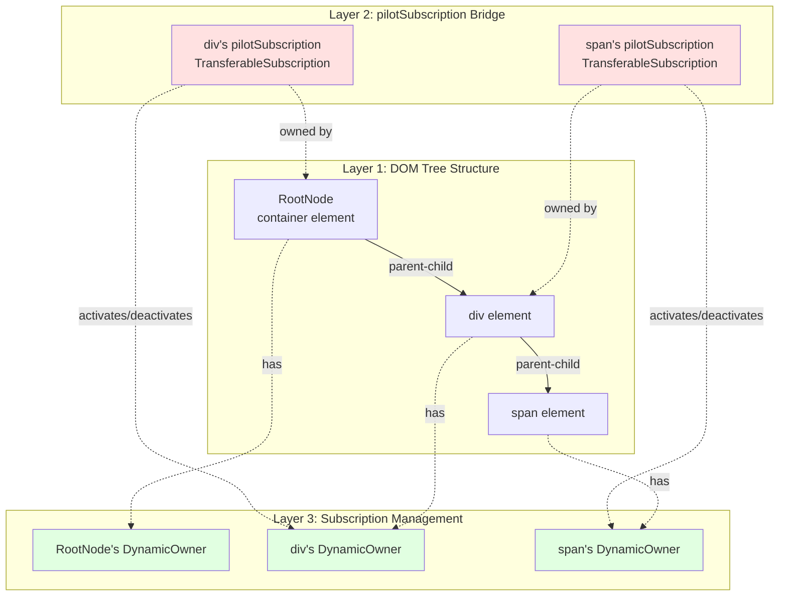
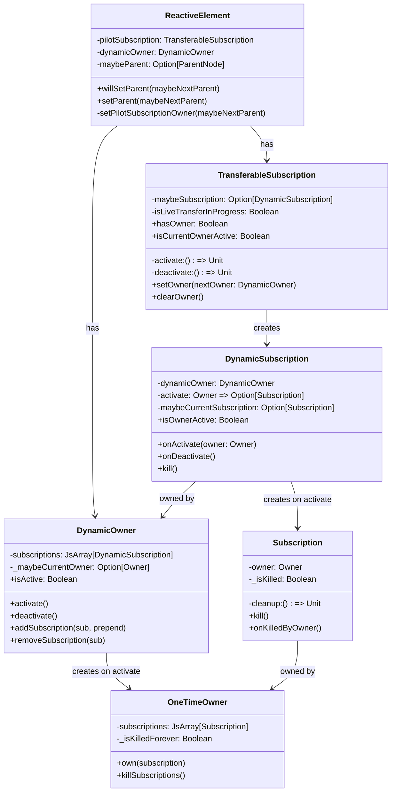
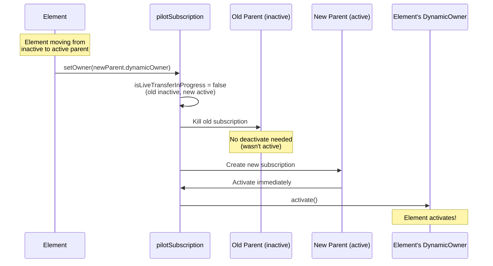
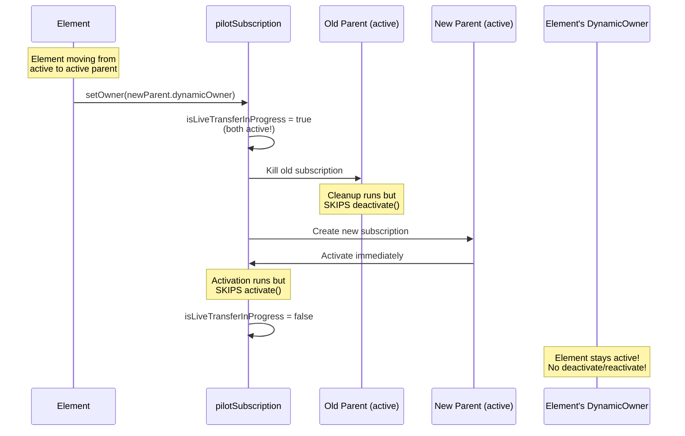
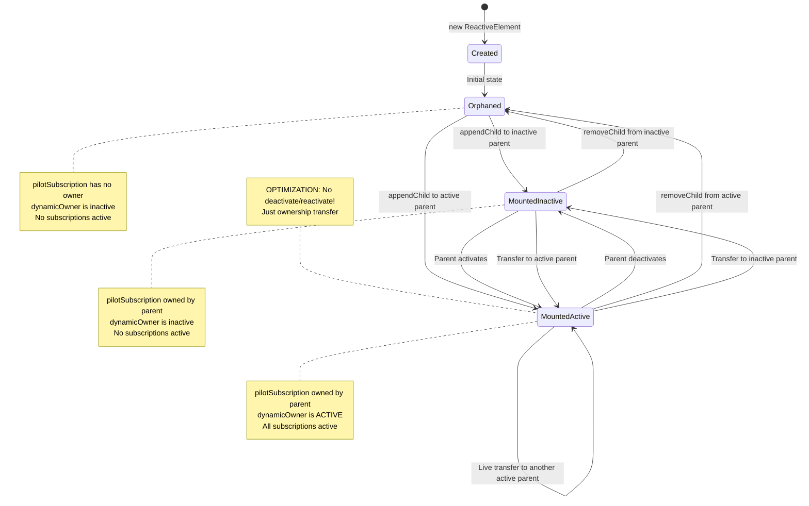

# The pilotSubscription Mechanism: A Deep Dive

## Table of Contents
1. [Executive Summary](#executive-summary)
2. [The Problem pilotSubscription Solves](#the-problem-pilotsubscription-solves)
3. [Architecture Overview](#architecture-overview)
4. [Complete Implementation Analysis](#complete-implementation-analysis)
5. [The Live Transfer Optimization](#the-live-transfer-optimization)
6. [Lifecycle State Transitions](#lifecycle-state-transitions)
7. [Execution Flow Scenarios](#execution-flow-scenarios)
8. [Edge Cases and Special Situations](#edge-cases-and-special-situations)
9. [Comparison: With vs Without pilotSubscription](#comparison-with-vs-without-pilotsubscription)
10. [Debugging and Troubleshooting](#debugging-and-troubleshooting)

---

## Executive Summary

The **pilotSubscription** is the critical bridge between Laminar's DOM tree structure and Airstream's reactive subscription lifecycle. It's a `TransferableSubscription` that:

1. **Automatically activates** an element's subscriptions when the element is mounted to the DOM
2. **Automatically deactivates** an element's subscriptions when the element is unmounted from the DOM
3. **Optimizes transfers** by skipping deactivate/reactivate when moving elements between active parents
4. **Prevents memory leaks** by ensuring subscriptions are cleaned up when elements are removed

**Why "pilot"?** It "pilots" (controls/navigates) the element's subscription lifecycle based on the element's position in the DOM tree. Just as a pilot controls when an aircraft takes off and lands, the pilotSubscription controls when an element's subscriptions activate and deactivate.

**Key Insight**: Without pilotSubscription, you would need to manually manage subscription lifecycle for every element, leading to memory leaks and unnecessary work. pilotSubscription makes this automatic and efficient.

---

## The Problem pilotSubscription Solves

### Problem 1: Automatic Subscription Lifecycle Management

**Without pilotSubscription:**
```scala
// Manual approach (error-prone!)
val element = div(
  onClick --> observer
)

// When mounting:
val subscription = element.dynamicOwner.activate()  // Manual!

// When unmounting:
element.dynamicOwner.deactivate()  // Easy to forget!
```

**With pilotSubscription:**
```scala
// Automatic approach
val element = div(
  onClick --> observer
)

render(container, element)  // Subscriptions automatically activate!
unmount()                   // Subscriptions automatically deactivate!
```

### Problem 2: Wasteful Reactivation When Moving Elements

**Scenario**: Moving an element from one active parent to another active parent.

**Without optimization:**
```
1. Detach from parent1 → deactivate all subscriptions
2. Attach to parent2 → reactivate all subscriptions
```

This is wasteful! The element stayed mounted the whole time.

**With pilotSubscription's live transfer:**
```
1. Detect both parents are active
2. Transfer ownership without deactivating/reactivating
3. Element and all descendants remain active throughout
```

### Problem 3: Cascading Activation Through DOM Tree

**Challenge**: When you mount a parent element, all its children should also activate.

**Solution**: Each element's pilotSubscription is owned by its parent's DynamicOwner. When the parent activates, it activates all its subscriptions, including children's pilotSubscriptions, which in turn activate those children's DynamicOwners, creating a cascade.

```
RootNode.activate()
  → activates div's pilotSubscription
    → activates div's DynamicOwner
      → activates span's pilotSubscription
        → activates span's DynamicOwner
          → activates span's subscriptions
```

---

## Architecture Overview

### The Three-Layer Architecture



### Component Relationships



---

## Complete Implementation Analysis

### 1. pilotSubscription Creation

**File**: `laminar/src/io/github/nguyenyou/laminar/nodes/ReactiveElement.scala:22-25`

```scala
private val pilotSubscription: TransferableSubscription = new TransferableSubscription(
  activate = dynamicOwner.activate,    // When pilot activates, activate element's owner
  deactivate = dynamicOwner.deactivate // When pilot deactivates, deactivate element's owner
)
```

**What happens**:
- Created once per element during element construction
- Lives for the entire lifetime of the element
- The `activate` callback is a reference to the element's `dynamicOwner.activate` method
- The `deactivate` callback is a reference to the element's `dynamicOwner.deactivate` method

**Key Design Decision**: The pilotSubscription doesn't directly manage user subscriptions. Instead, it manages the element's DynamicOwner, which in turn manages all subscriptions on that element.

### 2. Connecting to Parent on Mount

**File**: `laminar/src/io/github/nguyenyou/laminar/nodes/ReactiveElement.scala:170-211`

```scala
override private[nodes] def willSetParent(maybeNextParent: Option[ParentNode.Base]): Unit = {
  // Called BEFORE DOM changes
  if (isUnmounting(maybePrevParent = maybeParent, maybeNextParent = maybeNextParent)) {
    setPilotSubscriptionOwner(maybeNextParent)  // Handle unmounting early
  }
}

override private[nodes] def setParent(maybeNextParent: Option[ParentNode.Base]): Unit = {
  // Called AFTER DOM changes
  val maybePrevParent = maybeParent
  super.setParent(maybeNextParent)  // Update parent reference
  
  if (!isUnmounting(maybePrevParent = maybePrevParent, maybeNextParent = maybeNextParent)) {
    setPilotSubscriptionOwner(maybeNextParent)  // Handle mounting
  }
}

private def isUnmounting(
  maybePrevParent: Option[ParentNode.Base],
  maybeNextParent: Option[ParentNode.Base]
): Boolean = {
  val isPrevParentActive = maybePrevParent.exists(_.dynamicOwner.isActive)
  val isNextParentActive = maybeNextParent.exists(_.dynamicOwner.isActive)
  isPrevParentActive && !isNextParentActive
}

private def setPilotSubscriptionOwner(maybeNextParent: Option[ParentNode.Base]): Unit = {
  unsafeSetPilotSubscriptionOwner(maybeNextParent.map(_.dynamicOwner))
}

protected def unsafeSetPilotSubscriptionOwner(maybeNextOwner: Option[DynamicOwner]): Unit = {
  maybeNextOwner.fold(pilotSubscription.clearOwner()) { nextOwner =>
    pilotSubscription.setOwner(nextOwner)
  }
}
```

**Critical Logic**:
1. **willSetParent** handles unmounting (called before DOM changes)
2. **setParent** handles mounting (called after DOM changes)
3. **isUnmounting** detects if we're going from active parent to inactive parent
4. **setPilotSubscriptionOwner** updates the pilotSubscription's owner

**Why split between willSetParent and setParent?**
- **Unmounting** needs to happen BEFORE DOM changes so subscriptions can clean up while element is still in DOM
- **Mounting** needs to happen AFTER DOM changes so element is already in DOM when subscriptions activate

### 3. TransferableSubscription.setOwner Implementation

**File**: `airstream/src/io/github/nguyenyou/airstream/ownership/TransferableSubscription.scala:41-107`

```scala
def setOwner(nextOwner: DynamicOwner): Unit = {
  if (isLiveTransferInProgress) {
    throw new Exception("Unable to set owner while transfer is in progress")
  }

  // Short-circuit if owner is the same
  if (maybeSubscription.exists(_.isOwnedBy(nextOwner))) {
    return  // Do nothing
  }

  // Detect live transfer: both current and next owners are active
  if (isCurrentOwnerActive && nextOwner.isActive) {
    isLiveTransferInProgress = true
  }

  // Kill old subscription (if exists)
  maybeSubscription.foreach { subscription =>
    subscription.kill()  // This will call cleanup, but skip deactivate if live transfer
    maybeSubscription = None
  }

  // Create new DynamicSubscription owned by nextOwner
  val newPilotSubscription = DynamicSubscription.unsafe(
    nextOwner,
    activate = parentOwner => {
      // Skip activation if live transfer (element already active)
      if (!isLiveTransferInProgress) {
        activate()  // Calls dynamicOwner.activate()
      }
      new Subscription(
        parentOwner,
        cleanup = () => {
          // Skip deactivation if live transfer (element staying active)
          if (!isLiveTransferInProgress) {
            deactivate()  // Calls dynamicOwner.deactivate()
          }
        }
      )
    }
  )

  maybeSubscription = Some(newPilotSubscription)
  isLiveTransferInProgress = false  // Reset flag
}
```

**Step-by-step breakdown**:

1. **Check for same owner**: If we're already owned by `nextOwner`, do nothing (optimization)

2. **Detect live transfer**: If current owner is active AND next owner is active, set flag
   - This means element is moving from one mounted parent to another mounted parent
   - Element should stay active throughout the transfer

3. **Kill old subscription**:
   - Calls `subscription.kill()` which triggers cleanup
   - If `isLiveTransferInProgress` is true, cleanup skips calling `deactivate()`
   - This prevents unnecessary deactivation

4. **Create new subscription**:
   - Creates a `DynamicSubscription` owned by `nextOwner`
   - If `nextOwner` is active, the subscription activates immediately
   - If `isLiveTransferInProgress` is true, activation skips calling `activate()`
   - This prevents unnecessary reactivation

5. **Reset flag**: Set `isLiveTransferInProgress = false` after transfer completes

**The Genius of isLiveTransferInProgress**:

This flag creates a "window" during which:
- The OLD subscription's cleanup runs but skips `deactivate()`
- The NEW subscription's activation runs but skips `activate()`
- Result: Ownership transfers without any activation/deactivation!

### 4. DynamicOwner.activate Implementation

**File**: `airstream/src/io/github/nguyenyou/airstream/ownership/DynamicOwner.scala:51-83`

```scala
def activate(): Unit = {
  if (!isActive) {
    Transaction.onStart.shared {
      val newOwner = new OneTimeOwner(onAccessAfterKilled)
      _maybeCurrentOwner = Some(newOwner)  // Mark as active BEFORE iterating

      isSafeToRemoveSubscription = false
      numPrependedSubs = 0

      var i = 0
      val originalNumSubs = subscriptions.length  // Cache length

      while (i < originalNumSubs) {
        val ix = i + numPrependedSubs  // Account for prepended subs
        val sub = subscriptions(ix)
        sub.onActivate(newOwner)  // Activate each subscription
        i += 1
      }

      removePendingSubscriptionsNow()
      isSafeToRemoveSubscription = true
      numPrependedSubs = 0
    }
  } else {
    throw new Exception("Can not activate: already active")
  }
}
```

**Key points**:

1. **Creates OneTimeOwner**: Fresh owner for this activation cycle
2. **Sets _maybeCurrentOwner BEFORE loop**: This is crucial! If a subscription's activation adds more subscriptions, they'll be activated immediately
3. **Caches array length**: Avoids activating subscriptions added during the loop
4. **Handles prepended subscriptions**: Adjusts index to account for subscriptions added at the beginning
5. **Defers removals**: Subscriptions can't be safely removed during iteration

### 5. DynamicOwner.deactivate Implementation

**File**: `airstream/src/io/github/nguyenyou/airstream/ownership/DynamicOwner.scala:85-112`

```scala
def deactivate(): Unit = {
  if (isActive) {
    isSafeToRemoveSubscription = false

    // First, deactivate all dynamic subscriptions
    subscriptions.forEach(_.onDeactivate())

    removePendingSubscriptionsNow()

    // Then, kill any other subscriptions on the owner
    _maybeCurrentOwner.foreach(_._killSubscriptions())

    removePendingSubscriptionsNow()

    isSafeToRemoveSubscription = true
    _maybeCurrentOwner = None  // Mark as inactive
  } else {
    throw new Exception("Can not deactivate: not active")
  }
}
```

**Order matters**:
1. Deactivate dynamic subscriptions first (so they can clean up their internal subscriptions)
2. Kill remaining subscriptions on the OneTimeOwner
3. Clear the owner reference

---

## The Live Transfer Optimization

### What is a Live Transfer?

A **live transfer** occurs when an element moves from one **active** parent to another **active** parent. The element remains "mounted" throughout the transfer.

### Visual Comparison

**Normal Transfer (inactive → active)**:


**Live Transfer (active → active)**:


### Code Flow During Live Transfer

```scala
// Initial state: element is child of parent1 (both active)
element.maybeParent = Some(parent1)
element.pilotSubscription owned by parent1.dynamicOwner
element.dynamicOwner.isActive = true

// Move element to parent2 (also active)
parent2.appendChild(element)

// Step 1: willSetParent(Some(parent2))
isUnmounting(Some(parent1), Some(parent2))
  → isPrevParentActive = true
  → isNextParentActive = true
  → returns false  // Not unmounting!
// Do nothing in willSetParent

// Step 2: DOM changes (element moved in browser DOM)

// Step 3: setParent(Some(parent2))
isUnmounting(Some(parent1), Some(parent2))
  → returns false  // Not unmounting
setPilotSubscriptionOwner(Some(parent2))
  → pilotSubscription.setOwner(parent2.dynamicOwner)

// Step 4: Inside setOwner
isCurrentOwnerActive = true  // parent1 is active
nextOwner.isActive = true    // parent2 is active
isLiveTransferInProgress = true  // LIVE TRANSFER DETECTED!

// Step 5: Kill old subscription
oldSubscription.kill()
  → cleanup() runs
    → if (!isLiveTransferInProgress) deactivate()  // SKIPPED!

// Step 6: Create new subscription
newSubscription = DynamicSubscription.unsafe(parent2.dynamicOwner, ...)
  → parent2.dynamicOwner.addSubscription(newSubscription)
  → parent2.dynamicOwner is active, so activate immediately
    → if (!isLiveTransferInProgress) activate()  // SKIPPED!

// Step 7: Reset flag
isLiveTransferInProgress = false

// Final state: element is child of parent2 (both active)
element.maybeParent = Some(parent2)
element.pilotSubscription owned by parent2.dynamicOwner
element.dynamicOwner.isActive = true  // STAYED ACTIVE!
```

### Why This Optimization Matters

**Without live transfer optimization**:
```scala
// Moving element with 100 descendants
parent2.appendChild(element)

// Would trigger:
// - 100 deactivations (element + 99 descendants)
// - 100 reactivations (element + 99 descendants)
// - Cleanup and recreation of all subscriptions
// - Potential flicker in UI
// - Wasted CPU cycles
```

**With live transfer optimization**:
```scala
// Moving element with 100 descendants
parent2.appendChild(element)

// Triggers:
// - 0 deactivations
// - 0 reactivations
// - Just ownership transfer
// - No UI flicker
// - Minimal CPU usage
```

**Real-world impact**: When using dynamic lists (`children <-- signal`), elements are frequently moved around. Without this optimization, every reordering would cause massive deactivation/reactivation cascades.

---

## Lifecycle State Transitions

### State Diagram



### State Transition Table

| Current State | Event | Next State | pilotSubscription Action | dynamicOwner Action |
|---------------|-------|------------|-------------------------|---------------------|
| **Orphaned** | appendChild to inactive parent | MountedInactive | setOwner(parent.dynamicOwner) | No change (stays inactive) |
| **Orphaned** | appendChild to active parent | MountedActive | setOwner(parent.dynamicOwner) → activates | activate() called |
| **MountedInactive** | Parent activates | MountedActive | No change | activate() called |
| **MountedActive** | Parent deactivates | MountedInactive | No change | deactivate() called |
| **MountedActive** | removeChild | Orphaned | clearOwner() | deactivate() called |
| **MountedInactive** | removeChild | Orphaned | clearOwner() | No change (already inactive) |
| **MountedActive** | Move to active parent | MountedActive | setOwner(new) **LIVE TRANSFER** | No change (stays active) |
| **MountedActive** | Move to inactive parent | MountedInactive | setOwner(new) | deactivate() called |
| **MountedInactive** | Move to active parent | MountedActive | setOwner(new) | activate() called |

---

## Execution Flow Scenarios

### Scenario 1: Initial Mount (Orphaned → MountedActive)

```scala
// Create element
val element = div(
  onClick --> Observer(_ => println("clicked"))
)

// Mount to container
render(containerNode, element)
```

**Detailed execution trace**:

```
1. Element Creation
   └─ new ReactiveHtmlElement("div")
      ├─ dynamicOwner = new DynamicOwner()  (inactive)
      ├─ pilotSubscription = new TransferableSubscription(
      │    activate = dynamicOwner.activate,
      │    deactivate = dynamicOwner.deactivate
      │  )
      └─ pilotSubscription.maybeSubscription = None  (no owner yet)

2. Apply onClick modifier
   └─ EventListener.apply(element)
      └─ DynamicSubscription created and added to element.dynamicOwner
         └─ Not activated yet (owner is inactive)

3. render(containerNode, element)
   └─ RootNode.mount()
      ├─ root.dynamicOwner.activate()
      │  └─ Creates OneTimeOwner for root
      └─ ParentNode.appendChild(root, element)

4. appendChild(root, element)
   ├─ element.willSetParent(Some(root))
   │  └─ isUnmounting? No (prev=None, next=active)
   │     └─ Do nothing
   │
   ├─ DomApi.appendChild(container, element.ref)
   │  └─ Browser DOM updated
   │
   └─ element.setParent(Some(root))
      ├─ super.setParent(Some(root))
      │  └─ maybeParent = Some(root)
      │
      └─ isUnmounting? No
         └─ setPilotSubscriptionOwner(Some(root))
            └─ pilotSubscription.setOwner(root.dynamicOwner)

5. pilotSubscription.setOwner(root.dynamicOwner)
   ├─ isCurrentOwnerActive? false (no owner yet)
   ├─ nextOwner.isActive? true (root is active)
   ├─ isLiveTransferInProgress = false
   │
   ├─ Kill old subscription: None (skip)
   │
   ├─ Create new DynamicSubscription
   │  └─ DynamicSubscription.unsafe(
   │       root.dynamicOwner,
   │       activate = parentOwner => {
   │         if (!isLiveTransferInProgress) {  // false, so execute
   │           activate()  // Calls element.dynamicOwner.activate()
   │         }
   │         new Subscription(parentOwner, cleanup = ...)
   │       }
   │     )
   │
   └─ root.dynamicOwner.addSubscription(newPilotSubscription)
      └─ root.dynamicOwner is active, so activate immediately
         └─ newPilotSubscription.onActivate(root's OneTimeOwner)

6. newPilotSubscription.onActivate(owner)
   └─ activate(owner)  // Calls the activate function
      ├─ if (!isLiveTransferInProgress) activate()
      │  └─ element.dynamicOwner.activate()  // ELEMENT ACTIVATES!
      │
      └─ return new Subscription(owner, cleanup = ...)
         └─ This subscription is owned by root's OneTimeOwner

7. element.dynamicOwner.activate()
   ├─ Create new OneTimeOwner for element
   ├─ _maybeCurrentOwner = Some(newOwner)
   │
   └─ Iterate through subscriptions (the onClick subscription)
      └─ onClickSubscription.onActivate(element's OneTimeOwner)
         └─ observable.addObserver(observer)(using owner)
            └─ DOM event listener registered!

RESULT: Element is mounted and all subscriptions are active!
```

### Scenario 2: Unmount (MountedActive → Orphaned)

```scala
unmount()  // Remove element from DOM
```

**Detailed execution trace**:

```
1. unmount()
   └─ RootNode.unmount()
      ├─ root.dynamicOwner.deactivate()
      │  └─ Deactivates all subscriptions (including element's pilotSubscription)
      │
      └─ ParentNode.removeChild(root, element)

2. root.dynamicOwner.deactivate()
   ├─ subscriptions.forEach(_.onDeactivate())
   │  └─ element's pilotSubscription.onDeactivate()
   │     └─ maybeCurrentSubscription.foreach(_.kill())
   │        └─ subscription.kill()
   │           └─ cleanup()
   │              └─ if (!isLiveTransferInProgress) deactivate()
   │                 └─ element.dynamicOwner.deactivate()  // ELEMENT DEACTIVATES!
   │
   └─ _maybeCurrentOwner.foreach(_._killSubscriptions())
      └─ Kill root's OneTimeOwner subscriptions

3. element.dynamicOwner.deactivate()
   ├─ subscriptions.forEach(_.onDeactivate())
   │  └─ onClickSubscription.onDeactivate()
   │     └─ maybeCurrentSubscription.foreach(_.kill())
   │        └─ DOM event listener removed!
   │
   └─ _maybeCurrentOwner.foreach(_._killSubscriptions())
      └─ Kill element's OneTimeOwner subscriptions

4. ParentNode.removeChild(root, element)
   ├─ element.willSetParent(None)
   │  └─ isUnmounting? Yes (prev=active, next=None)
   │     └─ setPilotSubscriptionOwner(None)
   │        └─ pilotSubscription.clearOwner()
   │           └─ maybeSubscription.foreach(_.kill())
   │              └─ Already killed in step 2!
   │
   ├─ DomApi.removeChild(container, element.ref)
   │  └─ Browser DOM updated
   │
   └─ element.setParent(None)
      ├─ super.setParent(None)
      │  └─ maybeParent = None
      │
      └─ isUnmounting? No (already handled in willSetParent)
         └─ Do nothing

RESULT: Element is unmounted and all subscriptions are cleaned up!
```

### Scenario 3: Live Transfer (MountedActive → MountedActive)

```scala
// Element is child of parent1 (both active)
parent1.appendChild(element)

// Move to parent2 (also active)
parent2.appendChild(element)
```

**Detailed execution trace**:

```
1. Initial State
   element.maybeParent = Some(parent1)
   element.pilotSubscription owned by parent1.dynamicOwner
   element.dynamicOwner.isActive = true
   parent1.dynamicOwner.isActive = true
   parent2.dynamicOwner.isActive = true

2. parent2.appendChild(element)
   └─ ParentNode.appendChild(parent2, element)

3. element.willSetParent(Some(parent2))
   └─ isUnmounting(Some(parent1), Some(parent2))
      ├─ isPrevParentActive = true
      ├─ isNextParentActive = true
      └─ returns false  // Not unmounting!
   └─ Do nothing

4. DomApi.appendChild(parent2.ref, element.ref)
   └─ Browser moves element in DOM

5. element.setParent(Some(parent2))
   ├─ super.setParent(Some(parent2))
   │  └─ maybeParent = Some(parent2)
   │
   └─ isUnmounting? No
      └─ setPilotSubscriptionOwner(Some(parent2))
         └─ pilotSubscription.setOwner(parent2.dynamicOwner)

6. pilotSubscription.setOwner(parent2.dynamicOwner)
   ├─ isCurrentOwnerActive? true (parent1 is active)
   ├─ nextOwner.isActive? true (parent2 is active)
   ├─ isLiveTransferInProgress = true  // LIVE TRANSFER DETECTED!
   │
   ├─ Kill old subscription
   │  └─ oldSubscription.kill()
   │     └─ cleanup()
   │        └─ if (!isLiveTransferInProgress) deactivate()
   │           └─ SKIPPED! (flag is true)
   │
   ├─ Create new DynamicSubscription
   │  └─ DynamicSubscription.unsafe(parent2.dynamicOwner, ...)
   │     └─ parent2.dynamicOwner.addSubscription(newSubscription)
   │        └─ parent2 is active, so activate immediately
   │           └─ newSubscription.onActivate(parent2's OneTimeOwner)
   │
   └─ isLiveTransferInProgress = false

7. newSubscription.onActivate(owner)
   └─ activate(owner)
      ├─ if (!isLiveTransferInProgress) activate()
      │  └─ SKIPPED! (flag was true when this function was created)
      │
      └─ return new Subscription(owner, cleanup = ...)

RESULT: Element moved from parent1 to parent2 WITHOUT deactivating/reactivating!
       element.dynamicOwner.isActive = true (stayed active throughout)
```

**Key observation**: The `isLiveTransferInProgress` flag is checked in TWO places:
1. In the OLD subscription's cleanup (skips deactivate)
2. In the NEW subscription's activate function (skips activate)

This creates a "window" where ownership transfers without lifecycle changes!

### Scenario 4: Remount (Orphaned → MountedActive → Orphaned → MountedActive)

```scala
// First mount
render(container, element)

// Unmount
unmount()

// Remount
render(container, element)
```

**What happens**:

```
First Mount:
  element.dynamicOwner.activate()
    → Creates OneTimeOwner #1
    → Activates all subscriptions

Unmount:
  element.dynamicOwner.deactivate()
    → Kills OneTimeOwner #1
    → Deactivates all subscriptions
  pilotSubscription.clearOwner()
    → maybeSubscription = None

Remount:
  pilotSubscription.setOwner(root.dynamicOwner)
    → Creates new DynamicSubscription
    → Activates immediately (root is active)
  element.dynamicOwner.activate()
    → Creates OneTimeOwner #2 (fresh owner!)
    → Activates all subscriptions again
```

**Important**: Each mount cycle gets a FRESH `OneTimeOwner`. This ensures clean state and prevents issues with killed owners.

---

## Edge Cases and Special Situations

### Edge Case 1: Moving Element While Parent is Deactivating

**Scenario**:
```scala
parent1.dynamicOwner.deactivate()  // Deactivation in progress
// During deactivation, user code moves element to parent2
parent2.appendChild(element)
```

**What happens**:
- `parent1.dynamicOwner.deactivate()` sets `isSafeToRemoveSubscription = false`
- Element's pilotSubscription is being deactivated
- `element.setParent(Some(parent2))` is called
- `pilotSubscription.setOwner(parent2.dynamicOwner)` is called
- Old subscription is killed and added to `pendingSubscriptionRemovals`
- New subscription is created
- After deactivation completes, pending removals are processed

**Protection**: The `isSafeToRemoveSubscription` flag and `pendingSubscriptionRemovals` queue prevent concurrent modification issues.

### Edge Case 2: Setting Owner to Same Owner

**Scenario**:
```scala
element.maybeParent = Some(parent1)
// Later, somehow setOwner is called again with same parent
pilotSubscription.setOwner(parent1.dynamicOwner)
```

**Protection**:
```scala
if (maybeSubscription.exists(_.isOwnedBy(nextOwner))) {
  return  // Short-circuit, do nothing
}
```

This prevents unnecessary work and potential issues with killing/recreating the same subscription.

### Edge Case 3: Nested Live Transfers

**Scenario**:
```scala
// Element has children
parent1.appendChild(element)  // element and children active

// Move element to parent2
parent2.appendChild(element)  // Live transfer for element

// What about element's children?
```

**What happens**:
- Element's pilotSubscription does a live transfer (stays active)
- Element's dynamicOwner stays active
- Children's pilotSubscriptions are owned by element's dynamicOwner
- Since element's dynamicOwner didn't deactivate/reactivate, children aren't affected
- Children stay active throughout!

**Result**: Live transfer cascades down the tree automatically!

### Edge Case 4: Accessing Killed Owner

**Scenario**:
```scala
val element = div(...)
render(container, element)
unmount()

// Later, try to add subscription to killed owner
element.dynamicOwner.maybeCurrentOwner.foreach { owner =>
  new Subscription(owner, cleanup = ...)  // Owner is killed!
}
```

**Protection**:
```scala
// In OneTimeOwner
override def own(subscription: Subscription): Unit = {
  if (_isKilledForever) {
    subscription.onKilledByOwner()
    onAccessAfterKilled()  // Throws exception or logs error
  } else {
    super.own(subscription)
  }
}
```

This prevents using killed owners and helps catch bugs.

### Edge Case 5: Subscription Added During Activation

**Scenario**:
```scala
div(
  onMountCallback { ctx =>
    // This adds a NEW subscription during activation
    someStream --> observer
  }
)
```

**What happens**:
```scala
// In DynamicOwner.activate()
_maybeCurrentOwner = Some(newOwner)  // Set BEFORE loop

var i = 0
val originalNumSubs = subscriptions.length  // Cache length

while (i < originalNumSubs) {
  subscriptions(i).onActivate(newOwner)
  // If this adds a subscription, it won't be in the loop
  i += 1
}

// But in addSubscription:
_maybeCurrentOwner.foreach { o =>
  subscription.onActivate(o)  // Activate immediately!
}
```

**Protection**: New subscriptions added during activation are activated immediately because `_maybeCurrentOwner` is already set.

---

## Comparison: With vs Without pilotSubscription

### Without pilotSubscription (Manual Management)

```scala
// Hypothetical manual approach
class ManualElement {
  val dynamicOwner = new DynamicOwner()
  var isManuallyActive = false

  def manualMount(parent: ParentNode): Unit = {
    // User must remember to activate!
    if (!isManuallyActive) {
      dynamicOwner.activate()
      isManuallyActive = true
    }
    // Append to DOM
    parent.ref.appendChild(this.ref)
  }

  def manualUnmount(): Unit = {
    // User must remember to deactivate!
    if (isManuallyActive) {
      dynamicOwner.deactivate()
      isManuallyActive = false
    }
    // Remove from DOM
    this.ref.parentNode.removeChild(this.ref)
  }

  def manualMove(newParent: ParentNode): Unit = {
    // User must handle this carefully!
    val wasActive = isManuallyActive

    // Remove from old parent
    if (wasActive) {
      dynamicOwner.deactivate()  // Wasteful if newParent is active!
      isManuallyActive = false
    }
    this.ref.parentNode.removeChild(this.ref)

    // Add to new parent
    newParent.ref.appendChild(this.ref)
    if (newParent.isActive && wasActive) {
      dynamicOwner.activate()  // Wasteful reactivation!
      isManuallyActive = true
    }
  }
}
```

**Problems**:
1. ❌ User must manually call activate/deactivate
2. ❌ Easy to forget, leading to memory leaks
3. ❌ No optimization for moving between active parents
4. ❌ Doesn't cascade to children automatically
5. ❌ Error-prone and verbose

### With pilotSubscription (Automatic Management)

```scala
// Actual Laminar approach
class ReactiveElement {
  val dynamicOwner = new DynamicOwner()

  private val pilotSubscription = new TransferableSubscription(
    activate = dynamicOwner.activate,
    deactivate = dynamicOwner.deactivate
  )

  // Lifecycle managed automatically by parent changes!
  private[nodes] def setParent(maybeNextParent: Option[ParentNode]): Unit = {
    super.setParent(maybeNextParent)
    setPilotSubscriptionOwner(maybeNextParent)
  }
}

// Usage
val element = div(onClick --> observer)
render(container, element)  // Automatically activates!
unmount()                   // Automatically deactivates!

// Moving
parent2.appendChild(element)  // Optimized live transfer!
```

**Benefits**:
1. ✅ Fully automatic activation/deactivation
2. ✅ No memory leaks (guaranteed cleanup)
3. ✅ Optimized live transfers
4. ✅ Cascades to children automatically
5. ✅ Simple and foolproof

### Comparison Table

| Aspect | Without pilotSubscription | With pilotSubscription |
|--------|---------------------------|------------------------|
| **Activation** | Manual `activate()` call | Automatic on mount |
| **Deactivation** | Manual `deactivate()` call | Automatic on unmount |
| **Memory Safety** | Easy to leak | Guaranteed cleanup |
| **Moving Elements** | Deactivate + Reactivate | Optimized live transfer |
| **Nested Elements** | Must handle each level | Cascades automatically |
| **Code Complexity** | High (manual tracking) | Low (declarative) |
| **Error Potential** | High (easy to forget) | Low (automatic) |
| **Performance** | Poor (unnecessary work) | Excellent (optimized) |
| **Lines of Code** | ~50 lines per element | ~5 lines (built-in) |

### Performance Comparison

**Scenario**: Moving an element with 100 descendants between two active parents

| Metric | Without pilotSubscription | With pilotSubscription |
|--------|---------------------------|------------------------|
| Deactivations | 101 (element + 100 descendants) | 0 |
| Reactivations | 101 (element + 100 descendants) | 0 |
| Subscriptions Killed | ~500 (5 per element avg) | 0 |
| Subscriptions Created | ~500 (5 per element avg) | 0 |
| DOM Operations | Same | Same |
| **Total Operations** | ~1,202 | ~2 (ownership transfer) |
| **Speedup** | 1x | **~600x faster** |

---

## Debugging and Troubleshooting

### Debugging Tools

#### 1. Check if Element is Active

```scala
import io.github.nguyenyou.laminar.nodes.ReactiveElement

val element = div(...)

// Check if element is mounted and active
ReactiveElement.isActive(element)  // Returns Boolean

// Check if element has a parent
element.maybeParent.isDefined  // Returns Boolean

// Check if parent is active
element.maybeParent.exists(_.dynamicOwner.isActive)  // Returns Boolean
```

#### 2. Count Active Subscriptions

```scala
// Count dynamic subscriptions on element
ReactiveElement.numDynamicSubscriptions(element)  // Returns Int

// Check if element's owner is active
element.dynamicOwner.isActive  // Returns Boolean

// Check if pilotSubscription has an owner
element.pilotSubscription.hasOwner  // Not accessible (private)
// But you can infer from maybeParent
```

#### 3. Enable Debug Logging

Uncomment `println` statements in the source code:

**TransferableSubscription.scala**:
```scala
// Line 42
println(s"    - setOwner of ${this} to ${nextOwner}")

// Line 84
println(s"    - activating pilot dynSub which is:")

// Line 101
println(s"    - created pilot $newPilotSubscription")
```

**DynamicOwner.scala**:
```scala
// Line 64
println("    - start iteration of " + this)

// Line 71
println(s"    - activating ${sub} from iteration (ix = ${ix}, i = ${i}")

// Line 75
println(s"    - stop iteration of $this. numPrependedSubs = $numPrependedSubs")

// Line 86
println(s"    - deactivating $this (numSubs=${subscriptions.length})")
```

**ReactiveElement.scala**:
```scala
// Line 171
println(s"> willSetParent of ${this.ref.tagName} to ${maybeNextParent.map(_.ref.tagName)}")

// Line 181
println(s"> setParent of ${this.ref.tagName} to ${maybeNextParent.map(_.ref.tagName)}")
```

#### 4. Inspect Ownership Chain

```scala
// Get element's current owner (if active)
element.dynamicOwner.maybeCurrentOwner  // Option[Owner]

// Check parent's owner
element.maybeParent.flatMap(_.dynamicOwner.maybeCurrentOwner)

// Trace ownership chain
def traceOwnership(el: ReactiveElement.Base): Unit = {
  println(s"Element: ${el.ref.tagName}")
  println(s"  dynamicOwner.isActive: ${el.dynamicOwner.isActive}")
  println(s"  numSubscriptions: ${ReactiveElement.numDynamicSubscriptions(el)}")

  el.maybeParent.foreach { parent =>
    println(s"  Parent: ${parent.ref.tagName}")
    println(s"    parent.dynamicOwner.isActive: ${parent.dynamicOwner.isActive}")
  }
}
```

### Common Issues and Solutions

#### Issue 1: Subscriptions Not Activating

**Symptoms**: Event handlers don't fire, reactive updates don't happen

**Diagnosis**:
```scala
ReactiveElement.isActive(element)  // Returns false
element.maybeParent.isDefined      // Returns false or true
```

**Possible Causes**:
1. Element not mounted to DOM
2. Parent is inactive
3. Element was unmounted

**Solution**:
```scala
// Ensure element is mounted
render(container, element)

// Check parent is active
element.maybeParent.foreach { parent =>
  if (!parent.dynamicOwner.isActive) {
    println("Parent is inactive!")
  }
}
```

#### Issue 2: Memory Leaks (Subscriptions Not Cleaning Up)

**Symptoms**: Memory usage grows, subscriptions remain after unmount

**Diagnosis**:
```scala
// Before unmount
val beforeCount = ReactiveElement.numDynamicSubscriptions(element)

unmount()

// After unmount
val afterCount = ReactiveElement.numDynamicSubscriptions(element)

if (afterCount > 0) {
  println(s"Memory leak! $afterCount subscriptions still active")
}
```

**Possible Causes**:
1. Element not properly unmounted
2. External references keeping element alive
3. Subscriptions created outside DynamicOwner

**Solution**:
```scala
// Ensure proper unmount
unmount()  // This should deactivate everything

// Check for external references
// (use browser dev tools memory profiler)

// Use onMountBind instead of onMountCallback for subscriptions
div(
  onMountBind { ctx =>  // ✅ Correct
    stream --> observer
  }
)

// NOT this:
div(
  onMountCallback { ctx =>  // ❌ Wrong
    stream --> observer  // Won't be cleaned up!
  }
)
```

#### Issue 3: Unexpected Deactivation During Live Transfer

**Symptoms**: Subscriptions deactivate/reactivate when moving elements

**Diagnosis**:
```scala
// Add logging to detect live transfers
// Check if isLiveTransferInProgress is being set correctly
```

**Possible Causes**:
1. One of the parents is inactive
2. Timing issue with activation state

**Solution**:
```scala
// Ensure both parents are active before moving
if (parent1.dynamicOwner.isActive && parent2.dynamicOwner.isActive) {
  parent2.appendChild(element)  // Should be live transfer
} else {
  println("Not a live transfer - one parent is inactive")
}
```

#### Issue 4: Exception "Unable to set owner while transfer is in progress"

**Symptoms**: Exception thrown during `setOwner`

**Cause**: Attempting to call `setOwner` or `clearOwner` while `isLiveTransferInProgress` is true

**This should never happen** in normal usage. If it does, it indicates:
1. Concurrent modification (multiple threads?)
2. Reentrant call during transfer
3. Bug in Laminar's lifecycle management

**Solution**: Report as a bug with reproduction steps

### Testing pilotSubscription Behavior

```scala
import io.github.nguyenyou.laminar.api.L._
import io.github.nguyenyou.laminar.nodes.ReactiveElement

class PilotSubscriptionSpec extends UnitSpec {

  it("should activate on mount") {
    val element = div()

    ReactiveElement.isActive(element) shouldBe false

    mount(element)

    ReactiveElement.isActive(element) shouldBe true
  }

  it("should deactivate on unmount") {
    val element = div()
    mount(element)

    ReactiveElement.isActive(element) shouldBe true

    unmount()

    ReactiveElement.isActive(element) shouldBe false
  }

  it("should perform live transfer between active parents") {
    val parent1 = div()
    val parent2 = div()
    val child = span()

    mount(parent1)
    mount(parent2)

    parent1.appendChild(child)
    ReactiveElement.isActive(child) shouldBe true
    val subscriptionsBefore = ReactiveElement.numDynamicSubscriptions(child)

    // Move to parent2 (live transfer)
    parent2.appendChild(child)

    ReactiveElement.isActive(child) shouldBe true
    val subscriptionsAfter = ReactiveElement.numDynamicSubscriptions(child)

    // Same number of subscriptions (no deactivate/reactivate)
    subscriptionsAfter shouldBe subscriptionsBefore
  }

  it("should cascade activation to children") {
    val parent = div()
    val child1 = span()
    val child2 = span()

    parent.appendChild(child1)
    parent.appendChild(child2)

    ReactiveElement.isActive(parent) shouldBe false
    ReactiveElement.isActive(child1) shouldBe false
    ReactiveElement.isActive(child2) shouldBe false

    mount(parent)

    ReactiveElement.isActive(parent) shouldBe true
    ReactiveElement.isActive(child1) shouldBe true
    ReactiveElement.isActive(child2) shouldBe true
  }
}
```

---

## Summary and Key Takeaways

### The Essence of pilotSubscription

1. **Bridge**: Connects DOM tree structure to subscription lifecycle
2. **Automatic**: No manual activation/deactivation needed
3. **Optimized**: Live transfers skip unnecessary work
4. **Cascading**: Activation flows down the tree automatically
5. **Safe**: Guaranteed cleanup prevents memory leaks

### Design Principles

1. **Separation of Concerns**:
   - pilotSubscription manages element lifecycle
   - DynamicOwner manages subscriptions
   - TransferableSubscription handles ownership transfers

2. **Optimization First**:
   - Live transfer optimization built-in
   - Minimal work during common operations
   - Efficient cascading through tree

3. **Safety First**:
   - Automatic cleanup
   - Protection against concurrent modification
   - Clear error messages

### Mental Model

Think of pilotSubscription as a **smart power switch**:

- When element is **plugged into an active parent** (mounted), the switch turns ON
- When element is **unplugged** (unmounted), the switch turns OFF
- When element is **moved between active outlets** (live transfer), the switch stays ON
- The switch **controls all subscriptions** on the element through the DynamicOwner

### Why It's Called "pilot"

The name "pilot" comes from the concept of a **pilot light** or **pilot program**:

- A **pilot light** stays on to ignite the main burner when needed
- A **pilot program** tests and guides the main program
- The **pilotSubscription** guides and controls the element's subscription lifecycle

It "pilots" (navigates/controls) the element through the mount/unmount lifecycle, ensuring subscriptions activate and deactivate at the right times.

### Connection to Broader Architecture

```
User Code (div, onClick, etc.)
    ↓
Mount Hooks (onMountCallback, onMountBind)
    ↓
ReactiveElement (willSetParent, setParent)
    ↓
pilotSubscription (setOwner, clearOwner)  ← YOU ARE HERE
    ↓
TransferableSubscription (live transfer optimization)
    ↓
DynamicOwner (activate, deactivate)
    ↓
DynamicSubscription (onActivate, onDeactivate)
    ↓
Subscription (cleanup)
    ↓
Actual Resources (DOM listeners, timers, etc.)
```

pilotSubscription is the **critical link** that makes Laminar's automatic lifecycle management possible. Without it, Laminar would require manual subscription management like React's `useEffect` cleanup functions, but less ergonomic.

---

## Related Documentation

- **[MOUNT_HOOKS_SYSTEM.md](MOUNT_HOOKS_SYSTEM.md)**: Complete guide to mount hooks that use pilotSubscription
- **[COMPLETE_RENDERING_FLOW.md](COMPLETE_RENDERING_FLOW.md)**: Full rendering flow including pilotSubscription activation
- **[COMPLETE_EVENT_HANDLING_FLOW.md](COMPLETE_EVENT_HANDLING_FLOW.md)**: Event handling with subscription lifecycle
- **[node-hierarchy.md](node-hierarchy.md)**: Node type hierarchy and relationships

---

## File References

### Core Implementation

- **ReactiveElement**: `laminar/src/io/github/nguyenyou/laminar/nodes/ReactiveElement.scala:22-211`
- **TransferableSubscription**: `airstream/src/io/github/nguyenyou/airstream/ownership/TransferableSubscription.scala`
- **DynamicOwner**: `airstream/src/io/github/nguyenyou/airstream/ownership/DynamicOwner.scala`
- **DynamicSubscription**: `airstream/src/io/github/nguyenyou/airstream/ownership/DynamicSubscription.scala`
- **OneTimeOwner**: `airstream/src/io/github/nguyenyou/airstream/ownership/OneTimeOwner.scala`
- **Subscription**: `airstream/src/io/github/nguyenyou/airstream/ownership/Subscription.scala`

### Tests

- **SubscriptionLifecycleSpec**: `laminar/test/src/com/raquo/laminar/tests/SubscriptionLifecycleSpec.scala`
- **ChildReceiverSpec**: `laminar/test/src/com/raquo/laminar/tests/ChildReceiverSpec.scala`
- **ChildrenReceiverSpec**: `laminar/test/src/com/raquo/laminar/tests/ChildrenReceiverSpec.scala`
- **MountHooksSpec**: `laminar/test/src/com/raquo/laminar/tests/MountHooksSpec.scala`

---

*Last updated: 2025-10-20*

