# Render Sequence Diagram - Complete Flow

This document provides a comprehensive sequence diagram showing the complete flow of rendering a Laminar application from start to finish.

## Example Code

```scala
render(document.querySelector("#app"), div("Hello, world"))
```

## Table of Contents
- [Complete Sequence Diagram](#complete-sequence-diagram)
- [Phase-by-Phase Explanation](#phase-by-phase-explanation)
- [Key Actors](#key-actors)
- [State Transitions](#state-transitions)

---

## Complete Sequence Diagram

```mermaid
sequenceDiagram
    autonumber
    
    participant User as User Code
    participant Implicit as Implicit Conversion
    participant DivTag as HtmlTag[Div]
    participant DomApi as DomApi
    participant Browser as Browser DOM
    participant DivElement as ReactiveHtmlElement[Div]
    participant DynOwner as DynamicOwner
    participant TextNode as TextNode
    participant Render as render()
    participant RootNode as RootNode
    participant ParentNode as ParentNode
    
    %% Phase 1: String to TextNode Conversion
    rect rgb(230, 240, 255)
        Note over User,TextNode: Phase 1: Text Modifier Creation
        User->>Implicit: "Hello, world"
        Note right of Implicit: Implicit conversion triggered<br/>textToTextNode[String]
        Implicit->>Implicit: Find RenderableText[String]
        Note right of Implicit: stringRenderable found<br/>identity function
        Implicit->>TextNode: new TextNode("Hello, world")
        TextNode->>DomApi: createTextNode("Hello, world")
        DomApi->>Browser: document.createTextNode("Hello, world")
        Browser-->>DomApi: dom.Text node
        DomApi-->>TextNode: dom.Text ref
        Note right of TextNode: TextNode created<br/>ref = DOM text node<br/>maybeParent = None
        TextNode-->>Implicit: TextNode instance
        Implicit-->>User: TextNode (as Modifier)
    end
    
    %% Phase 2: Div Element Creation
    rect rgb(240, 255, 240)
        Note over User,DynOwner: Phase 2: Div Element Creation
        User->>DivTag: div(textNode)
        Note right of DivTag: apply(modifiers: Modifier*)
        DivTag->>DivTag: build()
        DivTag->>DomApi: createHtmlElement(tag)
        DomApi->>Browser: document.createElement("div")
        Browser-->>DomApi: dom.HTMLDivElement
        DomApi-->>DivTag: dom.HTMLDivElement ref
        
        DivTag->>DivElement: new ReactiveHtmlElement(tag, ref)
        Note right of DivElement: Constructor initializes:<br/>- ref = DOM div element<br/>- tag = HtmlTag[Div]<br/>- maybeParent = None
        
        DivElement->>DynOwner: new DynamicOwner()
        Note right of DynOwner: Created but NOT activated<br/>isActive = false<br/>subscriptions = []
        DynOwner-->>DivElement: dynamicOwner
        
        DivElement->>DivElement: new TransferableSubscription(...)
        Note right of DivElement: pilotSubscription created<br/>activate = dynamicOwner.activate<br/>deactivate = dynamicOwner.deactivate
        
        DivElement-->>DivTag: ReactiveHtmlElement instance
    end
    
    %% Phase 3: Apply Text Modifier
    rect rgb(255, 245, 230)
        Note over DivTag,Browser: Phase 3: Apply Text Modifier to Div
        DivTag->>DivTag: modifiers.foreach(modifier => modifier(element))
        DivTag->>TextNode: apply(divElement)
        Note right of TextNode: TextNode implements Modifier<br/>ChildNode.apply() calls appendChild
        
        TextNode->>ParentNode: appendChild(parent=div, child=textNode, hooks=undefined)
        ParentNode->>TextNode: willSetParent(Some(div))
        Note right of TextNode: Notification before DOM change<br/>Default implementation is no-op
        
        ParentNode->>DomApi: appendChild(parent=div.ref, child=textNode.ref)
        DomApi->>Browser: div.appendChild(textNode)
        Note right of Browser: DOM manipulation!<br/>Text node now child of div
        Browser-->>DomApi: true (success)
        DomApi-->>ParentNode: true
        
        ParentNode->>TextNode: setParent(Some(div))
        Note right of TextNode: Update Laminar tree<br/>maybeParent = Some(div)
        
        ParentNode-->>TextNode: true
        TextNode-->>DivTag: (void)
        
        DivTag-->>User: ReactiveHtmlElement[Div]
        Note right of User: Div element with text child<br/>NOT yet mounted to document
    end
    
    %% Phase 4: Render Function
    rect rgb(255, 240, 255)
        Note over User,RootNode: Phase 4: Render Function Call
        User->>Render: render(container, divElement)
        Note right of Render: container = #app element<br/>rootNode = div element
        
        Render->>RootNode: new RootNode(container, divElement)
        
        RootNode->>RootNode: Validate container != null
        Note right of RootNode: Throws if container is null
        
        RootNode->>DomApi: isDescendantOf(container, document)
        DomApi->>Browser: Walk up parent chain
        Browser-->>DomApi: true (container in DOM)
        DomApi-->>RootNode: true
        Note right of RootNode: Throws if container not in DOM
        
        RootNode->>RootNode: ref = container
        Note right of RootNode: RootNode uses existing element<br/>Does NOT create new element
        
        RootNode->>DynOwner: new DynamicOwner()
        Note right of DynOwner: RootNode's own DynamicOwner<br/>isActive = false
        DynOwner-->>RootNode: dynamicOwner
    end
    
    %% Phase 5: Mount
    rect rgb(240, 255, 255)
        Note over RootNode,Browser: Phase 5: Mount to DOM
        RootNode->>RootNode: mount()
        Note right of RootNode: Called automatically in constructor
        
        RootNode->>DynOwner: activate()
        Note right of DynOwner: RootNode's DynamicOwner activated<br/>isActive = true<br/>Activates all subscriptions
        DynOwner-->>RootNode: (void)
        
        RootNode->>ParentNode: appendChild(parent=rootNode, child=div, hooks=undefined)
        
        ParentNode->>DivElement: willSetParent(Some(rootNode))
        Note right of DivElement: Notification before DOM change
        
        ParentNode->>DomApi: appendChild(parent=container, child=div.ref)
        DomApi->>Browser: container.appendChild(div)
        Note right of Browser: DIV MOUNTED TO DOM!<br/>Div and its text child<br/>now visible in document
        Browser-->>DomApi: true
        DomApi-->>ParentNode: true
        
        ParentNode->>DivElement: setParent(Some(rootNode))
        Note right of DivElement: Update Laminar tree<br/>maybeParent = Some(rootNode)
        
        DivElement->>DivElement: setPilotSubscriptionOwner(Some(rootNode))
        Note right of DivElement: Transfer pilotSubscription<br/>to rootNode's dynamicOwner
        
        DivElement->>DivElement: pilotSubscription.setOwner(rootNode.dynamicOwner)
        Note right of DivElement: pilotSubscription now owned<br/>by rootNode's dynamicOwner
        
        DivElement->>DynOwner: activate()
        Note right of DynOwner: Div's DynamicOwner activated!<br/>isActive = true<br/>All subscriptions start
        DynOwner-->>DivElement: (void)
        
        ParentNode-->>RootNode: true
        RootNode-->>Render: RootNode instance
        Render-->>User: RootNode
    end
    
    %% Final State
    rect rgb(230, 255, 230)
        Note over User,Browser: Final State: Application Rendered
        Note right of Browser: DOM Tree:<br/>#app (container)<br/>  └─ div<br/>      └─ "Hello, world"
        Note right of DivElement: Laminar Tree:<br/>RootNode (container)<br/>  └─ ReactiveHtmlElement[Div]<br/>      └─ TextNode
        Note right of DynOwner: All DynamicOwners active:<br/>- RootNode.dynamicOwner<br/>- Div.dynamicOwner<br/>Ready for reactive updates!
    end
```



---

## Phase-by-Phase Explanation

### Phase 1: Text Modifier Creation (Steps 1-7)

**What happens:**
1. User provides string `"Hello, world"` as a modifier
2. Scala compiler looks for implicit conversion from `String` to `Modifier`
3. Finds `textToTextNode[String]` in `Implicits.scala`
4. Requires `RenderableText[String]` - finds `stringRenderable` (identity function)
5. Creates `new TextNode("Hello, world")`
6. TextNode constructor calls `DomApi.createTextNode()`
7. Browser creates actual DOM text node

**Key Files:**
- `laminar/src/io/github/nguyenyou/laminar/api/Implicits.scala:46-48`
- `laminar/src/io/github/nguyenyou/laminar/modifiers/RenderableText.scala:31`
- `laminar/src/io/github/nguyenyou/laminar/nodes/TextNode.scala:6-8`
- `laminar/src/io/github/nguyenyou/laminar/DomApi.scala` (createTextNode)

**State After Phase 1:**
- ✅ DOM text node created (detached)
- ✅ TextNode wrapper created
- ✅ TextNode.ref points to DOM text node
- ❌ Not yet attached to any parent

---

### Phase 2: Div Element Creation (Steps 8-17)

**What happens:**
1. User calls `div(textNode)` - invokes `HtmlTag.apply()`
2. `build()` method called to create the element
3. `DomApi.createHtmlElement()` calls `document.createElement("div")`
4. Browser creates actual DOM div element
5. `new ReactiveHtmlElement(tag, ref)` wraps the DOM element
6. ReactiveElement constructor creates `DynamicOwner` (not activated yet)
7. ReactiveElement constructor creates `pilotSubscription` (TransferableSubscription)

**Key Files:**
- `laminar/src/io/github/nguyenyou/laminar/tags/HtmlTag.scala:13-17`
- `laminar/src/io/github/nguyenyou/laminar/DomApi.scala:153-155`
- `laminar/src/io/github/nguyenyou/laminar/nodes/ReactiveHtmlElement.scala:13-16`
- `laminar/src/io/github/nguyenyou/laminar/nodes/ReactiveElement.scala:24-27`
- `laminar/src/io/github/nguyenyou/laminar/nodes/ParentNode.scala:12-15`

**State After Phase 2:**
- ✅ DOM div element created (detached)
- ✅ ReactiveHtmlElement wrapper created
- ✅ DynamicOwner created (isActive = false)
- ✅ pilotSubscription created (not yet owned)
- ❌ No children yet
- ❌ Not yet mounted to document

---

### Phase 3: Apply Text Modifier to Div (Steps 18-28)

**What happens:**
1. `HtmlTag.apply()` iterates through modifiers
2. Calls `textNode.apply(divElement)`
3. TextNode (as ChildNode) implements Modifier - calls `ParentNode.appendChild()`
4. `willSetParent()` called on TextNode (notification before change)
5. `DomApi.appendChild()` performs actual DOM manipulation
6. Browser appends text node to div element
7. `setParent()` called on TextNode to update Laminar tree

**Key Files:**
- `laminar/src/io/github/nguyenyou/laminar/tags/HtmlTag.scala:15`
- `laminar/src/io/github/nguyenyou/laminar/nodes/ChildNode.scala:38-40`
- `laminar/src/io/github/nguyenyou/laminar/nodes/ParentNode.scala:35-51`
- `laminar/src/io/github/nguyenyou/laminar/DomApi.scala:27-38`

**State After Phase 3:**
- ✅ DOM: div contains text node
- ✅ Laminar tree: TextNode.maybeParent = Some(div)
- ✅ Div element fully configured
- ❌ Still not mounted to document
- ❌ DynamicOwners still not activated

---

### Phase 4: Render Function Call (Steps 29-38)

**What happens:**
1. User calls `render(container, divElement)`
2. `render()` creates `new RootNode(container, divElement)`
3. RootNode constructor validates container is not null
4. RootNode constructor validates container is in the DOM
5. RootNode sets `ref = container` (uses existing element, doesn't create new one)
6. RootNode creates its own DynamicOwner (not activated yet)

**Key Files:**
- `laminar/src/io/github/nguyenyou/laminar/api/Laminar.scala:90-95`
- `laminar/src/io/github/nguyenyou/laminar/nodes/RootNode.scala:21-39`
- `laminar/src/io/github/nguyenyou/laminar/DomApi.scala:106-120`

**State After Phase 4:**
- ✅ RootNode created
- ✅ Container validated (exists and in DOM)
- ✅ RootNode.ref = container element
- ✅ RootNode.child = div element
- ✅ RootNode has its own DynamicOwner (not activated)
- ❌ Div still not mounted to container
- ❌ No subscriptions active yet

---

### Phase 5: Mount to DOM (Steps 39-54)

**What happens:**
1. RootNode constructor automatically calls `mount()`
2. RootNode activates its DynamicOwner
3. Calls `ParentNode.appendChild(rootNode, div)`
4. `willSetParent()` called on div (notification)
5. `DomApi.appendChild()` appends div to container
6. **DIV NOW MOUNTED TO DOM!** Visible in browser
7. `setParent()` called on div to update Laminar tree
8. Div's `pilotSubscription` transferred to RootNode's DynamicOwner
9. Div's DynamicOwner activated (all subscriptions start)

**Key Files:**
- `laminar/src/io/github/nguyenyou/laminar/nodes/RootNode.scala:42-45`
- `laminar/src/io/github/nguyenyou/laminar/nodes/ParentNode.scala:35-51`
- `laminar/src/io/github/nguyenyou/laminar/nodes/ReactiveElement.scala:193-203`
- `airstream/src/io/github/nguyenyou/airstream/ownership/DynamicOwner.scala:51-63`

**State After Phase 5:**
- ✅ **APPLICATION FULLY RENDERED!**
- ✅ DOM tree: container → div → text node
- ✅ Laminar tree: RootNode → ReactiveHtmlElement → TextNode
- ✅ RootNode.dynamicOwner.isActive = true
- ✅ Div.dynamicOwner.isActive = true
- ✅ All subscriptions active and ready for reactive updates
- ✅ Application visible in browser

---

## Key Actors

### User Code
The application code that calls `render()` and creates elements.

### Implicit Conversion System
Scala's implicit conversion mechanism that converts strings, numbers, and other types to Laminar modifiers.
- **File:** `laminar/src/io/github/nguyenyou/laminar/api/Implicits.scala`

### HtmlTag[Div]
The tag definition for creating div elements. Provides the `apply()` method.
- **File:** `laminar/src/io/github/nguyenyou/laminar/tags/HtmlTag.scala`

### DomApi
Low-level DOM manipulation utilities. Wraps browser DOM API calls.
- **File:** `laminar/src/io/github/nguyenyou/laminar/DomApi.scala`

### Browser DOM
The actual browser DOM API (`document.createElement`, `appendChild`, etc.)

### ReactiveHtmlElement[Div]
Laminar wrapper around the DOM div element. Provides reactive features.
- **File:** `laminar/src/io/github/nguyenyou/laminar/nodes/ReactiveHtmlElement.scala`
- **Extends:** `ReactiveElement` → `ChildNode` + `ParentNode`

### DynamicOwner
Manages subscriptions for an element. Activates when mounted, deactivates when unmounted.
- **File:** `airstream/src/io/github/nguyenyou/airstream/ownership/DynamicOwner.scala`
- **Key Methods:** `activate()`, `deactivate()`, `addSubscription()`

### TextNode
Laminar wrapper around DOM text nodes.
- **File:** `laminar/src/io/github/nguyenyou/laminar/nodes/TextNode.scala`
- **Implements:** `ChildNode` (thus also `Modifier`)

### render()
The main entry point for rendering Laminar applications.
- **File:** `laminar/src/io/github/nguyenyou/laminar/api/Laminar.scala`

### RootNode
Special node that manages mounting to a container. Uses existing DOM element as ref.
- **File:** `laminar/src/io/github/nguyenyou/laminar/nodes/RootNode.scala`
- **Extends:** `ParentNode`

### ParentNode
Provides methods for DOM tree manipulation (`appendChild`, `removeChild`, etc.)
- **File:** `laminar/src/io/github/nguyenyou/laminar/nodes/ParentNode.scala`

---

## State Transitions

### DOM Tree Evolution

```
Initial State:
  document
    └─ body
        └─ #app (container)

After Phase 1 (Text Node Created):
  document
    └─ body
        └─ #app (container)

  (detached) text node "Hello, world"

After Phase 2 (Div Created):
  document
    └─ body
        └─ #app (container)

  (detached) div
  (detached) text node "Hello, world"

After Phase 3 (Text Applied to Div):
  document
    └─ body
        └─ #app (container)

  (detached) div
    └─ text node "Hello, world"

After Phase 5 (Mounted):
  document
    └─ body
        └─ #app (container)
            └─ div
                └─ text node "Hello, world"
```

### Laminar Tree Evolution

```
After Phase 1:
  TextNode
    ref: DOM text node
    maybeParent: None

After Phase 2:
  ReactiveHtmlElement[Div]
    ref: DOM div
    maybeParent: None
    dynamicOwner: DynamicOwner (inactive)

  TextNode
    ref: DOM text node
    maybeParent: None

After Phase 3:
  ReactiveHtmlElement[Div]
    ref: DOM div
    maybeParent: None
    dynamicOwner: DynamicOwner (inactive)
    └─ TextNode
        ref: DOM text node
        maybeParent: Some(div)

After Phase 4:
  RootNode
    ref: container
    child: div
    dynamicOwner: DynamicOwner (inactive)

  ReactiveHtmlElement[Div]
    ref: DOM div
    maybeParent: None
    dynamicOwner: DynamicOwner (inactive)
    └─ TextNode
        ref: DOM text node
        maybeParent: Some(div)

After Phase 5:
  RootNode
    ref: container
    dynamicOwner: DynamicOwner (ACTIVE)
    └─ ReactiveHtmlElement[Div]
        ref: DOM div
        maybeParent: Some(rootNode)
        dynamicOwner: DynamicOwner (ACTIVE)
        └─ TextNode
            ref: DOM text node
            maybeParent: Some(div)
```

### DynamicOwner Activation States

```
Phase 1-4: All DynamicOwners inactive
  RootNode.dynamicOwner: not created yet
  Div.dynamicOwner: created but isActive = false

Phase 5 (Step 40): RootNode.dynamicOwner activated
  RootNode.dynamicOwner: isActive = true
  Div.dynamicOwner: still isActive = false

Phase 5 (Step 52): Div.dynamicOwner activated
  RootNode.dynamicOwner: isActive = true
  Div.dynamicOwner: isActive = true

  All subscriptions now active!
```

---

## Key Design Insights

### 1. Two Parallel Trees
Laminar maintains two tree structures:
- **DOM Tree:** The actual browser DOM (accessed via `.ref`)
- **Laminar Tree:** Parent-child relationships tracked via `maybeParent`

Both trees are kept in sync through `willSetParent()` and `setParent()` calls.

### 2. Lazy Activation
DynamicOwners are created early but activated late:
- Created during element construction
- Activated only when element is mounted to DOM
- Deactivated when element is unmounted

This ensures subscriptions only run when elements are visible.

### 3. Nodes as Modifiers
`ChildNode` implements `Modifier[ReactiveElement[dom.Element]]`:
```scala
override def apply(parentNode: ReactiveElement.Base): Unit = {
  ParentNode.appendChild(parent = parentNode, child = this, hooks = js.undefined)
}
```

This elegant design allows elements to be used as modifiers:
```scala
div(span("hello"))  // span is both a ChildNode and a Modifier
```

### 4. RootNode Special Case
RootNode is unique:
- Uses existing DOM element as `ref` (doesn't create new element)
- Validates container is in DOM before mounting
- Automatically calls `mount()` in constructor
- Manages the top-level DynamicOwner

### 5. Subscription Ownership Transfer
When an element is mounted:
1. Element's `pilotSubscription` is transferred to parent's DynamicOwner
2. Element's own DynamicOwner is activated
3. This creates a chain of ownership up to RootNode

When unmounted, the chain is broken and all subscriptions deactivate.

### 6. Implicit Conversions Enable Ergonomics
The string `"Hello, world"` goes through multiple transformations:
```
String
  → (implicit) RenderableText[String]
  → (implicit) textToTextNode
  → TextNode
  → (extends) ChildNode
  → (implements) Modifier
```

This allows natural syntax: `div("Hello, world")`

---

## Related Documentation

- [Modifier Type Hierarchy](MODIFIER_TYPE_HIERARCHY.md) - Complete modifier type system
- [Complete Rendering Flow](COMPLETE_RENDERING_FLOW.md) - Detailed step-by-step rendering
- [Element Nesting Explained](element-nesting-explained.md) - How element nesting works
- [Rendering Quick Reference](RENDERING_QUICK_REFERENCE.md) - Quick reference guide

---

**Last Updated:** 2025-10-20
