# Deep Dive: Counter App Program Flow in Laminar

## Overview

This document traces the complete execution flow when rendering and clicking the increase/decrease buttons in [index.scala:6](../www/src/www/index.scala#L6).

## Initial Code

```scala
@main def main(): Unit = {
  val counterVar = Var(0)## Recommended Implementation Order

**Philosophy: Start static, then add reactivity layer by layer**

### Phase 1: Static DOM Only (Week 1-2)

**Goal: Render static HTML trees without any reactivity**

1. **Minimal DOM operations**
   ```scala
   object DomApi {
     def createElement(tagName: String): dom.Element
     def appendChild(parent: dom.Element, child: dom.Node): Unit
     def createTextNode(text: String): dom.Text
   }
   ```

2. **Basic node wrappers**
   ```scala
   class HtmlElement(tagName: String) {
     val ref: dom.Element = DomApi.createElement(tagName)
     def appendChild(child: ChildNode): Unit
   }

   class TextNode(text: String) {
     val ref: dom.Text = DomApi.createTextNode(text)
   }
   ```

3. **Static rendering**
   ```scala
   def render(container: dom.Element, element: HtmlElement): Unit = {
     container.appendChild(element.ref)
   }
   ```

4. **Test with:**
   ```scala
   val app = div(
     h1("Hello"),
     p("Static text")
   )
   render(dom.document.getElementById("app"), app)
   ```

### Phase 2: Static Modifiers (Week 2-3)

**Goal: Add attributes, properties, and inline styles**

5. **Modifier trait**
   ```scala
   trait Modifier {
     def apply(element: HtmlElement): Unit
   }
   ```

6. **Attribute setter** - `className := "header"`
   ```scala
   def setAttribute(name: String, value: String): Modifier = {
     element => element.ref.setAttribute(name, value)
   }
   ```

7. **Style setter** - `color := "red"`, `backgroundColor := "blue"`
   ```scala
   def setStyle(property: String, value: String): Modifier = {
     element => element.ref.style.setProperty(property, value)
   }
   ```

8. **Text content** - Simple text modifier
   ```scala
   def setText(text: String): Modifier = {
     element => element.ref.textContent = text
   }
   ```

9. **Test with:**
   ```scala
   val app = div(
     className := "container",
     backgroundColor := "lightblue",
     h1(
       color := "darkblue",
       "Styled Header"
     ),
     p("Normal text")
   )
   ```

### Phase 3: Dynamic Text (Week 3-4)

**Goal: Make text content reactive**

10. **Minimal Var** (just writable value holder)
    ```scala
    class Var[A](private var currentValue: A) {
      private var listeners: List[A => Unit] = Nil

      def set(value: A): Unit = {
        currentValue = value
        listeners.foreach(_(value))
      }

      def subscribe(f: A => Unit): Unit = {
        listeners = f :: listeners
        f(currentValue) // Fire immediately
      }
    }
    ```

11. **Text binder**
    ```scala
    object text {
      def <--(source: Var[String]): Modifier = { element =>
        source.subscribe { value =>
          element.ref.textContent = value
        }
      }
    }
    ```

12. **Test with:**
    ```scala
    val nameVar = Var("World")

    val app = div(
      h1("Hello, ", text <-- nameVar),
      button(
        onClick := (() => nameVar.set("Laminar")),
        "Change name"
      )
    )
    ```

### Phase 4: Dynamic Styles (Week 4-5)

**Goal: Make styles reactive**

13. **Style binder**
    ```scala
    def styleBinder(prop: String)(source: Var[String]): Modifier = {
      element =>
        source.subscribe { value =>
          element.ref.style.setProperty(prop, value)
        }
    }

    // Usage: backgroundColor <-- colorVar
    ```

14. **Test with:**
    ```scala
    val colorVar = Var("red")

    val app = div(
      h1(
        color <-- colorVar,
        "Colored text"
      ),
      button("Red", onClick := (() => colorVar.set("red"))),
      button("Blue", onClick := (() => colorVar.set("blue")))
    )
    ```

### Phase 5: Dynamic Children (Week 5-7)

**Goal: Add/remove elements dynamically**

15. **Single child binder** - `child <-- var`
    ```scala
    object child {
      def <--(source: Var[HtmlElement]): Modifier = { parent =>
        var currentChild: Option[HtmlElement] = None
        source.subscribe { newChild =>
          currentChild.foreach(old => parent.ref.removeChild(old.ref))
          parent.ref.appendChild(newChild.ref)
          currentChild = Some(newChild)
        }
      }
    }
    ```

16. **Multiple children binder** - `children <-- var`
    ```scala
    object children {
      def <--(source: Var[List[HtmlElement]]): Modifier = { parent =>
        source.subscribe { newChildren =>
          // Simple: clear all and re-add
          parent.ref.innerHTML = ""
          newChildren.foreach(child => parent.ref.appendChild(child.ref))
        }
      }
    }
    ```

### Phase 6: Events (Week 7-8)

**Goal: Handle user interactions**

17. **EventStream** (just callbacks for now)
    ```scala
    class EventStream[A] {
      private var listeners: List[A => Unit] = Nil

      def fire(value: A): Unit = listeners.foreach(_(value))

      def foreach(f: A => Unit): Unit = {
        listeners = f :: listeners
      }
    }
    ```

18. **Event listeners** - `onClick --> observer`
    ```scala
    def onClick: EventStream[MouseEvent] = {
      val stream = new EventStream[MouseEvent]
      element.ref.addEventListener("click", e => stream.fire(e))
      stream
    }

    // Usage
    button(
      onClick.foreach(e => println("Clicked!")),
      "Click me"
    )
    ```

### Phase 7: Advanced Reactivity (Week 8-12)

19. **Signal** - like Var but read-only + operators
20. **map/filter operators**
21. **EventBus** - manual event emitter
22. **Ownership system** - proper memory management
23. **Transaction system** - batched updates
24. **Efficient children diffing** - minimize DOM operations

### Phase 8: Complete API (Week 12-14)

25. **All HTML tags and attributes**
26. **All style properties**
27. **SVG support**
28. **Comprehensive testing**

---

## Why This Order Works

### ✅ Advantages of Static-First Approach:

1. **Immediate gratification** - See results in DOM right away
2. **Incremental complexity** - Add one feature at a time
3. **Easier debugging** - No hidden reactivity issues
4. **Natural progression** - Each step builds on previous
5. **Working app at each stage** - Always have something runnable

### 🎯 Key Insight:

You suggested starting with:
1. Static DOM + children ✅
2. Text modifier ✅
3. Style modifiers (color, backgroundColor) ✅

**This is exactly right!** This order lets you:
- Build muscle memory with the patterns
- Test thoroughly at each layer
- Understand the "why" before the "how"
- Avoid premature optimization

### Example progression:

**Week 1:** Static tree
```scala
div(h1("Title"), p("Text"))
```

**Week 2:** Static styles
```scala
div(
  backgroundColor := "blue",
  h1(color := "white", "Title")
)
```

**Week 3:** Dynamic text
```scala
val text = Var("Hello")
div(h1(child.text <-- text))
```

**Week 4:** Dynamic styles
```scala
val color = Var("red")
div(h1(color <-- color, "Title"))
```

**Week 5:** Dynamic children
```scala
val items = Var(List(div("A"), div("B")))
div(children <-- items)
```

Each week, you have a **working, testable system**!
  render(
    dom.document.getElementById("app"),
    div(
      button("-", onClick --> Observer { _ => counterVar.update(_ - 1) }),
      div(text <-- counterVar.signal),
      button("+", onClick --> Observer { _ => counterVar.update(_ + 1) })
    )
  )
}
```

---

## Architecture Overview


---

## Phase 1: Initialization

### 1.1 Creating the Var

**Location:** [airstream/src/io/github/nguyenyou/airstream/state/Var.scala:272](../airstream/src/io/github/nguyenyou/airstream/state/Var.scala#L272)

```scala
val counterVar = Var(0)
```

**What happens:**
1. `Var.apply(0)` creates a `SourceVar[Int]` with initial value `Success(0)`
2. Inside `SourceVar`, a `VarSignal` is created to hold the reactive state
3. `VarSignal` is a `StrictSignal` - its current value is always up-to-date without needing subscriptions
4. The signal stores the initial value internally via `setCurrentValue(Success(0))`

**Key files:**
- [Var.scala:272](../airstream/src/io/github/nguyenyou/airstream/state/Var.scala#L272) - Factory method
- [VarSignal.scala:14](../airstream/src/io/github/nguyenyou/airstream/state/VarSignal.scala#L14) - Signal implementation

### 1.2 Building the UI Tree

**Location:** [laminar/src/io/github/nguyenyou/laminar/defs/tags/HtmlTags.scala](../laminar/src/io/github/nguyenyou/laminar/defs/tags/)

```scala
div(
  button("-", onClick --> Observer { _ => counterVar.update(_ - 1) }),
  div(text <-- counterVar.signal),
  button("+", onClick --> Observer { _ => counterVar.update(_ + 1) })
)
```

**What happens:**
1. `div` creates a `ReactiveHtmlElement[dom.html.Div]`
2. Each child element (`button`, inner `div`) is also created as `ReactiveHtmlElement`
3. **Modifiers** are applied:
   - `"-"` and `"+"` text becomes `TextNode` children
   - `onClick --> Observer { ... }` creates **event listeners** (not yet attached)
   - `text <-- counterVar.signal` creates a **dynamic inserter** (not yet subscribed)

**Key concept:** At this stage, we're just building a **declarative tree** of elements and modifiers. Nothing is "live" yet - no DOM elements, no subscriptions, no event listeners.


---

## Phase 2: Rendering - Mounting to the DOM

### 2.1 The render() Call

**Location:** [laminar/src/io/github/nguyenyou/laminar/api/Laminar.scala:90](../laminar/src/io/github/nguyenyou/laminar/api/Laminar.scala#L90)

```scala
render(dom.document.getElementById("app"), div(...))
```

**What happens:**
1. Creates a `RootNode` with the container and child element
2. `RootNode` constructor calls `mount()` immediately

**Location:** [laminar/src/io/github/nguyenyou/laminar/nodes/RootNode.scala:42](../laminar/src/io/github/nguyenyou/laminar/nodes/RootNode.scala#L42)

```scala
def mount(): Boolean = {
  dynamicOwner.activate()
  ParentNode.appendChild(parent = this, child, hooks = js.undefined)
}
```

### 2.2 Activation - The Ownership System

**What happens when `dynamicOwner.activate()` is called:**

1. **DynamicOwner** is activated on the root node
2. This recursively activates all child elements' `DynamicOwner`s
3. Each `ReactiveElement` has a `pilotSubscription` that:
   - Activates when the element is mounted
   - Deactivates when the element is unmounted
4. When activated, all **DynamicSubscriptions** owned by that element start

**Key concept:** This is Laminar's **automatic subscription management**. When an element is mounted to the DOM, all its reactive subscriptions become active. When unmounted, they're automatically cleaned up.

### 2.3 Attaching Event Listeners

**For:** `onClick --> Observer { _ => counterVar.update(_ - 1) }`

**Location:** [laminar/src/io/github/nguyenyou/laminar/api/Implicits.scala:140](../laminar/src/io/github/nguyenyou/laminar/api/Implicits.scala#L140)

**What happens:**

1. The `-->` operator is defined in `RichSource`:
   ```scala
   def -->(sink: Sink[A]): Binder.Base = {
     Binder(ReactiveElement.bindSink(_, source.toObservable)(sink))
   }
   ```

2. When the button element is mounted:
   - `EventListener` is created with:
     - `eventProp` = `onClick` (from [GlobalEventProps.scala:34](../laminar/src/io/github/nguyenyou/laminar/defs/eventProps/GlobalEventProps.scala#L34))
     - `callback` = the `Observer`'s `onNext` method
   - Native DOM event listener is attached: `button.addEventListener("click", callback)`
   - The listener is registered in the element's `maybeEventListeners` array

**Result:** Clicking the button will now call `Observer.onNext(mouseEvent)`

### 2.4 Text Binding Subscription

**For:** `text <-- counterVar.signal`

**Location:** [laminar/src/io/github/nguyenyou/laminar/receivers/ChildTextReceiver.scala:24](../laminar/src/io/github/nguyenyou/laminar/receivers/ChildTextReceiver.scala#L24)

**What happens:**

1. `text <-- counterVar.signal` creates a `ChildTextInserter` (dynamic inserter)
2. When the parent `div` is mounted, the inserter's `insertFn` is called
3. A subscription is created: `textSource.foreach { newValue => ... }`
4. **Initial render:**
   - Creates a `TextNode` with value `"0"`
   - Replaces the sentinel comment node with the new `TextNode`
   - Stores reference to the `TextNode` for future updates

**Location:** [laminar/src/io/github/nguyenyou/laminar/inserters/ChildTextInserter.scala:19](../laminar/src/io/github/nguyenyou/laminar/inserters/ChildTextInserter.scala#L19)

```scala
textSource.foreach { newValue =>
  maybeTextNode.fold {
    val newTextNode = new TextNode(renderable.asString(newValue))
    switchToText(newTextNode, ctx)
    maybeTextNode = newTextNode
  } { textNode =>
    textNode.ref.textContent = renderable.asString(newValue)
  }
}
```

**Result:** The counter displays "0" in the DOM


---

## Phase 3: Button Click - Update Flow

### 3.1 User Clicks the "+" Button

**What happens:**

1. Browser fires native `click` event
2. DOM event listener calls the Observer's callback
3. Observer executes: `counterVar.update(_ + 1)`

### 3.2 Var Update in a Transaction

**Location:** [airstream/src/io/github/nguyenyou/airstream/state/Var.scala:231](../airstream/src/io/github/nguyenyou/airstream/state/Var.scala#L231)

```scala
def update(mod: A => A): Unit = {
  Transaction { trx =>
    tryNow() match {
      case Success(currentValue) =>
        val nextValue = Try(mod(currentValue))
        setCurrentValue(nextValue, trx)
      case Failure(err) => ...
    }
  }
}
```

**What happens:**

1. **Transaction is created** ([Transaction.scala:102](../airstream/src/io/github/nguyenyou/airstream/core/Transaction.scala#L102))
   - Airstream uses transactions to prevent **FRP glitches**
   - All changes within a transaction are atomic
   - Observables can only emit once per transaction

2. **Current value is read:** `tryNow()` returns `Success(0)`

3. **Modifier is applied:** `mod(0)` returns `1`

4. **New value is set:** `setCurrentValue(Success(1), trx)`

### 3.3 Propagating the Change

**Location:** [airstream/src/io/github/nguyenyou/airstream/state/Var.scala:25](../airstream/src/io/github/nguyenyou/airstream/state/Var.scala#L25)

```scala
private[state] def setCurrentValue(value: Try[A], transaction: Transaction): Unit
```

**Flow:**

1. `SourceVar.setCurrentValue()` is called
2. It updates the internal `_currentValue`
3. It calls `signal.onTry(value, transaction)`

**Location:** [VarSignal.scala:28](../airstream/src/io/github/nguyenyou/airstream/state/VarSignal.scala#L28)

```scala
private[state] def onTry(nextValue: Try[A], transaction: Transaction): Unit = {
  fireTry(nextValue, transaction)
}
```

4. `fireTry()` propagates the new value to all **observers**

### 3.4 Signal Propagation

**What happens when `fireTry()` is called:**

1. The signal's current value is updated to `1`
2. **All active observers** of the signal are notified
3. In our case, there's one observer: the `ChildTextInserter`'s subscription

### 3.5 DOM Update

**Location:** [ChildTextInserter.scala:29](../laminar/src/io/github/nguyenyou/laminar/inserters/ChildTextInserter.scala#L29)

```scala
textNode.ref.textContent = renderable.asString(newValue)
```

**What happens:**

1. The inserter's `foreach` callback is invoked with `newValue = 1`
2. Since `maybeTextNode` already exists (from initial render), it takes the second branch
3. Updates the existing `TextNode`'s `textContent` to `"1"`
4. Browser automatically re-renders the changed text

**Result:** The counter now displays "1" in the DOM

### 3.6 Transaction Completion

**Location:** [Transaction.scala:394](../airstream/src/io/github/nguyenyou/airstream/core/Transaction.scala#L394)

```scala
private def run(transaction: Transaction): Unit = {
  try {
    transaction.code(transaction)
    transaction.resolvePendingObservables()
  } catch { ... }
}
```

**What happens:**

1. All pending observables in the transaction are resolved
2. Transaction is marked as complete
3. Memory is cleaned up (`transaction.code` is set to throw error if reused)


---

## Key Architectural Concepts

### 1. Transactions - Glitch Prevention

**Purpose:** Ensure consistency in reactive systems

**Example scenario without transactions:**
```scala
val a = Var(1)
val b = a.signal.map(_ * 2)
val c = a.signal.combineWith(b.signal)(_ + _)
```

If `a` updates to `2`:
- Without transactions: `c` might temporarily see inconsistent state (old `a` + new `b`)
- With transactions: All updates happen atomically, `c` sees consistent state

**Implementation:**
- [Transaction.scala:12](../airstream/src/io/github/nguyenyou/airstream/core/Transaction.scala#L12)
- Uses topological ordering via `topoRank` to fire observables in correct order
- Prevents multiple emissions from same observable in one transaction

```mermaid
graph LR
    subgraph "Without Transactions (Glitch)"
        A1[a=1] --> B1[b=2]
        A1 --> C1[c=3]
        A2[a=2] --> B2[b=4]
        B1 --> C2[c=5 ❌]
        B2 --> C3[c=6 ✓]
        style C2 fill:#ffcccc
    end

    subgraph "With Transactions (Glitch-Free)"
        A3[a=1] --> B3[b=2]
        A3 --> C4[c=3]
        A4[a=2] -.Transaction.-> B4[b=4]
        A4 -.Transaction.-> C5[c=6 ✓]
        style C5 fill:#ccffcc
    end
```



### 2. Ownership System

**Purpose:** Automatic subscription lifecycle management

**Key components:**
- `Owner` - manages subscriptions' lifetime
- `DynamicOwner` - can be activated/deactivated
- `DynamicSubscription` - subscription tied to an owner
- `pilotSubscription` - special subscription that activates element's owner when mounted

**Flow:**
1. Element created → has inactive `DynamicOwner`
2. Element mounted → `pilotSubscription` activates owner
3. Owner activated → all `DynamicSubscription`s start
4. Element unmounted → owner deactivated → subscriptions stop
5. No memory leaks! 🎉


### 3. Signals vs EventStreams

**Signal:**
- Has current value (can call `.now()`)
- Always emits to new subscribers
- Example: `counterVar.signal`

**EventStream:**
- No current value
- Only emits new events
- Example: `onClick` events


### 4. Observers vs Binders

**Observer** ([Observer.scala:9](../airstream/src/io/github/nguyenyou/airstream/core/Observer.scala#L9)):
- Consumes values from observables
- Has `onNext(value)` method
- Example: `Observer { _ => counterVar.update(_ + 1) }`

**Binder** ([Implicits.scala:140](../laminar/src/io/github/nguyenyou/laminar/api/Implicits.scala#L140)):
- Connects an observable to an observer on an element
- Created by `-->` operator
- Manages subscription lifecycle via element's ownership


---

## Complete Flow Diagram

```mermaid
flowchart TD
    Start([User clicks + button]) --> Click[Browser fires DOM click event]
    Click --> Listener[EventListener callback invoked]
    Listener --> ObsNext[Observer.onNext mouseEvent]
    ObsNext --> Update[counterVar.update _ + 1]

    Update --> TrxStart{{Transaction created}}

    subgraph Transaction["🔒 Transaction (Atomic)"]
        TrxStart --> GetVal[Get current value: 0]
        GetVal --> ApplyMod[Apply modifier: 0 + 1 = 1]
        ApplyMod --> SetVal[setCurrentValue Success 1, trx]
        SetVal --> OnTry[VarSignal.onTry Success 1, trx]
        OnTry --> Fire[Signal.fireTry Success 1, trx]
        Fire --> Notify[Notify all observers]
    end

    Notify --> InserterTrig[ChildTextInserter observer triggered]
    InserterTrig --> UpdateText[textNode.ref.textContent = 1]
    UpdateText --> Render[Browser re-renders text node]
    Render --> End([User sees 1 in UI])

    style Transaction fill:#e1f5ff,stroke:#0066cc,stroke-width:3px
    style Start fill:#90EE90
    style End fill:#90EE90
    style TrxStart fill:#FFD700
```



### Detailed Flow with Class Interactions


---

## Class Architecture Diagram


---

## Performance Optimizations

1. **Lazy evaluation:** `VarSignal` maintains current value without subscriptions
2. **No redundant updates:** Inserter doesn't check if text changed (setting is faster than reading from DOM)
3. **Topological ordering:** Signals fire in dependency order to minimize recalculations
4. **Memory efficiency:** Completed transactions clean up immediately
5. **Single TextNode reuse:** Text updates modify existing node, no DOM thrashing

---

## Summary

The counter app demonstrates Laminar's core principles:

1. **Declarative UI:** Build element tree with modifiers
2. **Automatic reactivity:** Changes propagate automatically via signals
3. **Automatic lifecycle:** Subscriptions managed by ownership system
4. **Glitch-free:** Transactions ensure consistency
5. **Efficient updates:** Direct DOM manipulation, minimal overhead

When you click "+":
- Observer updates Var in transaction
- Signal propagates to inserter
- TextNode updates in place
- Total time: ~microseconds
- Memory allocations: minimal (transaction object, updated value)