# Laminar Node Type Hierarchy

## Overview

This document visualizes the complete inheritance hierarchy of Laminar's node types. Laminar's node system is designed around a clear separation of concerns:

- **ReactiveNode**: The base trait that represents any wrapper around a DOM node
- **ChildNode**: Nodes that can be children of other nodes (also implements `Modifier`)
- **ParentNode**: Nodes that can have children and manage subscriptions via `DynamicOwner`
- **ReactiveElement**: The core element type that is both a child and a parent
- **Concrete implementations**: Specific node types for HTML elements, SVG elements, text, comments, and roots

### Key Architectural Insights

1. **ReactiveElement is both ChildNode and ParentNode**: This dual inheritance allows elements to be nested within each other while also containing children.

2. **ChildNode implements Modifier**: This is why you can write `div(span("hello"))` - the `span` element is both a `ChildNode` and a `Modifier` that can be applied to the parent `div`.

3. **Type Parameters**: Most traits use covariant type parameters (`+Ref <: dom.Node`) to maintain type safety while allowing flexibility. For example:
   - `TextNode` extends `ChildNode[dom.Text]`
   - `ReactiveHtmlElement` extends `ReactiveElement[dom.html.Element]`
   - All can be used where `ChildNode[dom.Node]` is expected

4. **RootNode is special**: It extends `ParentNode` but not `ChildNode`, as it represents the top-level mounting point and cannot be a child of another Laminar node.

5. **DetachedRoot is not a node**: It's a lifecycle manager that wraps a `ReactiveElement` for manual subscription management when integrating with third-party libraries.

## Node Type Hierarchy Diagram

```mermaid
classDiagram
    %% External DOM types (from org.scalajs.dom)
    class dom_Node["dom.Node"] {
        <<external>>
    }
    class dom_Element["dom.Element"] {
        <<external>>
    }
    class dom_Text["dom.Text"] {
        <<external>>
    }
    class dom_Comment["dom.Comment"] {
        <<external>>
    }
    class dom_html_Element["dom.html.Element"] {
        <<external>>
    }
    class dom_svg_Element["dom.svg.Element"] {
        <<external>>
    }

    %% DOM type hierarchy
    dom_Node <|-- dom_Element
    dom_Node <|-- dom_Text
    dom_Node <|-- dom_Comment
    dom_Element <|-- dom_html_Element
    dom_Element <|-- dom_svg_Element

    %% Modifier trait (from laminar.modifiers)
    class Modifier~-El~ {
        <<trait>>
        +apply(element: El): Unit
    }

    %% Base Laminar node trait
    class ReactiveNode~+Ref~ {
        <<trait>>
        +ref: Ref
    }
    note for ReactiveNode "Base trait for all Laminar nodes.\nWraps a DOM node reference.\nType param: +Ref <: dom.Node"

    %% ChildNode trait
    class ChildNode~+Ref~ {
        <<trait>>
        -_maybeParent: Option[ParentNode.Base]
        +maybeParent: Option[ParentNode.Base]
        +setParent(Option[ParentNode.Base]): Unit
        +willSetParent(Option[ParentNode.Base]): Unit
        +apply(ReactiveElement.Base): Unit
    }
    note for ChildNode "Nodes that can be children.\nImplements Modifier to enable\nelement nesting syntax.\nType param: +Ref <: dom.Node"

    %% ParentNode trait
    class ParentNode~+Ref~ {
        <<trait>>
        +dynamicOwner: DynamicOwner
    }
    note for ParentNode "Nodes that can have children.\nManages reactive subscriptions.\nType param: +Ref <: dom.Element"

    %% ReactiveElement trait
    class ReactiveElement~+Ref~ {
        <<trait>>
        -pilotSubscription: TransferableSubscription
        -maybeEventListeners: js.UndefOr[JsArray[EventListener.Base]]
        -_compositeValues: Map[CompositeKey, List]
        +tag: Tag[ReactiveElement[Ref]]
        +dynamicOwner: DynamicOwner
        +events(EventProcessor): EventStream
        +amend(Modifier*): this.type
        +amendThis(this.type => Modifier): this.type
        #onBoundKeyUpdater(Key): Unit
    }
    note for ReactiveElement "Core element type.\nBoth child and parent.\nManages event listeners,\ncomposite values, and lifecycle.\nType param: +Ref <: dom.Element"

    %% Concrete node classes
    class TextNode {
        <<class>>
        +ref: dom.Text
        +text: String
    }
    note for TextNode "Wraps DOM text nodes.\nExtends ChildNode[dom.Text]"

    class CommentNode {
        <<class>>
        +ref: dom.Comment
        +text: String
    }
    note for CommentNode "Wraps DOM comment nodes.\nExtends ChildNode[dom.Comment]"

    class ReactiveHtmlElement~+Ref~ {
        <<class>>
        -controllers: js.UndefOr[JsArray[InputController]]
        -controllablePropBinders: js.UndefOr[JsArray[String]]
        +tag: HtmlTag[Ref]
        +ref: Ref
        +bindController(InputController): DynamicSubscription
        +controllableProps: js.UndefOr[JsArray[String]]
        +isControllableProp(String): Boolean
        +onBoundKeyUpdater(Key): Unit
    }
    note for ReactiveHtmlElement "Wraps HTML elements.\nSupports input controllers\nfor form elements.\nType param: +Ref <: dom.html.Element"

    class ReactiveSvgElement~+Ref~ {
        <<class>>
        +tag: SvgTag[Ref]
        +ref: Ref
        +onBoundKeyUpdater(Key): Unit
    }
    note for ReactiveSvgElement "Wraps SVG elements.\nSimpler than HTML elements\n(no input controllers).\nType param: +Ref <: dom.svg.Element"

    class RootNode {
        <<class>>
        +container: dom.Element
        +child: ReactiveElement.Base
        +ref: dom.Element
        +mount(): Boolean
        +unmount(): Boolean
    }
    note for RootNode "Top-level mounting point.\nExtends ParentNode but NOT ChildNode.\nManages mounting to a container."

    %% Lifecycle manager (not a node)
    class DetachedRoot~+El~ {
        <<class>>
        +node: El
        +ref: node.ref.type
        +activate(): Unit
        +deactivate(): Unit
        +isActive: Boolean
    }
    note for DetachedRoot "NOT a node type.\nLifecycle manager for\nmanual subscription control.\nUseful for third-party integration."

    %% Inheritance relationships
    ReactiveNode <|-- ChildNode : extends
    ReactiveNode <|-- ParentNode : extends
    ChildNode <|-- ReactiveElement : extends
    ParentNode <|-- ReactiveElement : extends
    ChildNode <|-- TextNode : extends
    ChildNode <|-- CommentNode : extends
    ReactiveElement <|-- ReactiveHtmlElement : extends
    ReactiveElement <|-- ReactiveSvgElement : extends
    ParentNode <|-- RootNode : extends

    %% Modifier implementation
    Modifier <|.. ChildNode : implements

    %% DetachedRoot composition (not inheritance)
    DetachedRoot o-- ReactiveElement : wraps

    %% Type aliases (shown as notes)
    note for ReactiveElement "Type aliases:\nReactiveElement.Base = ReactiveElement[dom.Element]\nChildNode.Base = ChildNode[dom.Node]\nParentNode.Base = ParentNode[dom.Element]"
```



## Node Type Details

### ReactiveNode[+Ref <: dom.Node]
**File:** `laminar/src/io/github/nguyenyou/laminar/nodes/ReactiveNode.scala`

The absolute base trait for all Laminar nodes. Contains only a reference to the underlying DOM node.

### ChildNode[+Ref <: dom.Node]
**File:** `laminar/src/io/github/nguyenyou/laminar/nodes/ChildNode.scala`

Nodes that can be children of other nodes. Key features:
- Tracks parent reference via `maybeParent`
- Implements `Modifier[ReactiveElement[dom.Element]]` to enable element nesting
- Provides lifecycle hooks: `willSetParent` (before DOM changes) and `setParent` (after DOM changes)

### ParentNode[+Ref <: dom.Element]
**File:** `laminar/src/io/github/nguyenyou/laminar/nodes/ParentNode.scala`

Nodes that can have children. Key features:
- Contains a `DynamicOwner` for managing reactive subscriptions
- Companion object provides static methods for DOM manipulation: `appendChild`, `removeChild`, `insertChildBefore`, etc.

### ReactiveElement[+Ref <: dom.Element]
**File:** `laminar/src/io/github/nguyenyou/laminar/nodes/ReactiveElement.scala`

The core element type that combines both `ChildNode` and `ParentNode`. Key features:
- Manages event listeners
- Handles composite values (e.g., multiple CSS classes from different modifiers)
- Provides `amend` method for applying modifiers
- Manages lifecycle via `pilotSubscription` that activates/deactivates subscriptions on mount/unmount

### TextNode
**File:** `laminar/src/io/github/nguyenyou/laminar/nodes/TextNode.scala`

Wraps DOM text nodes (`dom.Text`). Simple leaf node that can be a child but not a parent.

### CommentNode
**File:** `laminar/src/io/github/nguyenyou/laminar/nodes/CommentNode.scala`

Wraps DOM comment nodes (`dom.Comment`). Used for debugging and as placeholders.

### ReactiveHtmlElement[+Ref <: dom.html.Element]
**File:** `laminar/src/io/github/nguyenyou/laminar/nodes/ReactiveHtmlElement.scala`

Wraps HTML elements. Extends `ReactiveElement` with additional features:
- Input controllers for form elements (controlled/uncontrolled inputs)
- Tracks controllable properties to prevent conflicts

### ReactiveSvgElement[+Ref <: dom.svg.Element]
**File:** `laminar/src/io/github/nguyenyou/laminar/nodes/ReactiveSvgElement.scala`

Wraps SVG elements. Simpler than `ReactiveHtmlElement` as SVG elements don't need input controllers.

### RootNode
**File:** `laminar/src/io/github/nguyenyou/laminar/nodes/RootNode.scala`

Special node type for mounting Laminar applications. Key features:
- Extends `ParentNode` but NOT `ChildNode` (cannot be a child)
- Uses an existing DOM element as its container
- Provides `mount()` and `unmount()` methods for lifecycle management
- Automatically mounts on creation if container is attached to the DOM

### DetachedRoot[+El <: ReactiveElement.Base]
**File:** `laminar/src/io/github/nguyenyou/laminar/nodes/DetachedRoot.scala`

**Note:** This is NOT a node type - it's a lifecycle manager.

Wraps a `ReactiveElement` to provide manual control over its subscriptions. Useful when:
- Integrating with third-party JavaScript libraries
- You need to pass a DOM element to external code
- You want manual control over when subscriptions activate/deactivate

## Common Type Aliases

Defined in `laminar/src/io/github/nguyenyou/laminar/api/LaminarAliases.scala`:

```scala
type HtmlElement = ReactiveHtmlElement.Base  // ReactiveHtmlElement[dom.html.Element]
type SvgElement = ReactiveSvgElement.Base    // ReactiveSvgElement[dom.svg.Element]
type Element = ReactiveElement.Base          // ReactiveElement[dom.Element]
type Node = ChildNode.Base                   // ChildNode[dom.Node]
type TextNode = nodes.TextNode
type CommentNode = nodes.CommentNode
type RootNode = nodes.RootNode
```

## Usage Examples

### Element Nesting (ChildNode as Modifier)
```scala
div(
  span("Hello"),  // span is a ChildNode, also a Modifier
  "World"         // String is implicitly converted to TextNode
)
```

### Mounting with RootNode
```scala
val appElement: ReactiveHtmlElement[Div] = div(
  h1("My App"),
  p("Content")
)

val rootNode = render(
  containerNode = dom.document.getElementById("app"),
  rootNode = appElement
)
// Creates a RootNode internally
```

### Manual Lifecycle with DetachedRoot
```scala
val element = div(
  child.text <-- textSignal
)

val detached = new DetachedRoot(element, activateNow = false)

// Later, when ready:
detached.activate()  // Start subscriptions

// Pass detached.ref to third-party library
thirdPartyLib.render(detached.ref)

// When done:
detached.deactivate()  // Stop subscriptions
```

## Related Documentation

- [Element Nesting Explained](element-nesting-explained.md) - How ChildNode implements Modifier
- [Modifier Type Hierarchy](MODIFIER_TYPE_HIERARCHY.md) - Complete modifier system
- [Rendering Flow](rendering-flow.md) - How nodes are mounted and rendered
- [Rebuilding Laminar from Scratch](rebuilding-laminar-from-scratch.md) - Step-by-step guide

---

**Last Updated:** 2025-10-20

